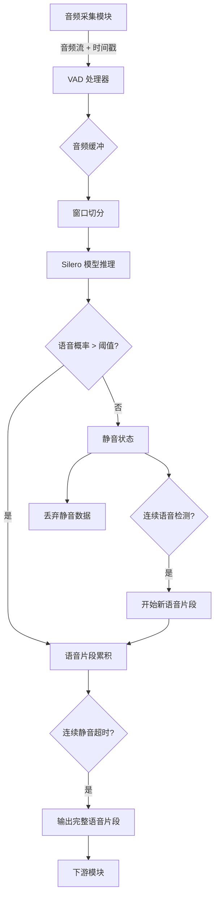
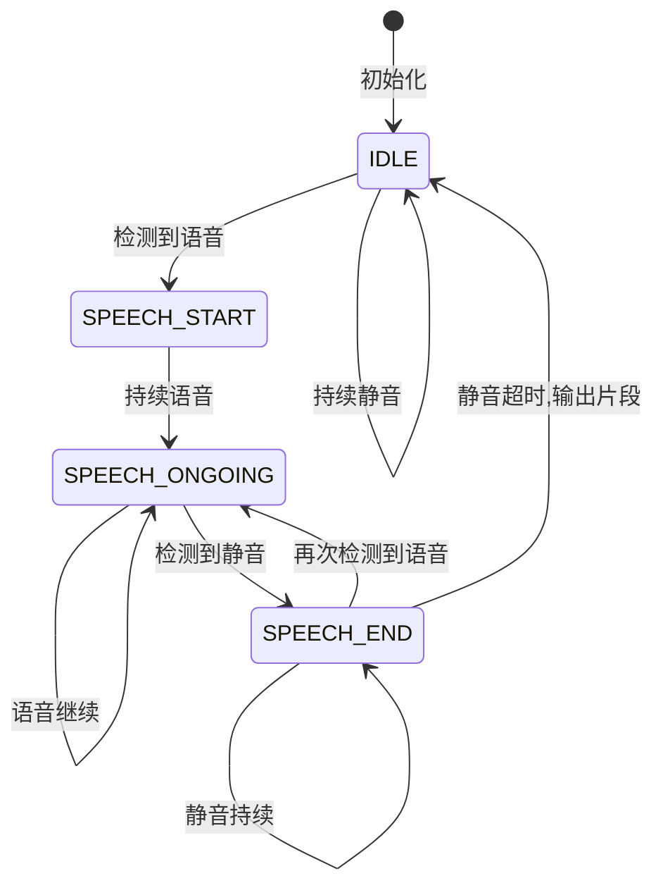
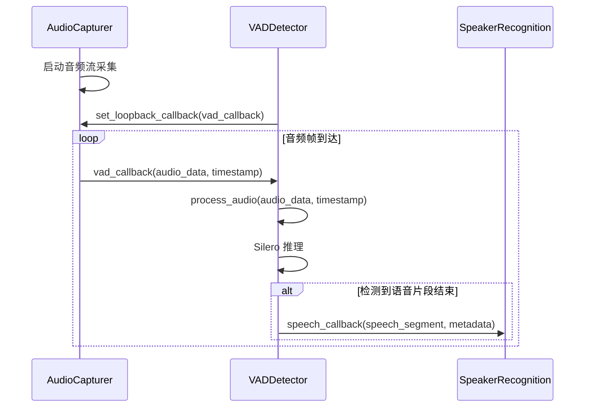
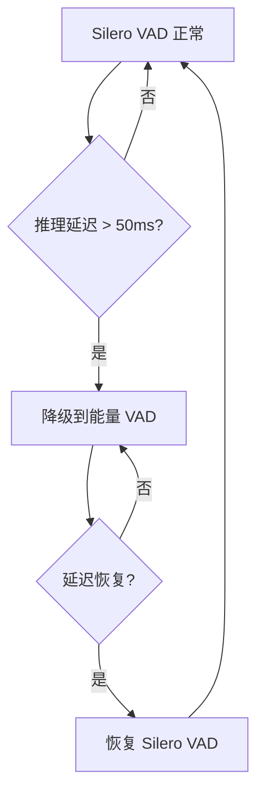

# VAD 模块开发设计文档

## 1. 模块概述

### 1.1 功能定位

VAD（Voice Activity Detection，语音活动检测）模块负责从连续音频流中实时检测并切分出包含语音的片段，过滤静音和环境噪声，为后续的说话人识别和语音转文本模块提供高质量的语音输入。

### 1.2 核心职责

- 接收来自音频采集模块的实时音频流
- 检测音频中的语音活动片段
- 过滤静音与背景噪声
- 切分并输出带时间戳的语音片段
- 提供 VAD 置信度评分

### 1.3 性能目标

- **检测延迟**: 目标 30ms，最大可接受 50ms
- **检测准确率**: > 95%
- **资源占用**: CPU < 5%（单线程），内存 < 200MB
- **实时性**: 支持 16kHz 音频流实时处理

---

## 2. 技术方案

### 2.1 VAD 模型选择

**选用方案**: Silero VAD

**选择理由**:
- PyTorch 实现，支持 CPU 和 GPU
- 毫秒级响应速度，满足实时性要求
- 准确率高（>95%），适应多种噪声环境
- 开箱即用，无需训练
- 社区活跃，模型持续优化

**模型参数**:
- 输入采样率: 16000 Hz
- 输入片段长度: 512 或 1024 样本（32ms 或 64ms）
- 输出: 语音概率值（0.0-1.0）
- 模型大小: ~1MB（轻量级）

### 2.2 音频处理流程



### 2.3 语音片段切分策略

**状态机设计**:



**状态转换条件**:

| 当前状态 | 触发条件 | 目标状态 | 动作 |
|---------|---------|---------|------|
| IDLE | 语音概率 > 阈值 | SPEECH_START | 记录起始时间戳，开始累积 |
| SPEECH_START | 语音概率 > 阈值 | SPEECH_ONGOING | 继续累积音频 |
| SPEECH_ONGOING | 语音概率 > 阈值 | SPEECH_ONGOING | 继续累积音频 |
| SPEECH_ONGOING | 语音概率 ≤ 阈值 | SPEECH_END | 记录可能结束点 |
| SPEECH_END | 语音概率 > 阈值 | SPEECH_ONGOING | 撤销结束，继续累积 |
| SPEECH_END | 静音持续 > 300ms | IDLE | 输出语音片段，清空缓冲 |

---

## 3. 模块设计

### 3.1 模块结构

**目录组织**:
```
src/vad/
├── __init__.py
├── vad_detector.py       # VAD 检测器主类
├── silero_vad.py         # Silero VAD 封装
└── audio_buffer.py       # 音频缓冲管理
```

### 3.2 核心类设计

#### 3.2.1 VADDetector

**职责**: VAD 模块的主入口，管理音频流处理和语音片段输出

**核心属性**:

| 属性名 | 类型 | 说明 |
|-------|------|------|
| model | SileroVAD | Silero VAD 模型封装 |
| sample_rate | int | 音频采样率（16000） |
| threshold | float | 语音检测阈值（默认 0.5） |
| min_speech_duration_ms | int | 最小语音片段时长（默认 250ms） |
| max_speech_duration_ms | int | 最大语音片段时长（默认 10000ms） |
| min_silence_duration_ms | int | 切分静音时长（默认 300ms） |
| speech_pad_ms | int | 语音片段前后填充时长（默认 30ms） |
| state | VADState | 当前状态（IDLE/SPEECH_START/SPEECH_ONGOING/SPEECH_END） |
| buffer | AudioBuffer | 音频缓冲区 |
| current_speech | list | 当前累积的语音数据 |
| speech_start_time | float | 当前语音片段起始时间戳 |
| silence_start_time | float | 静音开始时间戳 |
| callback | Callable | 语音片段输出回调函数 |

**核心方法**:

| 方法名 | 参数 | 返回值 | 说明 |
|-------|------|--------|------|
| process_audio | audio_data, timestamp | None | 处理单帧音频数据 |
| set_callback | callback | None | 设置语音片段输出回调 |
| reset | - | None | 重置状态和缓冲区 |
| get_statistics | - | dict | 获取检测统计信息 |
| update_threshold | threshold | None | 动态调整检测阈值 |

**处理流程**:

1. 接收音频帧和时间戳
2. 将音频数据送入 Silero 模型获取语音概率
3. 根据概率值和当前状态执行状态转换
4. 在语音状态下累积音频数据
5. 检测到语音结束时输出完整语音片段
6. 通过回调函数传递给下游模块

#### 3.2.2 SileroVAD

**职责**: 封装 Silero VAD 模型，提供简洁的推理接口

**核心属性**:

| 属性名 | 类型 | 说明 |
|-------|------|------|
| model | torch.nn.Module | Silero VAD PyTorch 模型 |
| sample_rate | int | 模型支持的采样率 |
| device | str | 推理设备（cpu/cuda） |
| _state | Tensor | 模型内部状态（用于流式处理） |

**核心方法**:

| 方法名 | 参数 | 返回值 | 说明 |
|-------|------|--------|------|
| __init__ | sample_rate, device | - | 初始化并加载模型 |
| predict | audio_chunk | float | 预测单帧语音概率 |
| reset_states | - | None | 重置模型内部状态 |

**模型加载策略**:

- 首次加载时从 torch hub 下载模型
- 缓存到本地 `~/.cache/torch/hub/` 目录
- 后续使用直接从缓存加载
- 支持 CPU 和 CUDA 设备自动选择

#### 3.2.3 AudioBuffer

**职责**: 管理音频数据的缓冲和窗口切分

**核心属性**:

| 属性名 | 类型 | 说明 |
|-------|------|------|
| buffer | deque | 音频样本队列 |
| window_size | int | 处理窗口大小（样本数） |
| max_buffer_size | int | 最大缓冲区大小限制 |

**核心方法**:

| 方法名 | 参数 | 返回值 | 说明 |
|-------|------|--------|------|
| append | audio_data | None | 追加音频数据到缓冲区 |
| get_window | - | np.ndarray | 获取一个处理窗口的数据 |
| clear | - | None | 清空缓冲区 |
| size | - | int | 获取当前缓冲区大小 |

---

## 4. 集成方式

### 4.1 与音频采集模块集成

**集成方式**: 回调函数模式（实时性最高）

**数据流向**:



**回调函数签名**:

```
def vad_callback(audio_data: np.ndarray, timestamp: float):
    """
    VAD 音频处理回调
    
    Args:
        audio_data: 音频数据（float32, shape=(n_samples,)）
        timestamp: 音频帧时间戳
    """
```

**语音片段输出回调**:

```
def speech_callback(speech_segment: np.ndarray, metadata: dict):
    """
    语音片段输出回调
    
    Args:
        speech_segment: 语音片段数据（float32）
        metadata: 元数据字典
            - start_time: 片段起始时间戳
            - end_time: 片段结束时间戳
            - duration: 片段时长（秒）
            - avg_confidence: 平均置信度
    """
```

### 4.2 与下游模块对接

**输出数据格式**:

| 字段名 | 类型 | 说明 |
|-------|------|------|
| audio_data | np.ndarray | 语音片段音频数据（float32, shape=(n,)） |
| start_time | float | 起始时间戳（秒） |
| end_time | float | 结束时间戳（秒） |
| duration | float | 片段时长（秒） |
| sample_rate | int | 采样率（16000） |
| avg_confidence | float | 平均 VAD 置信度（0.0-1.0） |
| segment_id | str | 片段唯一标识（UUID） |

**对接说话人识别模块**:

- VAD 模块输出的语音片段直接传递给说话人识别模块
- 说话人识别模块根据 segment_id 跟踪处理进度
- 识别失败的片段可选择性丢弃或记录日志

---

## 5. 配置管理

### 5.1 配置文件扩展

**文件位置**: `config/audio_config.yaml`

**新增配置节**:

```
vad:
  # VAD 模型类型
  model_type: "silero"  # silero / webrtc
  
  # 推理设备
  device: "cpu"  # cpu / cuda
  
  # 语音检测阈值 (0.0-1.0)
  threshold: 0.5
  
  # 最小语音片段时长 (毫秒)
  min_speech_duration_ms: 250
  
  # 最大语音片段时长 (毫秒)
  max_speech_duration_ms: 10000
  
  # 切分静音时长 (毫秒)
  min_silence_duration_ms: 300
  
  # 语音片段前后填充时长 (毫秒)
  speech_pad_ms: 30
  
  # 窗口大小 (样本数, 512=32ms @ 16kHz)
  window_size_samples: 512
  
  # 启用自适应阈值
  adaptive_threshold: false
  
  # 调试模式（记录详细日志）
  debug: false
```

**配置参数说明**:

| 参数名 | 取值范围 | 默认值 | 说明 |
|-------|---------|--------|------|
| threshold | 0.0 - 1.0 | 0.5 | 提高阈值减少误检，降低阈值提高灵敏度 |
| min_speech_duration_ms | 100 - 1000 | 250 | 过短的语音片段会被过滤 |
| max_speech_duration_ms | 1000 - 30000 | 10000 | 超长片段会被强制切分 |
| min_silence_duration_ms | 100 - 1000 | 300 | 语音间隔的静音时长 |
| speech_pad_ms | 0 - 100 | 30 | 避免切掉语音起止边缘 |
| window_size_samples | 256, 512, 1024 | 512 | 必须是 Silero 支持的尺寸 |

### 5.2 动态配置调整

**支持运行时调整的参数**:

- threshold: 根据环境噪声水平动态调整
- min_silence_duration_ms: 根据说话风格调整
- speech_pad_ms: 根据识别准确率反馈调整

**调整接口**:

通过 VADDetector 提供的方法在运行时更新参数，无需重启服务。

---

## 6. 性能优化策略

### 6.1 推理优化

**策略清单**:

1. **批处理禁用**: 保持单帧实时推理，避免累积延迟
2. **模型量化**: 可选使用 INT8 量化模型降低计算量
3. **GPU 加速**: 检测到 CUDA 环境时自动切换
4. **状态复用**: 保持模型内部状态，避免重复初始化
5. **懒加载**: 仅在首次使用时加载模型

### 6.2 内存优化

**策略清单**:

1. **环形缓冲**: 使用 deque 限制缓冲区最大长度
2. **及时释放**: 语音片段输出后立即清理缓冲
3. **数组复用**: 复用 numpy 数组避免频繁分配
4. **内存监控**: 记录峰值内存占用供调优参考

### 6.3 延迟控制

**目标分解**:

| 环节 | 目标延迟 | 优化手段 |
|------|---------|---------|
| 音频回调触发 | < 1ms | 系统级音频流 |
| 缓冲区操作 | < 2ms | 高效数据结构 |
| Silero 推理 | < 20ms | CPU/GPU 优化 |
| 状态机处理 | < 5ms | 简化逻辑 |
| 回调函数调用 | < 2ms | 异步处理 |
| **总计** | **< 30ms** | - |

---

## 7. 错误处理与容错

### 7.1 异常场景处理

**场景一: 模型加载失败**

- 原因: 网络问题、缓存损坏
- 处理: 清理缓存重试，失败后回退到基于能量的简单 VAD
- 日志: ERROR 级别记录失败原因

**场景二: 音频流异常**

- 原因: 设备断连、数据格式错误
- 处理: 重置缓冲区和状态机，记录错误帧数
- 日志: WARNING 级别记录异常

**场景三: 内存溢出**

- 原因: 超长语音未切分、缓冲区泄漏
- 处理: 强制切分当前片段，清空缓冲区
- 日志: ERROR 级别记录溢出信息

**场景四: 推理超时**

- 原因: 设备负载过高、死锁
- 处理: 跳过当前帧，重置模型状态
- 日志: WARNING 级别记录超时

### 7.2 降级方案

**降级路径**:



**能量 VAD 实现**:

基于音频能量（RMS）和过零率的简单 VAD 算法：
- 计算短时能量，超过阈值视为语音
- 仅作为紧急降级方案，准确率较低

---

## 8. 测试策略

### 8.1 单元测试

**测试用例清单**:

| 测试项 | 测试目的 | 验证指标 |
|-------|---------|---------|
| 模型加载 | 验证 Silero 模型正确加载 | 加载成功且可推理 |
| 纯语音检测 | 检测连续语音片段 | 准确识别起止点 |
| 纯静音过滤 | 过滤静音帧 | 不输出任何片段 |
| 语音静音交替 | 正确切分多个语音片段 | 片段数量正确 |
| 边界填充 | 验证片段前后填充 | 片段长度符合预期 |
| 阈值调整 | 动态调整检测阈值 | 灵敏度变化正确 |
| 状态重置 | 重置后恢复初始状态 | 无残留数据 |
| 异常输入 | 空数据、错误格式 | 不崩溃，正确处理 |

### 8.2 集成测试

**测试场景**:

1. **与音频采集集成**: 验证回调函数正确注册和触发
2. **实时性能测试**: 模拟持续音频流，测量端到端延迟
3. **资源占用测试**: 长时间运行监控 CPU 和内存
4. **多设备兼容性**: 测试不同音频设备的兼容性

### 8.3 端到端测试

**测试数据**:

- 预录制的 VRChat 对话音频（包含多人、噪声、静音）
- 标注好的语音活动时间戳（Ground Truth）
- 不同噪声环境的音频样本

**评估指标**:

| 指标名 | 计算方式 | 目标值 |
|-------|---------|--------|
| 准确率 | 正确检测帧数 / 总帧数 | > 95% |
| 召回率 | 正确检测的语音帧 / 实际语音帧 | > 93% |
| 精确率 | 正确检测的语音帧 / 检测出的语音帧 | > 97% |
| 平均延迟 | 检测到语音的平均时间 | < 30ms |
| 片段完整性 | 完整保留的语音片段比例 | > 98% |

---

## 9. 监控与日志

### 9.1 统计指标

**运行时统计**:

| 指标名 | 说明 | 用途 |
|-------|------|------|
| total_frames_processed | 已处理音频帧总数 | 监控运行状态 |
| speech_segments_detected | 检测到的语音片段数 | 评估活跃度 |
| total_speech_duration | 累计语音时长（秒） | 统计有效语音 |
| avg_speech_duration | 平均语音片段时长 | 分析说话风格 |
| avg_confidence | 平均检测置信度 | 评估质量 |
| frames_dropped | 丢弃的异常帧数 | 监控异常 |
| avg_processing_time_ms | 平均单帧处理时长 | 性能监控 |
| peak_buffer_size | 峰值缓冲区大小 | 内存监控 |

### 9.2 日志规范

**日志级别使用**:

| 级别 | 使用场景 | 示例 |
|------|---------|------|
| DEBUG | 详细状态转换、推理结果 | "状态转换: IDLE -> SPEECH_START, 置信度: 0.87" |
| INFO | 模块初始化、配置加载、片段输出 | "VAD 模块已初始化，阈值: 0.5" |
| WARNING | 异常帧、推理延迟、降级 | "推理延迟 65ms 超过目标，考虑降级" |
| ERROR | 模型加载失败、崩溃 | "Silero 模型加载失败: NetworkError" |

**日志格式**:

```
[时间戳] [级别] [模块名] [消息内容] [关键字段]
```

示例:
```
[2025-01-15 10:23:45.123] [INFO] [VADDetector] 检测到语音片段 segment_id=abc123, duration=1.2s, confidence=0.92
```

---

## 10. 依赖管理

### 10.1 新增依赖项

**requirements.txt 新增**:

```
# VAD 模块依赖
torch>=2.0.0              # Silero VAD 需要
torchaudio>=2.0.0         # 音频处理工具
silero-vad>=4.0.0         # Silero VAD 官方包（可选，可直接用 torch hub）
```

### 10.2 依赖版本兼容性

| 依赖项 | 最低版本 | 推荐版本 | 兼容性说明 |
|-------|---------|---------|-----------|
| torch | 2.0.0 | 2.1.0 | 支持 CPU 和 CUDA 11.8+ |
| torchaudio | 2.0.0 | 2.1.0 | 与 torch 版本保持一致 |
| numpy | 1.24.0 | 1.26.0 | 与音频采集模块共享 |

### 10.3 可选依赖

**CUDA 加速**（可选）:
- CUDA Toolkit 11.8+
- cuDNN 8.0+

**WebRTC VAD 备选**（可选）:
- webrtcvad>=2.0.10

---

## 11. 开发计划

### 11.1 开发里程碑

**阶段一: 核心功能实现（3-5 天）**

- 实现 SileroVAD 模型封装
- 实现 AudioBuffer 缓冲管理
- 实现 VADDetector 主流程和状态机
- 编写单元测试

**阶段二: 集成与测试（2-3 天）**

- 与 AudioCapturer 集成
- 端到端测试与调优
- 性能测试和优化
- 配置文件扩展

**阶段三: 优化与完善（2-3 天）**

- 错误处理和降级方案
- 日志和监控完善
- 文档编写
- 代码审查和重构

### 11.2 验收标准

**功能验收**:

- [ ] 能够正确加载 Silero VAD 模型
- [ ] 能够实时处理 16kHz 音频流
- [ ] 能够准确检测和切分语音片段
- [ ] 能够过滤静音和噪声
- [ ] 能够通过回调输出语音片段

**性能验收**:

- [ ] 单帧处理延迟 < 30ms（平均）
- [ ] 检测准确率 > 95%（测试集）
- [ ] CPU 占用 < 5%（单线程）
- [ ] 内存占用 < 200MB

**质量验收**:

- [ ] 单元测试覆盖率 > 80%
- [ ] 无已知严重 Bug
- [ ] 日志完整清晰
- [ ] 代码符合项目规范

---

## 12. 风险与挑战

### 12.1 技术风险

| 风险项 | 影响程度 | 缓解措施 |
|-------|---------|---------|
| Silero 模型推理延迟 | 中 | GPU 加速，模型量化 |
| 环境噪声导致误检 | 中 | 自适应阈值，降噪预处理 |
| 语音片段边界不准 | 低 | 填充策略，边界优化 |
| 模型下载网络问题 | 低 | 本地缓存，离线安装包 |

### 12.2 集成风险

| 风险项 | 影响程度 | 缓解措施 |
|-------|---------|---------|
| 与音频采集模块接口不匹配 | 低 | 早期集成测试 |
| 回调函数性能瓶颈 | 中 | 异步处理，队列缓冲 |
| 音频格式兼容性 | 低 | 严格格式检查 |

---

## 13. 后续优化方向

### 13.1 短期优化（1-2 周）

- **自适应阈值**: 根据环境噪声自动调整检测阈值
- **多级 VAD**: 结合能量 VAD 和模型 VAD 提高鲁棒性
- **语音质量评估**: 对输出片段进行质量打分

### 13.2 中期扩展（1-2 月）

- **WebRTC VAD 支持**: 提供超低延迟备选方案
- **模型微调**: 针对 VRChat 场景收集数据微调模型
- **方向性检测**: 结合立体声判断语音方向

### 13.3 长期愿景（3+ 月）

- **端到端优化**: 与说话人识别联合优化
- **多人场景**: 支持同时检测多人语音活动
- **自学习**: 根据用户反馈持续优化参数

## 11. 开发计划

### 11.1 开发里程碑

**阶段一: 核心功能实现（3-5 天）**

- 实现 SileroVAD 模型封装
- 实现 AudioBuffer 缓冲管理
- 实现 VADDetector 主流程和状态机
- 编写单元测试

**阶段二: 集成与测试（2-3 天）**

- 与 AudioCapturer 集成
- 端到端测试与调优
- 性能测试和优化
- 配置文件扩展

**阶段三: 优化与完善（2-3 天）**

- 错误处理和降级方案
- 日志和监控完善
- 文档编写
- 代码审查和重构

### 11.2 验收标准

**功能验收**:

- [ ] 能够正确加载 Silero VAD 模型
- [ ] 能够实时处理 16kHz 音频流
- [ ] 能够准确检测和切分语音片段
- [ ] 能够过滤静音和噪声
- [ ] 能够通过回调输出语音片段

**性能验收**:

- [ ] 单帧处理延迟 < 30ms（平均）
- [ ] 检测准确率 > 95%（测试集）
- [ ] CPU 占用 < 5%（单线程）
- [ ] 内存占用 < 200MB

**质量验收**:

- [ ] 单元测试覆盖率 > 80%
- [ ] 无已知严重 Bug
- [ ] 日志完整清晰
- [ ] 代码符合项目规范

---

## 12. 风险与挑战

### 12.1 技术风险

| 风险项 | 影响程度 | 缓解措施 |
|-------|---------|---------|
| Silero 模型推理延迟 | 中 | GPU 加速，模型量化 |
| 环境噪声导致误检 | 中 | 自适应阈值，降噪预处理 |
| 语音片段边界不准 | 低 | 填充策略，边界优化 |
| 模型下载网络问题 | 低 | 本地缓存，离线安装包 |

### 12.2 集成风险

| 风险项 | 影响程度 | 缓解措施 |
|-------|---------|---------|
| 与音频采集模块接口不匹配 | 低 | 早期集成测试 |
| 回调函数性能瓶颈 | 中 | 异步处理，队列缓冲 |
| 音频格式兼容性 | 低 | 严格格式检查 |

---

## 13. 后续优化方向

### 13.1 短期优化（1-2 周）

- **自适应阈值**: 根据环境噪声自动调整检测阈值
- **多级 VAD**: 结合能量 VAD 和模型 VAD 提高鲁棒性
- **语音质量评估**: 对输出片段进行质量打分

### 13.2 中期扩展（1-2 月）

- **WebRTC VAD 支持**: 提供超低延迟备选方案
- **模型微调**: 针对 VRChat 场景收集数据微调模型
- **方向性检测**: 结合立体声判断语音方向

### 13.3 长期愿景（3+ 月）

- **端到端优化**: 与说话人识别联合优化
- **多人场景**: 支持同时检测多人语音活动
- **自学习**: 根据用户反馈持续优化参数
---
