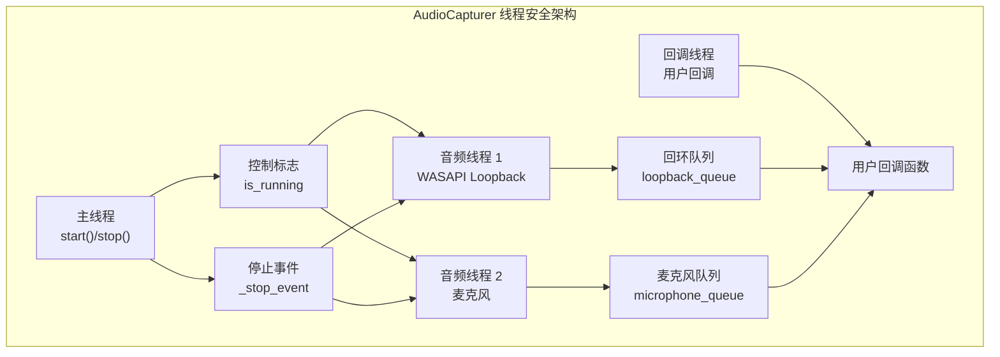
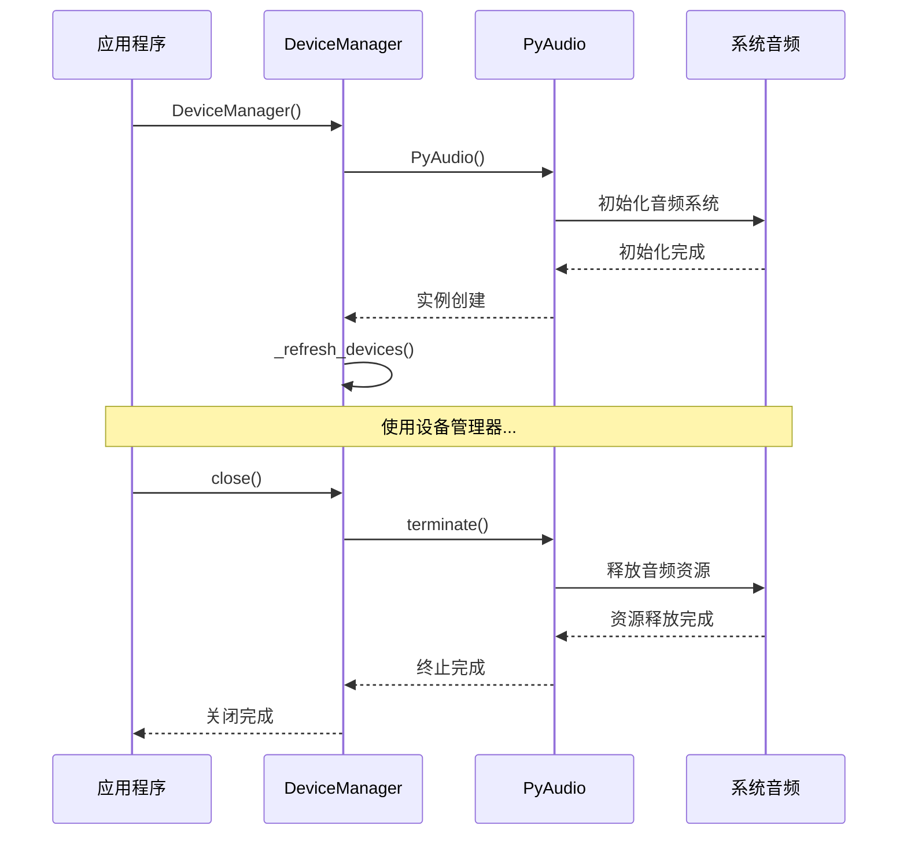
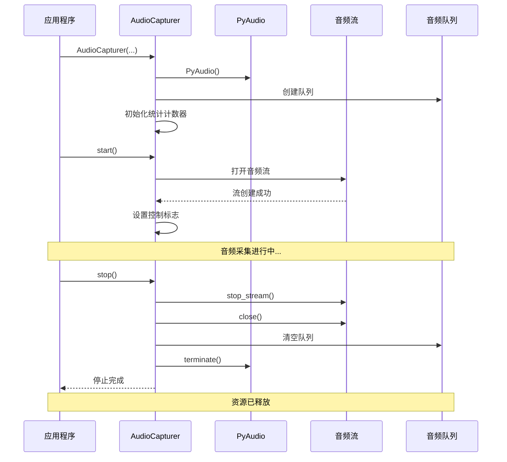

# API参考

<cite>
**本文档中引用的文件**
- [device_manager.py](file://src/audio_capture/device_manager.py)
- [audio_capturer.py](file://src/audio_capture/audio_capturer.py)
- [__init__.py](file://src/audio_capture/__init__.py)
- [test_audio_capture.py](file://tests/test_audio_capture.py)
</cite>

## 目录
1. [简介](#简介)
2. [DeviceManager 类](#devicemanager-类)
3. [AudioCapturer 类](#audiocapturer-类)
4. [线程安全与资源管理](#线程安全与资源管理)
5. [使用示例](#使用示例)
6. [故障排除](#故障排除)

## 简介

本文档详细介绍了 VRChat 社交助手音频采集模块的两个核心类：`DeviceManager` 和 `AudioCapturer`。这些类提供了完整的音频设备管理和实时音频采集功能，支持 WASAPI Loopback 音频采集和麦克风输入采集。

## DeviceManager 类

`DeviceManager` 类负责管理音频设备，包括设备枚举、设备信息获取和设备选择功能。

### 构造函数

```python
DeviceManager()
```

**用途**: 初始化设备管理器实例，建立与音频系统的连接。

**异常情况**: 
- 如果无法初始化 PyAudio 实例，可能会抛出 `RuntimeError`
- 系统音频设备不可用时会记录警告但不会抛出异常

### 核心方法

#### `get_default_wasapi_loopback()`

```python
def get_default_wasapi_loopback(self) -> Optional[Dict]
```

**用途**: 获取默认 WASAPI Loopback 设备（系统扬声器的回环版本）

**参数**: 无

**返回值**: 
- 成功时返回设备信息字典，包含以下字段：
  - `index`: 设备索引
  - `name`: 设备名称
  - `max_input_channels`: 最大输入声道数
  - `max_output_channels`: 最大输出声道数
  - `default_samplerate`: 默认采样率
  - `hostapi`: 主机 API 类型
  - `hostapi_name`: 主机 API 名称
  - `is_loopback`: 是否为回环设备标识
- 失败时返回 `None`

**异常情况**: 
- 如果系统不支持 WASAPI 或设备不存在，返回 `None`
- 内部异常会被捕获并记录警告日志

#### `get_device_info(device_index: int)`

```python
def get_device_info(self, device_index: int) -> Optional[Dict]
```

**用途**: 获取指定索引的设备详细信息

**参数**:
- `device_index` (int): 设备索引号

**返回值**: 
- 成功时返回设备信息字典
- 失败时返回 `None`

**异常情况**: 
- 设备索引无效或设备不存在时返回 `None`
- 内部异常会被捕获并记录错误日志

#### `list_devices()`

```python
def list_devices(self) -> List[Dict]
```

**用途**: 列出所有可用的音频设备

**参数**: 无

**返回值**: 设备列表，每个设备包含完整信息

**异常情况**: 
- 单个设备信息获取失败时记录警告但继续处理其他设备
- 返回空列表表示没有可用设备

#### `list_input_devices()`

```python
def list_input_devices(self) -> List[Dict]
```

**用途**: 列出所有输入设备（麦克风）

**参数**: 无

**返回值**: 输入设备列表

**异常情况**: 无

#### `list_output_devices()`

```python
def list_output_devices(self) -> List[Dict]
```

**用途**: 列出所有输出设备（扬声器）

**参数**: 无

**返回值**: 输出设备列表

**异常情况**: 无

#### `list_loopback_devices()`

```python
def list_loopback_devices(self) -> List[Dict]
```

**用途**: 列出所有 WASAPI Loopback 设备

**参数**: 无

**返回值**: Loopback 设备列表

**异常情况**: 无

#### `find_device_by_name(name: str, device_type: str = 'all')`

```python
def find_device_by_name(self, name: str, device_type: str = 'all') -> Optional[Dict]
```

**用途**: 根据设备名称查找设备

**参数**:
- `name` (str): 设备名称（支持部分匹配）
- `device_type` (str): 设备类型 ('input', 'output', 'loopback', 'all')

**返回值**: 匹配的设备信息，如果没有找到则返回 `None`

**异常情况**: 无

#### `check_device_support(device_index: int, samplerate: int, channels: int, is_input: bool = True)`

```python
def check_device_support(self, device_index: int, samplerate: int, channels: int, is_input: bool = True) -> bool
```

**用途**: 检查设备是否支持指定的采样率和声道数

**参数**:
- `device_index` (int): 设备索引
- `samplerate` (int): 采样率
- `channels` (int): 声道数
- `is_input` (bool): 是否为输入设备

**返回值**: 是否支持指定配置

**异常情况**: 
- 设备不支持指定参数时返回 `False`
- 内部异常会被捕获并记录警告日志

### 辅助方法

#### `print_device_list()`

```python
def print_device_list(self)
```

**用途**: 打印所有设备信息（用于调试）

**参数**: 无

**返回值**: 无

**异常情况**: 无

#### `close()`

```python
def close(self)
```

**用途**: 关闭设备管理器，释放资源

**参数**: 无

**返回值**: 无

**异常情况**: 无

**资源管理**: 此方法会终止 PyAudio 实例，释放系统资源

**段落来源**
- [device_manager.py](file://src/audio_capture/device_manager.py#L14-L267)

## AudioCapturer 类

`AudioCapturer` 类负责同时采集 WASAPI Loopback 音频和麦克风音频。

### 构造函数

```python
AudioCapturer(
    loopback_device: Optional[int] = None,
    microphone_device: Optional[int] = None,
    samplerate: int = 16000,
    channels: int = 1,
    chunk_size: int = 480,
    format: int = pyaudio.paInt16
)
```

**用途**: 初始化音频采集器

**参数**:
- `loopback_device` (Optional[int]): WASAPI Loopback 设备索引（用于采集系统音频）
- `microphone_device` (Optional[int]): 麦克风设备索引
- `samplerate` (int): 采样率，默认 16kHz（STT 标准）
- `channels` (int): 声道数，默认单声道
- `chunk_size` (int): 缓冲区大小（样本数），默认 30ms
- `format` (int): 音频格式，默认 `pyaudio.paInt16`

**数据格式**:
- 音频数据类型: `numpy.ndarray` (float32)
- 数据形状: `(samples,)` 或 `(samples, channels)`（根据声道数）
- 采样精度: 16-bit PCM
- 音量范围: [-1.0, 1.0]

**异常情况**:
- 设备索引无效时记录警告但继续初始化
- 内部异常会被捕获并记录错误日志

### 核心方法

#### `start_capture()`

```python
def start(self)
```

**用途**: 启动音频采集

**调用方式**: 直接调用

**线程安全**: 是

**并发访问**: 多次调用会被忽略，只会启动一次

**返回值**: 无

**内部流程**:
1. 检查是否已在运行，避免重复启动
2. 启动 WASAPI Loopback 音频流（如果指定了设备）
3. 启动麦克风音频流（如果指定了设备）
4. 设置控制标志和停止事件

**异常情况**:
- 设备打开失败时记录错误日志
- 流启动失败时设置流对象为 `None`
- 内部异常会被捕获并记录错误日志

#### `stop_capture()`

```python
def stop(self)
```

**用途**: 停止音频采集

**调用方式**: 直接调用

**线程安全**: 是

**并发访问**: 多次调用会被忽略，只会停止一次

**返回值**: 无

**内部流程**:
1. 检查是否正在运行
2. 设置停止标志
3. 停止并关闭 WASAPI Loopback 音频流
4. 停止并关闭麦克风音频流
5. 清理资源

**异常情况**:
- 流关闭失败时记录错误日志
- 内部异常会被捕获并记录错误日志

#### `set_callback(callback_type: str, callback: Callable)`

```python
def set_loopback_callback(self, callback: Callable[[np.ndarray, float], None])
def set_microphone_callback(self, callback: Callable[[np.ndarray, float], None])
```

**用途**: 设置音频回调函数

**调用方式**: 分别调用对应的方法

**参数**:
- `callback` (Callable): 回调函数，接收参数 `(audio_data: np.ndarray, timestamp: float)`

**回调函数原型**:
```python
def callback(audio_data: np.ndarray, timestamp: float) -> None
```

**数据格式**:
- `audio_data`: numpy 数组，float32 类型，范围 [-1.0, 1.0]
- `timestamp`: 浮点数，Unix 时间戳

**线程安全**: 是

**并发访问**: 可以在多个线程中安全调用

**异常情况**:
- 回调函数内部异常会被捕获并记录错误日志
- 回调函数不应执行耗时操作，否则可能影响音频流性能

#### `get_audio_data(data_type: str, timeout: float = 0.1)`

```python
def get_loopback_audio(self, timeout: float = 0.1) -> Optional[Tuple[np.ndarray, float]]
def get_microphone_audio(self, timeout: float = 0.1) -> Optional[Tuple[np.ndarray, float]]
```

**用途**: 从队列获取音频数据

**调用方式**: 分别调用对应的方法

**参数**:
- `timeout` (float): 超时时间（秒）

**返回值**:
- 成功时返回 `(audio_data: np.ndarray, timestamp: float)`
- 超时时返回 `None`

**数据格式**:
- `audio_data`: numpy 数组，float32 类型
- `timestamp`: Unix 时间戳

**线程安全**: 是

**并发访问**: 可以在多个线程中安全调用

**异常情况**:
- 队列为空且超时发生时返回 `None`
- 队列操作异常时返回 `None`

### 辅助方法

#### `get_statistics()`

```python
def get_statistics(self) -> dict
```

**用途**: 获取采集统计信息

**调用方式**: 直接调用

**返回值**: 统计信息字典

**统计信息**:
- `loopback_frames_captured`: WASAPI Loopback 采集的帧数
- `microphone_frames_captured`: 麦克风采集的帧数
- `loopback_overflows`: WASAPI Loopback 溢出次数
- `microphone_overflows`: 麦克风溢出次数
- `loopback_queue_size`: WASAPI Loopback 队列大小
- `microphone_queue_size`: 麦克风队列大小
- `is_running`: 是否正在运行

**线程安全**: 是

**并发访问**: 可以在多个线程中安全调用

#### `clear_queues()`

```python
def clear_queues(self)
```

**用途**: 清空音频队列

**调用方式**: 直接调用

**返回值**: 无

**线程安全**: 是

**并发访问**: 可以在多个线程中安全调用

**异常情况**: 无

### 上下文管理器支持

```python
def __enter__(self)
def __exit__(self, exc_type, exc_val, exc_tb)
```

**用途**: 支持上下文管理器语法

**使用示例**:
```python
with AudioCapturer(loopback_device=0, microphone_device=1) as capturer:
    # 在这里进行音频采集
    pass
# capturer 会自动停止和清理
```

**线程安全**: 是

**并发访问**: 可以在多个线程中安全使用

**资源管理**: 自动调用 `stop()` 方法

**段落来源**
- [audio_capturer.py](file://src/audio_capture/audio_capturer.py#L19-L325)

## 线程安全与资源管理

### 线程安全特性

#### AudioCapturer 线程安全设计



**图表来源**
- [audio_capturer.py](file://src/audio_capture/audio_capturer.py#L65-L67)
- [audio_capturer.py](file://src/audio_capture/audio_capturer.py#L56-L57)

#### 关键线程安全机制

1. **控制标志保护**
   - `is_running` 标志防止重复启动
   - `_stop_event` 事件用于优雅停止

2. **队列安全**
   - Python 的 `queue.Queue` 是线程安全的
   - 生产者（音频回调）和消费者（get_audio_data）安全分离

3. **回调函数隔离**
   - 用户回调在独立线程中执行
   - 异常被捕获，不影响音频流

4. **资源访问同步**
   - 统计信息通过只读访问保证线程安全
   - 队列清空操作原子性执行

### 资源管理要求

#### 设备管理器资源管理



**图表来源**
- [device_manager.py](file://src/audio_capture/device_manager.py#L258-L267)

#### 音频采集器资源管理



**图表来源**
- [audio_capturer.py](file://src/audio_capture/audio_capturer.py#L154-L247)
- [audio_capturer.py](file://src/audio_capture/audio_capturer.py#L311-L325)

#### 资源管理最佳实践

1. **DeviceManager**
   - 始终调用 `close()` 方法释放资源
   - 使用上下文管理器自动管理生命周期
   - 在程序退出时确保资源被清理

2. **AudioCapturer**
   - 使用上下文管理器自动停止和清理
   - 在异常情况下确保资源被正确释放
   - 避免长时间持有音频流对象

3. **通用原则**
   - 捕获所有异常，确保资源清理
   - 使用 try-finally 或上下文管理器模式
   - 在析构函数中提供后备清理机制

**段落来源**
- [audio_capturer.py](file://src/audio_capture/audio_capturer.py#L65-L67)
- [audio_capturer.py](file://src/audio_capture/audio_capturer.py#L56-L57)
- [device_manager.py](file://src/audio_capture/device_manager.py#L258-L267)

## 使用示例

### 基础设备管理示例

```python
# 设备管理器使用示例
from src.audio_capture import DeviceManager

# 创建设备管理器
manager = DeviceManager()

try:
    # 列出所有设备
    devices = manager.list_devices()
    
    # 查找特定设备
    loopback_device = manager.find_device_by_name("Speakers", "loopback")
    if loopback_device:
        print(f"找到回环设备: {loopback_device['name']}")
    
    # 获取默认设备
    default_loopback = manager.get_default_wasapi_loopback()
    if default_loopback:
        print(f"默认回环设备: {default_loopback['name']}")
    
    # 检查设备支持
    if loopback_device:
        supported = manager.check_device_support(
            loopback_device['index'], 
            16000, 
            1, 
            is_input=False
        )
        print(f"设备支持: {supported}")

finally:
    # 清理资源
    manager.close()
```

### 基础音频采集示例

```python
# 音频采集器使用示例
from src.audio_capture import AudioCapturer
import numpy as np

# 定义回调函数
def loopback_callback(audio_data: np.ndarray, timestamp: float) -> None:
    """处理回环音频数据"""
    volume = np.sqrt(np.mean(audio_data ** 2))
    if volume > 0.01:  # 忽略静音
        print(f"回环音频 - 音量: {volume:.4f}, 样本数: {len(audio_data)}")

def microphone_callback(audio_data: np.ndarray, timestamp: float) -> None:
    """处理麦克风音频数据"""
    volume = np.sqrt(np.mean(audio_data ** 2))
    if volume > 0.01:  # 忽略静音
        print(f"麦克风音频 - 音量: {volume:.4f}, 样本数: {len(audio_data)}")

# 创建音频采集器
capturer = AudioCapturer(
    loopback_device=0,  # 指定回环设备
    microphone_device=1,  # 指定麦克风设备
    samplerate=16000,
    channels=1,
    chunk_size=480
)

try:
    # 设置回调函数
    capturer.set_loopback_callback(loopback_callback)
    capturer.set_microphone_callback(microphone_callback)
    
    # 启动采集
    capturer.start()
    
    # 运行一段时间
    import time
    time.sleep(10)
    
    # 获取统计数据
    stats = capturer.get_statistics()
    print(f"采集统计: {stats}")

finally:
    # 停止采集
    capturer.stop()
```

### 上下文管理器示例

```python
# 使用上下文管理器的音频采集
from src.audio_capture import AudioCapturer
import numpy as np

def audio_processor(audio_data: np.ndarray, timestamp: float) -> None:
    """音频处理函数"""
    # 处理音频数据
    pass

# 使用上下文管理器自动管理生命周期
with AudioCapturer(
    loopback_device=0,
    microphone_device=1,
    samplerate=16000,
    channels=1
) as capturer:
    
    # 设置回调
    capturer.set_loopback_callback(audio_processor)
    
    # 音频采集自动开始
    
    # 运行采集
    import time
    time.sleep(5)
    
    # 音频采集自动停止，资源自动清理
```

### 错误处理示例

```python
# 带错误处理的音频采集
from src.audio_capture import DeviceManager, AudioCapturer
import logging

# 配置日志
logging.basicConfig(level=logging.INFO)

def robust_audio_capture():
    """健壮的音频采集实现"""
    manager = None
    capturer = None
    
    try:
        # 初始化设备管理器
        manager = DeviceManager()
        
        # 查找可用设备
        loopback_devices = manager.list_loopback_devices()
        if not loopback_devices:
            raise RuntimeError("未找到可用的 WASAPI Loopback 设备")
        
        loopback_device = loopback_devices[0]['index']
        
        # 创建音频采集器
        capturer = AudioCapturer(
            loopback_device=loopback_device,
            samplerate=16000,
            channels=1
        )
        
        # 设置回调
        def simple_callback(audio_data, timestamp):
            print(f"音频数据: {len(audio_data)} 样本")
        
        capturer.set_loopback_callback(simple_callback)
        
        # 启动采集
        capturer.start()
        
        # 运行采集
        import time
        time.sleep(10)
        
    except Exception as e:
        logging.error(f"音频采集失败: {e}")
        raise
    finally:
        # 清理资源
        if capturer:
            capturer.stop()
        if manager:
            manager.close()

# 使用健壮的音频采集
robust_audio_capture()
```

**段落来源**
- [test_audio_capture.py](file://tests/test_audio_capture.py#L46-L212)

## 故障排除

### 常见问题与解决方案

#### 1. 设备发现失败

**症状**: `list_devices()` 返回空列表

**可能原因**:
- 系统音频驱动未正确安装
- WASAPI 不可用
- 权限不足

**解决方案**:
```python
# 检查系统音频状态
manager = DeviceManager()
devices = manager.list_devices()
if not devices:
    print("未检测到音频设备")
    print("请检查:")
    print("- 音频驱动是否正常")
    print("- WASAPI 是否启用")
    print("- 是否以管理员权限运行")
```

#### 2. WASAPI Loopback 设备缺失

**症状**: `get_default_wasapi_loopback()` 返回 `None`

**可能原因**:
- 系统不支持 WASAPI
- pyaudiowpatch 库未正确安装
- 设备权限限制

**解决方案**:
```python
# 尝试手动查找设备
manager = DeviceManager()
loopbacks = manager.list_loopback_devices()
if not loopbacks:
    print("尝试手动查找设备...")
    # 查找所有设备
    all_devices = manager.list_devices()
    for device in all_devices:
        if device.get('is_loopback', False):
            print(f"找到回环设备: {device['name']}")
```

#### 3. 音频采集卡顿或丢失

**症状**: 音频数据丢失或延迟

**可能原因**:
- 队列满载
- 回调函数执行时间过长
- 系统资源不足

**解决方案**:
```python
# 优化音频采集
capturer = AudioCapturer(
    samplerate=16000,      # 使用标准采样率
    chunk_size=240,        # 减小缓冲区大小
    channels=1             # 使用单声道减少负载
)

# 确保回调函数快速执行
def fast_callback(audio_data, timestamp):
    # 避免复杂计算
    volume = np.max(np.abs(audio_data))
    # 快速处理
    process_audio_fast(volume)
```

#### 4. 回调函数异常

**症状**: 音频流中断或出现异常

**可能原因**:
- 回调函数内部异常
- 数据处理错误

**解决方案**:
```python
# 添加异常处理的回调函数
def safe_callback(audio_data, timestamp):
    try:
        # 安全的数据处理
        processed_data = preprocess_audio(audio_data)
        process_safely(processed_data)
    except Exception as e:
        logging.error(f"回调函数错误: {e}")
        # 不要抛出异常，否则会中断音频流
```

#### 5. 资源泄漏

**症状**: 程序运行一段时间后内存或CPU使用率上升

**可能原因**:
- 未正确关闭音频设备
- 队列未及时清理

**解决方案**:
```python
# 使用上下文管理器
with AudioCapturer(...) as capturer:
    # 自动资源管理
    pass

# 或手动管理
capturer = AudioCapturer(...)
try:
    # 使用采集器
    pass
finally:
    capturer.stop()  # 确保资源清理
```

### 性能优化建议

#### 1. 队列管理
- 定期调用 `get_statistics()` 监控队列状态
- 使用 `clear_queues()` 清理积压数据
- 避免长时间阻塞在 `get_audio_data()` 调用上

#### 2. 回调函数优化
- 保持回调函数轻量级
- 避免在回调中执行I/O操作
- 使用异步处理大数据

#### 3. 设备选择
- 优先选择支持标准采样率的设备
- 避免高负载设备
- 考虑设备的延迟特性

#### 4. 系统配置
- 确保系统音频缓冲区足够大
- 关闭不必要的音频应用程序
- 调整系统音频优先级

**段落来源**
- [audio_capturer.py](file://src/audio_capture/audio_capturer.py#L278-L293)
- [device_manager.py](file://src/audio_capture/device_manager.py#L223-L245)