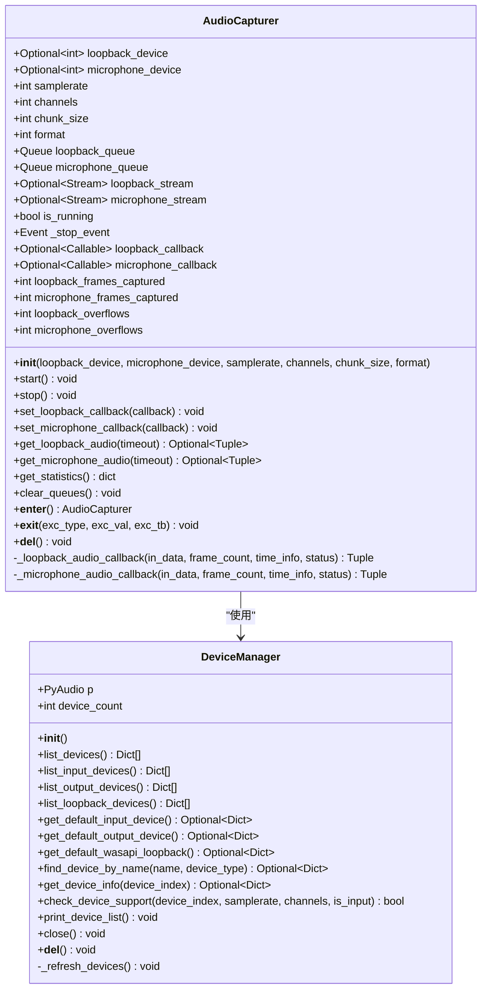
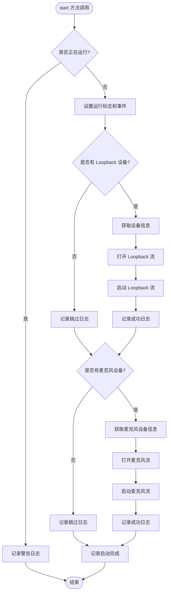
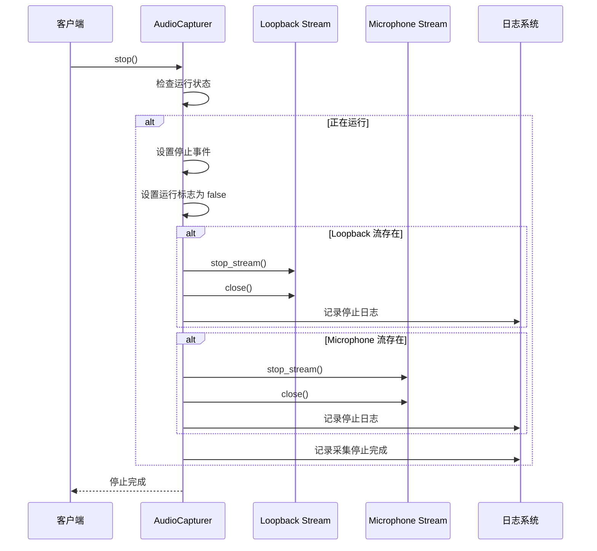
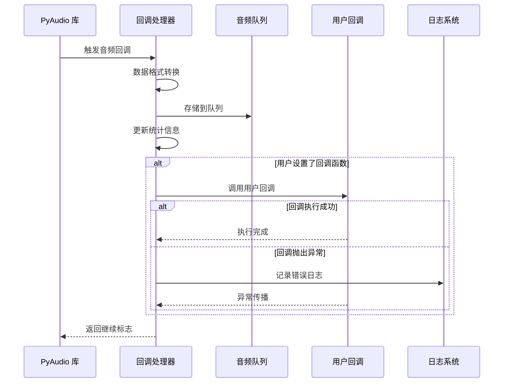
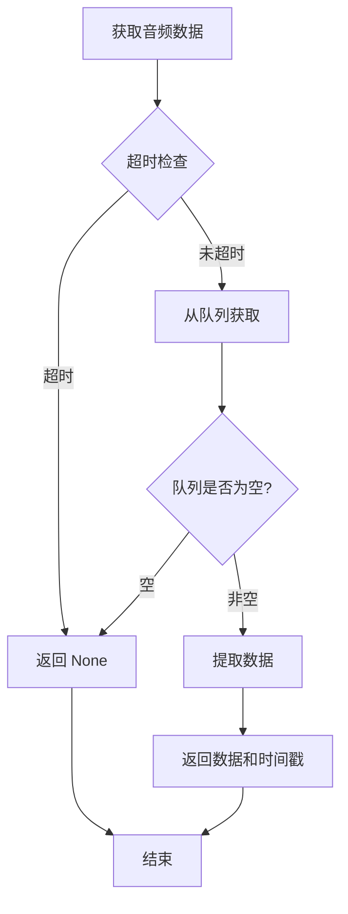
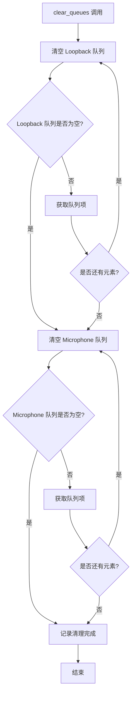
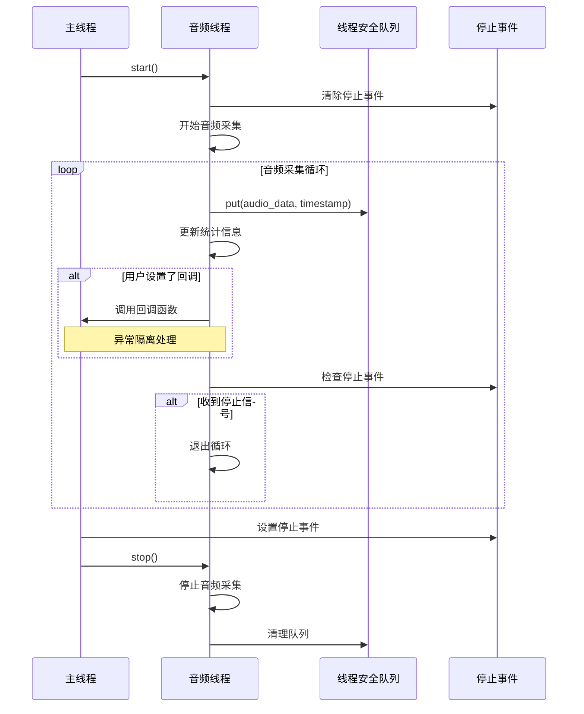

# AudioCapturer API 文档

<cite>
**本文档中引用的文件**
- [audio_capturer.py](file://src/audio_capture/audio_capturer.py)
- [device_manager.py](file://src/audio_capture/device_manager.py)
- [__init__.py](file://src/audio_capture/__init__.py)
- [test_audio_capture.py](file://tests/test_audio_capture.py)
</cite>

## 目录
1. [简介](#简介)
2. [类概述](#类概述)
3. [构造函数](#构造函数)
4. [核心接口](#核心接口)
5. [回调函数系统](#回调函数系统)
6. [队列操作](#队列操作)
7. [统计信息与资源管理](#统计信息与资源管理)
8. [线程安全机制](#线程安全机制)
9. [使用示例](#使用示例)
10. [最佳实践](#最佳实践)
11. [故障排除](#故障排除)

## 简介

AudioCapturer 是一个专门用于同时采集系统音频（WASAPI Loopback）和麦克风音频的高性能音频采集器。该类基于 pyaudiowpatch 库构建，支持实时音频流处理，适用于语音识别、音频分析和实时通信等应用场景。

### 主要特性

- **双音频流采集**：同时采集系统音频输出和麦克风输入
- **实时处理**：支持回调函数进行实时音频处理
- **线程安全**：内置线程安全机制确保多线程环境下的稳定性
- **灵活配置**：可配置采样率、声道数、缓冲区大小等参数
- **资源管理**：提供上下文管理器和显式资源清理功能

## 类概述



**图表来源**
- [audio_capturer.py](file://src/audio_capture/audio_capturer.py#L18-L324)
- [device_manager.py](file://src/audio_capture/device_manager.py#L14-L267)

## 构造函数

### 初始化参数

AudioCapturer 的构造函数提供了丰富的配置选项，允许用户根据具体需求定制音频采集行为。

| 参数 | 类型 | 默认值 | 描述 |
|------|------|--------|------|
| `loopback_device` | `Optional[int]` | `None` | WASAPI Loopback 设备索引，用于采集系统音频输出 |
| `microphone_device` | `Optional[int]` | `None` | 麦克风设备索引，用于采集用户输入音频 |
| `samplerate` | `int` | `16000` | 采样率，单位 Hz，推荐使用 16kHz 作为 STT 标准 |
| `channels` | `int` | `1` | 声道数，通常使用单声道（1） |
| `chunk_size` | `int` | `480` | 缓冲区大小（样本数），默认 30ms @ 16kHz |
| `format` | `int` | `pyaudio.paInt16` | 音频格式，支持 paInt16 和 paFloat32 |

### 数据格式规范

音频数据在内部处理时遵循以下格式规范：

- **数据类型**：`numpy.ndarray`，dtype 为 `float32`
- **取值范围**：`[-1.0, 1.0]`，表示归一化后的音频幅度
- **声道处理**：如果输入为双声道，自动降为单声道（通过平均值计算）
- **字节序**：小端序（Little Endian）

**章节来源**
- [audio_capturer.py](file://src/audio_capture/audio_capturer.py#L26-L51)

## 核心接口

### start() - 启动音频采集

启动音频采集器，同时开启 WASAPI Loopback 音频流和麦克风音频流。

#### 功能特点
- **双重启动**：同时启动两个独立的音频流
- **设备验证**：自动验证设备可用性
- **参数适配**：根据设备能力调整采样率和声道数
- **异常处理**：优雅处理设备不可用的情况

#### 启动流程



**图表来源**
- [audio_capturer.py](file://src/audio_capture/audio_capturer.py#L154-L214)

#### 返回值
- 无返回值（`void`）

#### 异常处理
- 记录启动失败的详细信息
- 清理部分启动成功的资源
- 设置相应的流对象为 `None`

**章节来源**
- [audio_capturer.py](file://src/audio_capture/audio_capturer.py#L154-L214)

### stop() - 停止音频采集

停止音频采集器，关闭所有音频流并释放相关资源。

#### 功能特点
- **优雅关闭**：确保当前音频处理完成
- **资源清理**：关闭并清理所有音频流
- **异常恢复**：即使出现异常也能保证资源释放
- **状态重置**：重置运行状态和控制标志

#### 关闭流程



**图表来源**
- [audio_capturer.py](file://src/audio_capture/audio_capturer.py#L216-L246)

#### 返回值
- 无返回值（`void`）

#### 注意事项
- 即使多次调用也不会引发异常
- 自动调用析构函数确保资源释放

**章节来源**
- [audio_capturer.py](file://src/audio_capture/audio_capturer.py#L216-L246)

## 回调函数系统

AudioCapturer 提供了强大的回调函数机制，支持对实时音频数据进行处理。

### 回调函数原型

#### set_loopback_callback(callback)
设置 WASAPI Loopback 音频的回调函数。

**函数签名**：
```python
callback(audio_data: np.ndarray, timestamp: float) -> None
```

**参数说明**：
- `audio_data`：numpy 数组，包含当前音频块的数据
- `timestamp`：浮点数，表示音频块的时间戳

#### set_microphone_callback(callback)
设置麦克风音频的回调函数。

**函数签名**：
```python
callback(audio_data: np.ndarray, timestamp: float) -> None
```

**参数说明**：
- `audio_data`：numpy 数组，包含当前音频块的数据
- `timestamp`：浮点数，表示音频块的时间戳

### 回调函数处理机制



**图表来源**
- [audio_capturer.py](file://src/audio_capture/audio_capturer.py#L98-L152)

### 回调函数最佳实践

1. **非阻塞设计**：回调函数应快速执行，避免长时间阻塞
2. **异常处理**：回调函数内部应妥善处理异常
3. **数据处理**：可以进行实时音频分析或特征提取
4. **性能考虑**：避免在回调中进行复杂计算

**章节来源**
- [audio_capturer.py](file://src/audio_capture/audio_capturer.py#L80-L96)

## 队列操作

AudioCapturer 提供了直接从内部队列获取音频数据的功能，支持阻塞式获取。

### get_loopback_audio(timeout)

从 WASAPI Loopback 音频队列获取音频数据。

#### 参数
- `timeout`：超时时间（秒），默认 0.1 秒

#### 返回值
- `(audio_data: np.ndarray, timestamp: float)`：音频数据和时间戳的元组
- `None`：如果超时或队列为空

#### 使用场景
- 手动轮询获取音频数据
- 与其他音频处理流程集成
- 实现自定义的音频处理逻辑

### get_microphone_audio(timeout)

从麦克风音频队列获取音频数据。

#### 参数
- `timeout`：超时时间（秒），默认 0.1 秒

#### 返回值
- `(audio_data: np.ndarray, timestamp: float)`：音频数据和时间戳的元组
- `None`：如果超时或队列为空

#### 使用场景
- 手动轮询获取音频数据
- 与其他音频处理流程集成
- 实现自定义的音频处理逻辑

### 队列管理策略



**图表来源**
- [audio_capturer.py](file://src/audio_capture/audio_capturer.py#L248-L276)

**章节来源**
- [audio_capturer.py](file://src/audio_capture/audio_capturer.py#L248-L276)

## 统计信息与资源管理

### get_statistics()

获取当前音频采集器的统计信息和状态。

#### 返回的统计信息

| 字段名 | 类型 | 描述 |
|--------|------|------|
| `loopback_frames_captured` | `int` | 已捕获的 WASAPI Loopback 音频帧数 |
| `microphone_frames_captured` | `int` | 已捕获的麦克风音频帧数 |
| `loopback_overflows` | `int` | WASAPI Loopback 音频溢出次数 |
| `microphone_overflows` | `int` | 麥克风音频溢出次数 |
| `loopback_queue_size` | `int` | WASAPI Loopback 音频队列大小 |
| `microphone_queue_size` | `int` | 麥克风音频队列大小 |
| `is_running` | `bool` | 音频采集器是否正在运行 |

#### 使用场景
- 监控音频采集状态
- 性能分析和调试
- 资源使用情况跟踪
- 故障诊断

### clear_queues()

清空所有音频队列中的数据。

#### 功能特点
- **批量清理**：一次性清空所有队列
- **异常安全**：即使在队列操作过程中发生异常也能安全完成
- **资源优化**：释放不必要的内存占用

#### 清理流程



**图表来源**
- [audio_capturer.py](file://src/audio_capture/audio_capturer.py#L295-L308)

**章节来源**
- [audio_capturer.py](file://src/audio_capture/audio_capturer.py#L278-L293)
- [audio_capturer.py](file://src/audio_capture/audio_capturer.py#L295-L308)

## 线程安全机制

AudioCapturer 内部实现了完善的线程安全机制，确保在多线程环境下稳定运行。

### 线程安全设计原则

1. **原子操作**：关键状态变量使用原子操作
2. **锁机制**：使用 Event 对象协调线程间同步
3. **队列安全**：使用 Python 标准库的 Queue 确保线程安全
4. **异常隔离**：回调函数异常不影响主线程

### 线程同步机制



**图表来源**
- [audio_capturer.py](file://src/audio_capture/audio_capturer.py#L160-L161)
- [audio_capturer.py](file://src/audio_capture/audio_capturer.py#L221-L222)

### 线程安全注意事项

1. **回调函数**：回调函数可能在音频线程中执行，需注意线程安全
2. **统计数据**：统计信息可能被多个线程访问，建议使用 `get_statistics()` 获取快照
3. **队列操作**：队列操作本身是线程安全的，但组合操作需要额外注意
4. **资源释放**：析构函数和 `stop()` 方法都确保资源安全释放

**章节来源**
- [audio_capturer.py](file://src/audio_capture/audio_capturer.py#L65-L66)
- [audio_capturer.py](file://src/audio_capture/audio_capturer.py#L154-L246)

## 使用示例

### 基本使用模式

#### 上下文管理器用法

```python
# 推荐的使用方式
with AudioCapturer(loopback_device=0, microphone_device=1) as capturer:
    # 音频采集自动开始
    # 在这里进行音频处理...
    pass
# 音频采集自动停止，资源自动释放
```

#### 手动控制用法

```python
capturer = AudioCapturer(
    loopback_device=0,
    microphone_device=1,
    samplerate=16000,
    channels=1,
    chunk_size=480
)

try:
    capturer.start()
    # 进行音频处理...
    time.sleep(10)
finally:
    capturer.stop()
```

### 回调函数处理实时音频流

```python
import numpy as np
import logging

logger = logging.getLogger(__name__)

def audio_processor(audio_data: np.ndarray, timestamp: float):
    """实时音频处理器"""
    # 计算音频特征
    volume = np.sqrt(np.mean(audio_data ** 2))
    duration = len(audio_data) / 16000  # 采样率 16kHz
    
    # 记录音频特征
    if volume > 0.01:  # 忽略静音
        logger.info(f"音频特征: 体积={volume:.4f}, 持续时间={duration:.2f}s, 时间戳={timestamp:.3f}")
    
    # 这里可以添加更复杂的音频分析逻辑
    # 例如：语音活动检测、噪声抑制、特征提取等

# 设置回调函数
capturer = AudioCapturer(...)
capturer.set_loopback_callback(audio_processor)
capturer.set_microphone_callback(audio_processor)

# 开始采集
capturer.start()
```

### 获取统计信息监控采集状态

```python
def monitor_audio_status(capturer: AudioCapturer, interval: float = 1.0):
    """监控音频采集状态"""
    while capturer.is_running:
        stats = capturer.get_statistics()
        
        logger.info(f"音频状态:")
        logger.info(f"  Loopback: 帧数={stats['loopback_frames_captured']}, 溢出={stats['loopback_overflows']}")
        logger.info(f"  Microphone: 帧数={stats['microphone_frames_captured']}, 溢出={stats['microphone_overflows']}")
        logger.info(f"  队列状态: Loopback={stats['loopback_queue_size']}, Microphone={stats['microphone_queue_size']}")
        
        time.sleep(interval)

# 使用示例
capturer = AudioCapturer(...)
capturer.start()

# 启动监控线程
monitor_thread = threading.Thread(target=monitor_audio_status, args=(capturer,))
monitor_thread.start()

# 主线程继续其他工作...
```

### 双音频流同时采集实现

```python
class DualAudioProcessor:
    """双音频流处理器"""
    
    def __init__(self):
        self.loopback_buffer = []
        self.mic_buffer = []
        self.buffer_size = 10  # 保存最近 10 个音频块
    
    def process_loopback(self, audio_data: np.ndarray, timestamp: float):
        """处理系统音频"""
        # 保存到缓冲区
        self.loopback_buffer.append((audio_data, timestamp))
        if len(self.loopback_buffer) > self.buffer_size:
            self.loopback_buffer.pop(0)
        
        # 分析系统音频特征
        volume = np.sqrt(np.mean(audio_data ** 2))
        if volume > 0.1:
            logger.info(f"系统音频检测到声音: 体积={volume:.4f}")
    
    def process_mic(self, audio_data: np.ndarray, timestamp: float):
        """处理麦克风音频"""
        # 保存到缓冲区
        self.mic_buffer.append((audio_data, timestamp))
        if len(self.mic_buffer) > self.buffer_size:
            self.mic_buffer.pop(0)
        
        # 分析麦克风音频特征
        volume = np.sqrt(np.mean(audio_data ** 2))
        if volume > 0.05:
            logger.info(f"麦克风检测到声音: 体积={volume:.4f}")

# 创建处理器
processor = DualAudioProcessor()

# 设置回调
capturer = AudioCapturer(...)
capturer.set_loopback_callback(processor.process_loopback)
capturer.set_microphone_callback(processor.process_mic)

# 开始采集
capturer.start()
```

**章节来源**
- [test_audio_capture.py](file://tests/test_audio_capture.py#L31-L43)
- [test_audio_capture.py](file://tests/test_audio_capture.py#L159-L190)

## 最佳实践

### 设备选择与配置

1. **采样率选择**
   - 推荐使用 16kHz 作为标准采样率
   - 保持系统音频和麦克风采样率一致
   - 考虑后续处理算法的需求

2. **声道配置**
   - 通常使用单声道（1）以简化处理
   - 如果需要立体声信息，确保设备支持双声道

3. **缓冲区大小**
   - 默认 30ms（480 样本）适合大多数应用
   - 实时性要求高的应用可减小缓冲区
   - 稳定性要求高的应用可适当增大缓冲区

### 性能优化

1. **回调函数优化**
   ```python
   def optimized_callback(audio_data: np.ndarray, timestamp: float):
       # 避免在回调中进行复杂计算
       # 使用简单的特征提取
       volume = np.max(np.abs(audio_data))  # 使用最大值而非 RMS
       
       # 异步处理复杂任务
       if volume > threshold:
           asyncio.create_task(complex_processing(audio_data))
   ```

2. **队列管理**
   ```python
   # 定期清理队列避免内存泄漏
   def periodic_cleanup(capturer: AudioCapturer, interval: float = 5.0):
       while capturer.is_running:
           capturer.clear_queues()
           time.sleep(interval)
   ```

### 错误处理

1. **设备不可用处理**
   ```python
   try:
       capturer.start()
   except Exception as e:
       logger.error(f"音频采集启动失败: {e}")
       # 尝试备用设备或降级处理
       capturer = AudioCapturer(microphone_device=default_mic)
       capturer.start()
   ```

2. **回调函数异常处理**
   ```python
   def robust_callback(audio_data: np.ndarray, timestamp: float):
       try:
           # 可能抛出异常的代码
           process_audio(audio_data)
       except Exception as e:
           logger.error(f"音频处理异常: {e}", exc_info=True)
           # 优雅降级处理
   ```

### 资源管理

1. **及时释放资源**
   ```python
   # 使用上下文管理器
   with AudioCapturer(...) as capturer:
       # 音频处理
       pass  # 自动释放资源
   
   # 或者手动管理
   capturer = AudioCapturer(...)
   try:
       capturer.start()
       # 音频处理
   finally:
       capturer.stop()  # 确保资源释放
   ```

2. **避免资源泄漏**
   ```python
   def safe_audio_processing():
       capturer = None
       try:
           capturer = AudioCapturer(...)
           capturer.start()
           # 处理逻辑
       except Exception:
           if capturer:
               capturer.stop()
           raise
   ```

## 故障排除

### 常见问题及解决方案

#### 1. 设备无法识别

**症状**：启动时显示 "未检测到 WASAPI Loopback 设备" 或 "未检测到麦克风设备"

**解决方案**：
- 确认系统支持 WASAPI
- 检查 pyaudiowpatch 库是否正确安装
- 验证设备驱动程序是否正常
- 使用 DeviceManager 列出可用设备

```python
from src.audio_capture import DeviceManager

manager = DeviceManager()
manager.print_device_list()  # 查看设备列表
```

#### 2. 音频质量差或有噪音

**症状**：采集到的音频有杂音、失真或静音

**解决方案**：
- 检查设备音量设置
- 调整采样率和声道配置
- 确认设备驱动程序更新
- 检查系统音频路由设置

#### 3. 回调函数不执行

**症状**：设置的回调函数没有被调用

**解决方案**：
- 确认音频采集器正在运行
- 检查回调函数签名是否正确
- 验证设备配置是否正确
- 检查异常处理逻辑

#### 4. 内存泄漏

**症状**：长时间运行后内存占用持续增长

**解决方案**：
- 定期调用 `clear_queues()` 清理队列
- 确保正确使用上下文管理器
- 监控队列大小并设置合理的阈值

#### 5. 线程死锁

**症状**：程序卡死或响应缓慢

**解决方案**：
- 避免在回调函数中进行长时间阻塞操作
- 使用超时机制防止无限等待
- 确保正确处理异常情况

### 调试技巧

1. **启用详细日志**
   ```python
   import logging
   logging.basicConfig(level=logging.DEBUG)
   ```

2. **监控统计信息**
   ```python
   def debug_audio_stats(capturer):
       stats = capturer.get_statistics()
       print(f"帧数: Loopback={stats['loopback_frames_captured']}, "
             f"Microphone={stats['microphone_frames_captured']}")
       print(f"溢出: Loopback={stats['loopback_overflows']}, "
             f"Microphone={stats['microphone_overflows']}")
   ```

3. **验证音频数据**
   ```python
   def validate_audio_data(audio_data: np.ndarray):
       assert isinstance(audio_data, np.ndarray)
       assert audio_data.dtype == np.float32
       assert np.min(audio_data) >= -1.0
       assert np.max(audio_data) <= 1.0
   ```

**章节来源**
- [test_audio_capture.py](file://tests/test_audio_capture.py#L46-L55)
- [device_manager.py](file://src/audio_capture/device_manager.py#L223-L256)