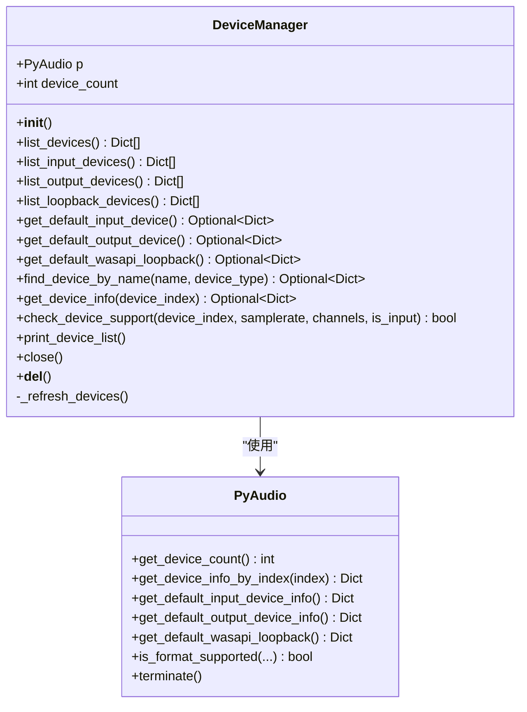
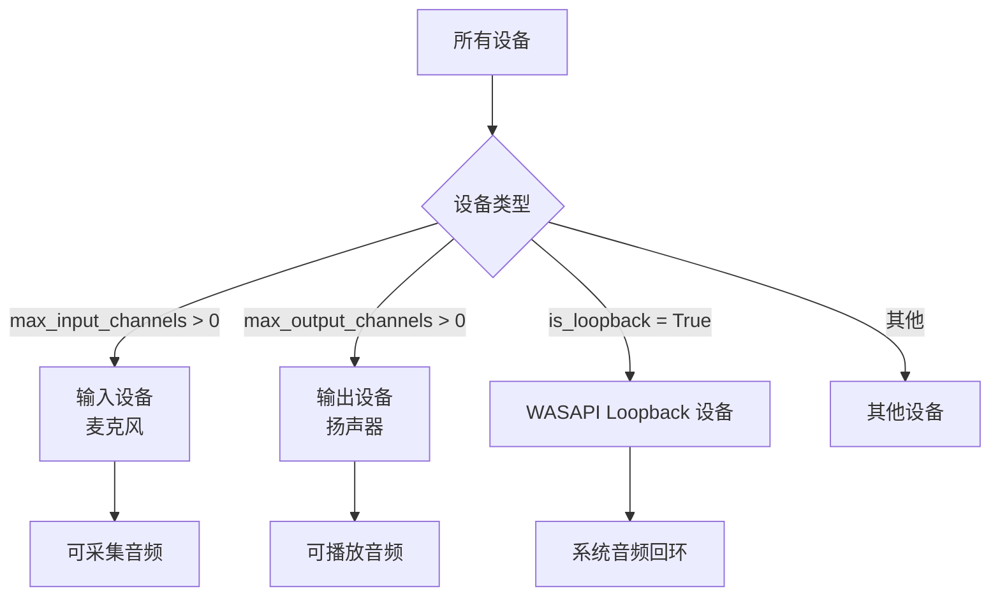
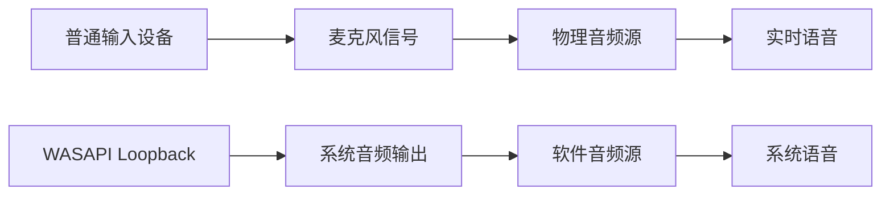
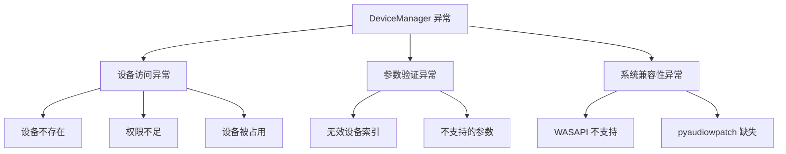

# DeviceManager API 文档

<cite>
**本文档引用的文件**
- [device_manager.py](file://src/audio_capture/device_manager.py)
- [audio_capturer.py](file://src/audio_capture/audio_capturer.py)
- [test_audio_capture.py](file://tests/test_audio_capture.py)
- [__init__.py](file://src/audio_capture/__init__.py)
</cite>

## 目录
1. [简介](#简介)
2. [类概述](#类概述)
3. [核心方法详解](#核心方法详解)
4. [设备信息数据结构](#设备信息数据结构)
5. [WASAPI Loopback 设备特殊性](#wasapi-loopback-设备特殊性)
6. [使用示例](#使用示例)
7. [线程安全注意事项](#线程安全注意事项)
8. [异常处理](#异常处理)
9. [最佳实践](#最佳实践)

## 简介

DeviceManager 类是一个专门用于管理音频设备的工具类，支持 Windows WASAPI Loopback 功能。该类提供了完整的音频设备枚举、查询、验证和配置功能，特别适用于需要捕获系统音频的应用场景，如 VRChat 社交助手中的语音识别和音频处理。

## 类概述



**图表来源**
- [device_manager.py](file://src/audio_capture/device_manager.py#L14-L267)

**章节来源**
- [device_manager.py](file://src/audio_capture/device_manager.py#L1-L267)

## 核心方法详解

### 初始化方法

#### `__init__()`
```python
def __init__(self):
```
- **用途**: 初始化设备管理器实例
- **功能**: 创建 PyAudio 实例并刷新设备列表
- **线程安全**: 是
- **异常处理**: 无显式异常处理，依赖 PyAudio 的内部错误处理

### 设备枚举方法

#### `list_devices()`
```python
def list_devices(self) -> List[Dict]:
```
- **用途**: 列出系统中的所有音频设备
- **参数**: 无
- **返回值**: 包含所有设备信息的字典列表
- **异常情况**: 
  - 设备信息获取失败时记录警告日志
  - 返回空列表表示没有可用设备
- **线程安全**: 是

#### `list_input_devices()`
```python
def list_input_devices(self) -> List[Dict]:
```
- **用途**: 列出所有输入设备（麦克风）
- **参数**: 无
- **返回值**: 包含输入设备信息的字典列表
- **异常情况**: 无
- **线程安全**: 是

#### `list_output_devices()`
```python
def list_output_devices(self) -> List[Dict]:
```
- **用途**: 列出所有输出设备（扬声器）
- **参数**: 无
- **返回值**: 包含输出设备信息的字典列表
- **异常情况**: 无
- **线程安全**: 是

#### `list_loopback_devices()`
```python
def list_loopback_devices(self) -> List[Dict]:
```
- **用途**: 列出所有 WASAPI Loopback 设备
- **参数**: 无
- **返回值**: 包含 Loopback 设备信息的字典列表
- **异常情况**: 无
- **线程安全**: 是

### 默认设备获取方法

#### `get_default_input_device()`
```python
def get_default_input_device(self) -> Optional[Dict]:
```
- **用途**: 获取系统的默认输入设备
- **参数**: 无
- **返回值**: 默认输入设备信息字典或 None
- **异常情况**: 
  - 获取默认设备失败时记录错误日志
  - 返回 None 表示没有默认输入设备
- **线程安全**: 是

#### `get_default_output_device()`
```python
def get_default_output_device(self) -> Optional[Dict]:
```
- **用途**: 获取系统的默认输出设备
- **参数**: 无
- **返回值**: 默认输出设备信息字典或 None
- **异常情况**: 
  - 获取默认设备失败时记录错误日志
  - 返回 None 表示没有默认输出设备
- **线程安全**: 是

#### `get_default_wasapi_loopback()`
```python
def get_default_wasapi_loopback(self) -> Optional[Dict]:
```
- **用途**: 获取默认 WASAPI Loopback 设备
- **参数**: 无
- **返回值**: 默认 Loopback 设备信息字典或 None
- **异常情况**: 
  - 主要方法失败时记录警告日志
  - 备用方案：返回第一个可用的 Loopback 设备
  - 返回 None 表示没有可用的 Loopback 设备
- **线程安全**: 是

### 设备查询方法

#### `find_device_by_name()`
```python
def find_device_by_name(self, name: str, device_type: str = 'all') -> Optional[Dict]:
```
- **用途**: 根据设备名称查找设备
- **参数**:
  - `name`: 设备名称（支持部分匹配）
  - `device_type`: 设备类型 ('input', 'output', 'loopback', 'all')
- **返回值**: 匹配的设备信息字典或 None
- **异常情况**: 
  - 未找到匹配设备时返回 None
  - 参数验证失败时抛出 ValueError
- **线程安全**: 是

#### `get_device_info()`
```python
def get_device_info(self, device_index: int) -> Optional[Dict]:
```
- **用途**: 获取指定索引的设备详细信息
- **参数**: `device_index`: 设备索引
- **返回值**: 设备信息字典或 None
- **异常情况**:
  - 索引无效时记录错误日志
  - 返回 None 表示设备不存在或无法访问
- **线程安全**: 是

### 设备支持验证方法

#### `check_device_support()`
```python
def check_device_support(self, device_index: int, samplerate: int, 
                        channels: int, is_input: bool = True) -> bool:
```
- **用途**: 检查设备是否支持指定的音频参数
- **参数**:
  - `device_index`: 设备索引
  - `samplerate`: 采样率
  - `channels`: 声道数
  - `is_input`: 是否为输入设备（默认 True）
- **返回值**: 布尔值，表示设备是否支持指定参数
- **异常情况**:
  - 参数不支持时记录警告日志
  - 返回 False 表示设备不支持指定参数
- **线程安全**: 是

### 辅助方法

#### `print_device_list()`
```python
def print_device_list(self):
```
- **用途**: 打印所有设备信息（用于调试）
- **参数**: 无
- **返回值**: 无
- **异常情况**: 无
- **线程安全**: 是

#### `close()`
```python
def close(self):
```
- **用途**: 关闭设备管理器，释放资源
- **参数**: 无
- **返回值**: 无
- **异常情况**: 无
- **线程安全**: 是

**章节来源**
- [device_manager.py](file://src/audio_capture/device_manager.py#L17-L267)

## 设备信息数据结构

### 设备信息字典结构

每个设备信息都包含以下字段：

| 字段名 | 类型 | 描述 | 示例值 |
|--------|------|------|--------|
| `index` | int | 设备索引 | 0, 1, 2 |
| `name` | str | 设备名称 | "Microphone (Realtek High Definition Audio)" |
| `max_input_channels` | int | 最大输入声道数 | 2 |
| `max_output_channels` | int | 最大输出声道数 | 2 |
| `default_samplerate` | int | 默认采样率 | 48000 |
| `hostapi` | int | Host API 类型 | 0 |
| `hostapi_name` | str | Host API 名称 | "DirectSound" |
| `is_loopback` | bool | 是否为 Loopback 设备 | True/False |

### 设备类型分类



**图表来源**
- [device_manager.py](file://src/audio_capture/device_manager.py#L27-L83)

**章节来源**
- [device_manager.py](file://src/audio_capture/device_manager.py#L38-L47)

## WASAPI Loopback 设备特殊性

### WASAPI Loopback 简介

WASAPI Loopback 是 Windows 特有的音频技术，允许应用程序捕获系统播放的音频内容。这是 VRChat 社交助手的核心功能之一，使应用能够实时捕获游戏中的语音对话。

### 技术特性

1. **系统级音频捕获**: 不需要物理麦克风，直接捕获系统音频输出
2. **低延迟**: WASAPI 提供低延迟的音频访问
3. **多声道支持**: 通常支持立体声（2声道）捕获
4. **自动创建**: pyaudiowpatch 库会自动为每个输出设备创建对应的 Loopback 设备

### 使用场景

- **VRChat 语音识别**: 捕获玩家在游戏中说的话
- **游戏音频监控**: 监控游戏中的重要音频事件
- **语音转文字**: 实时将语音转换为文本
- **音频分析**: 分析游戏音频内容

### 配置要求

- **操作系统**: Windows 7 及以上版本
- **驱动程序**: 需要支持 WASAPI 的音频驱动
- **库依赖**: pyaudiowpatch 库
- **权限**: 通常不需要特殊权限，但可能需要管理员权限某些情况下

### 与普通设备的区别



**图表来源**
- [audio_capturer.py](file://src/audio_capture/audio_capturer.py#L163-L186)

**章节来源**
- [device_manager.py](file://src/audio_capture/device_manager.py#L70-L83)
- [audio_capturer.py](file://src/audio_capture/audio_capturer.py#L163-L186)

## 使用示例

### 基本设备枚举

以下是典型的设备枚举和查询序列：

```python
# 创建设备管理器
manager = DeviceManager()

# 枚举所有设备
all_devices = manager.list_devices()
print(f"发现 {len(all_devices)} 个设备")

# 查看输入设备
input_devices = manager.list_input_devices()
print(f"麦克风设备数量: {len(input_devices)}")

# 查看输出设备  
output_devices = manager.list_output_devices()
print(f"扬声器设备数量: {len(output_devices)}")

# 查看 WASAPI Loopback 设备
loopback_devices = manager.list_loopback_devices()
print(f"WASAPI Loopback 设备数量: {len(loopback_devices)}")

# 获取默认设备
default_input = manager.get_default_input_device()
default_output = manager.get_default_output_device()
default_loopback = manager.get_default_wasapi_loopback()

# 打印设备列表（调试用）
manager.print_device_list()
```

### 设备查找和验证

```python
# 根据名称查找设备
device_name = "Realtek High Definition Audio"
device = manager.find_device_by_name(device_name, device_type='input')
if device:
    print(f"找到设备: {device['name']} (索引: {device['index']})")
else:
    print("未找到指定设备")

# 检查设备支持的参数
device_index = 0
supported = manager.check_device_support(
    device_index=device_index,
    samplerate=16000,
    channels=1,
    is_input=True
)
if supported:
    print("设备支持指定参数")
else:
    print("设备不支持指定参数")
```

### 获取默认 WASAPI Loopback 设备

```python
# 获取默认 WASAPI Loopback 设备
default_loopback = manager.get_default_wasapi_loopback()
if default_loopback:
    print(f"默认 WASAPI Loopback 设备:")
    print(f"  索引: {default_loopback['index']}")
    print(f"  名称: {default_loopback['name']}")
    print(f"  采样率: {default_loopback['default_samplerate']}Hz")
    print(f"  声道数: {default_loopback['max_input_channels']}")
else:
    print("未检测到 WASAPI Loopback 设备")
    print("请确保系统支持 WASAPI 且 pyaudiowpatch 已正确安装")
```

### 错误处理和备用方案

```python
# 安全的设备获取方式
def get_safe_loopback_device(manager):
    try:
        # 尝试获取默认 WASAPI Loopback
        default_loopback = manager.get_default_wasapi_loopback()
        if default_loopback:
            return default_loopback
        
        # 备用方案：获取第一个可用的 Loopback 设备
        loopback_devices = manager.list_loopback_devices()
        if loopback_devices:
            return loopback_devices[0]
        
        # 最终备用方案：获取第一个输入设备
        input_devices = manager.list_input_devices()
        if input_devices:
            return input_devices[0]
            
        return None
    except Exception as e:
        logger.error(f"获取设备失败: {e}")
        return None
```

### 完整的设备管理流程

```python
def manage_audio_devices():
    """完整的音频设备管理流程"""
    try:
        # 初始化设备管理器
        manager = DeviceManager()
        
        # 打印设备列表
        print("=== 音频设备列表 ===")
        manager.print_device_list()
        
        # 检查 WASAPI Loopback 支持
        loopback_devices = manager.list_loopback_devices()
        if not loopback_devices:
            print("⚠️  警告: 未检测到 WASAPI Loopback 设备")
            print("   这可能影响系统音频捕获功能")
        
        # 获取默认设备
        default_input = manager.get_default_input_device()
        default_output = manager.get_default_output_device()
        default_loopback = manager.get_default_wasapi_loopback()
        
        # 显示默认设备
        print("\n=== 默认设备 ===")
        if default_input:
            print(f"默认输入设备: {default_input['name']}")
        if default_output:
            print(f"默认输出设备: {default_output['name']}")
        if default_loopback:
            print(f"默认 WASAPI Loopback: {default_loopback['name']}")
        
        return manager
        
    except Exception as e:
        print(f"设备管理器初始化失败: {e}")
        return None
```

**章节来源**
- [test_audio_capture.py](file://tests/test_audio_capture.py#L46-L55)
- [test_audio_capture.py](file://tests/test_audio_capture.py#L73-L102)

## 线程安全注意事项

### 当前实现的安全性

DeviceManager 类在设计上具有良好的线程安全性：

1. **PyAudio 实例**: PyAudio 本身不是线程安全的，但 DeviceManager 通过单例模式确保只有一个实例
2. **设备信息缓存**: 设备信息在初始化时缓存，避免频繁的系统调用
3. **异常隔离**: 每个方法都有独立的异常处理，不会相互影响

### 推荐的使用模式

```python
# 推荐：单例模式使用
device_manager = DeviceManager()

# 在多个线程中安全使用
def thread_safe_device_access():
    # 每个线程可以独立调用方法
    input_devices = device_manager.list_input_devices()
    return input_devices

# 正确：在主线程中管理生命周期
try:
    manager = DeviceManager()
    # 使用设备管理器...
finally:
    manager.close()  # 确保资源释放
```

### 注意事项

1. **避免多实例**: 不要在不同线程中创建多个 DeviceManager 实例
2. **资源管理**: 始终调用 `close()` 方法释放资源
3. **异常处理**: 在多线程环境中添加适当的异常处理
4. **设备状态**: 设备状态可能会在运行时变化，建议定期重新枚举

## 异常处理

### 常见异常类型



### 异常处理策略

#### 1. 设备访问异常
```python
def safe_get_device_info(manager, device_index):
    try:
        return manager.get_device_info(device_index)
    except Exception as e:
        logger.error(f"获取设备 {device_index} 信息失败: {e}")
        return None
```

#### 2. 参数验证异常
```python
def safe_check_device_support(manager, device_index, samplerate, channels):
    try:
        return manager.check_device_support(
            device_index=device_index,
            samplerate=samplerate,
            channels=channels
        )
    except Exception as e:
        logger.warning(f"设备 {device_index} 参数验证失败: {e}")
        return False
```

#### 3. 系统兼容性异常
```python
def detect_wasapi_support(manager):
    try:
        # 尝试获取 WASAPI Loopback 设备
        loopback = manager.get_default_wasapi_loopback()
        return loopback is not None
    except ImportError:
        logger.error("pyaudiowpatch 库未安装")
        return False
    except Exception as e:
        logger.error(f"WASAPI 支持检测失败: {e}")
        return False
```

### 错误恢复机制

```python
class RobustDeviceManager(DeviceManager):
    """增强错误处理能力的设备管理器"""
    
    def get_default_wasapi_loopback(self):
        try:
            return super().get_default_wasapi_loopback()
        except Exception as e:
            logger.warning(f"主要 WASAPI 获取失败: {e}")
            # 尝试重新初始化
            try:
                self.close()
                self.__init__()
                return super().get_default_wasapi_loopback()
            except Exception as e2:
                logger.error(f"重试失败: {e2}")
                # 返回第一个可用的 Loopback 设备
                loopback_devices = self.list_loopback_devices()
                return loopback_devices[0] if loopback_devices else None
```

**章节来源**
- [device_manager.py](file://src/audio_capture/device_manager.py#L48-L50)
- [device_manager.py](file://src/audio_capture/device_manager.py#L185-L186)
- [device_manager.py](file://src/audio_capture/device_manager.py#L219-L221)

## 最佳实践

### 1. 设备管理最佳实践

#### 资源管理
```python
# 推荐的资源管理模式
with DeviceManager() as manager:
    # 使用设备管理器
    devices = manager.list_devices()
    # 自动资源释放
```

#### 设备状态监控
```python
class DeviceMonitor:
    """设备状态监控器"""
    
    def __init__(self):
        self.manager = DeviceManager()
        self.last_device_count = 0
    
    def check_device_changes(self):
        """检查设备状态变化"""
        current_count = self.manager.device_count
        if current_count != self.last_device_count:
            self.last_device_count = current_count
            logger.info(f"设备数量变化: {current_count}")
            return True
        return False
```

### 2. 性能优化建议

#### 缓存设备信息
```python
class CachedDeviceManager(DeviceManager):
    """带缓存的设备管理器"""
    
    def __init__(self):
        super().__init__()
        self._cached_devices = None
        self._last_refresh_time = 0
    
    def list_devices(self):
        current_time = time.time()
        if self._cached_devices is None or (current_time - self._last_refresh_time) > 60:
            self._cached_devices = super().list_devices()
            self._last_refresh_time = current_time
        return self._cached_devices
```

#### 批量操作优化
```python
def optimize_device_operations(manager):
    """批量优化设备操作"""
    # 预先获取所有设备信息
    all_devices = manager.list_devices()
    
    # 批量检查支持性
    supported_devices = []
    for device in all_devices:
        if manager.check_device_support(
            device['index'], 16000, 1, True
        ):
            supported_devices.append(device)
    
    return supported_devices
```

### 3. 用户体验优化

#### 设备选择界面
```python
def interactive_device_selection(manager):
    """交互式设备选择界面"""
    
    print("请选择音频设备:")
    print("1. 默认设备")
    print("2. 手动选择")
    print("3. 自动推荐")
    
    choice = input("选择选项 (1/2/3): ")
    
    if choice == '1':
        return {
            'loopback': manager.get_default_wasapi_loopback(),
            'input': manager.get_default_input_device()
        }
    elif choice == '2':
        # 显示设备列表供手动选择
        return manual_device_selection(manager)
    elif choice == '3':
        return auto_recommend_devices(manager)
```

#### 设备验证流程
```python
def validate_device_setup(manager):
    """设备设置验证流程"""
    
    print("正在验证设备设置...")
    
    # 检查基本设备
    input_device = manager.get_default_input_device()
    output_device = manager.get_default_output_device()
    loopback_device = manager.get_default_wasapi_loopback()
    
    results = {}
    
    # 验证输入设备
    if input_device:
        supported = manager.check_device_support(
            input_device['index'], 16000, 1, True
        )
        results['input'] = {'device': input_device, 'supported': supported}
    else:
        results['input'] = {'error': '未检测到输入设备'}
    
    # 验证输出设备
    if output_device:
        results['output'] = {'device': output_device, 'supported': True}
    else:
        results['output'] = {'error': '未检测到输出设备'}
    
    # 验证 Loopback 设备
    if loopback_device:
        supported = manager.check_device_support(
            loopback_device['index'], 16000, 2, True
        )
        results['loopback'] = {'device': loopback_device, 'supported': supported}
    else:
        results['loopback'] = {'error': '未检测到 WASAPI Loopback 设备'}
    
    return results
```

### 4. 调试和诊断

#### 设备诊断工具
```python
def diagnose_audio_devices(manager):
    """音频设备诊断工具"""
    
    print("=== 音频设备诊断报告 ===")
    
    # 设备总数
    total_devices = manager.device_count
    print(f"总设备数量: {total_devices}")
    
    # 设备类型分布
    input_count = len(manager.list_input_devices())
    output_count = len(manager.list_output_devices())
    loopback_count = len(manager.list_loopback_devices())
    
    print(f"输入设备: {input_count}")
    print(f"输出设备: {output_count}")
    print(f"WASAPI Loopback 设备: {loopback_count}")
    
    # 默认设备状态
    default_input = manager.get_default_input_device()
    default_output = manager.get_default_output_device()
    default_loopback = manager.get_default_wasapi_loopback()
    
    print("\n默认设备:")
    print(f"默认输入: {'✓' if default_input else '✗'}")
    print(f"默认输出: {'✓' if default_output else '✗'}")
    print(f"默认 Loopback: {'✓' if default_loopback else '✗'}")
    
    # WASAPI 支持检测
    try:
        loopback = manager.get_default_wasapi_loopback()
        if loopback:
            print(f"\nWASAPI Loopback 设备: {loopback['name']}")
            print(f"采样率: {loopback['default_samplerate']}Hz")
            print(f"声道数: {loopback['max_input_channels']}")
        else:
            print("\n⚠️  未检测到 WASAPI Loopback 设备")
    except Exception as e:
        print(f"\n❌ WASAPI 支持检测失败: {e}")
```

这些最佳实践可以帮助开发者更有效地使用 DeviceManager 类，提高应用程序的稳定性和用户体验。

**章节来源**
- [device_manager.py](file://src/audio_capture/device_manager.py#L223-L256)
- [test_audio_capture.py](file://tests/test_audio_capture.py#L46-L55)