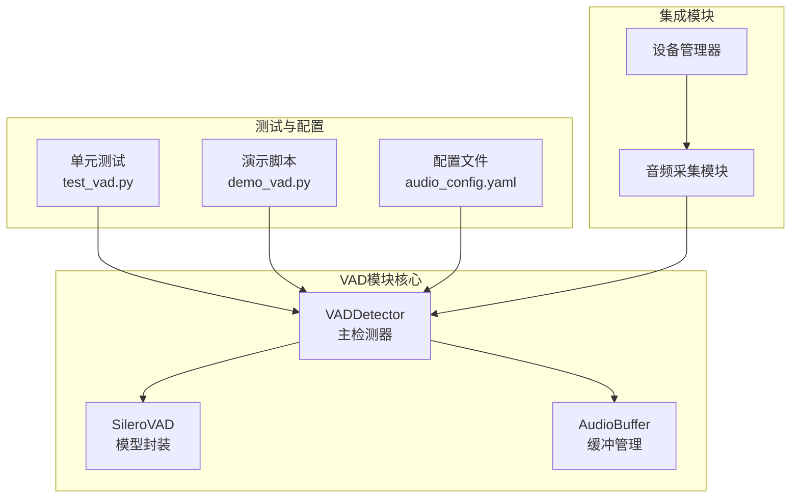
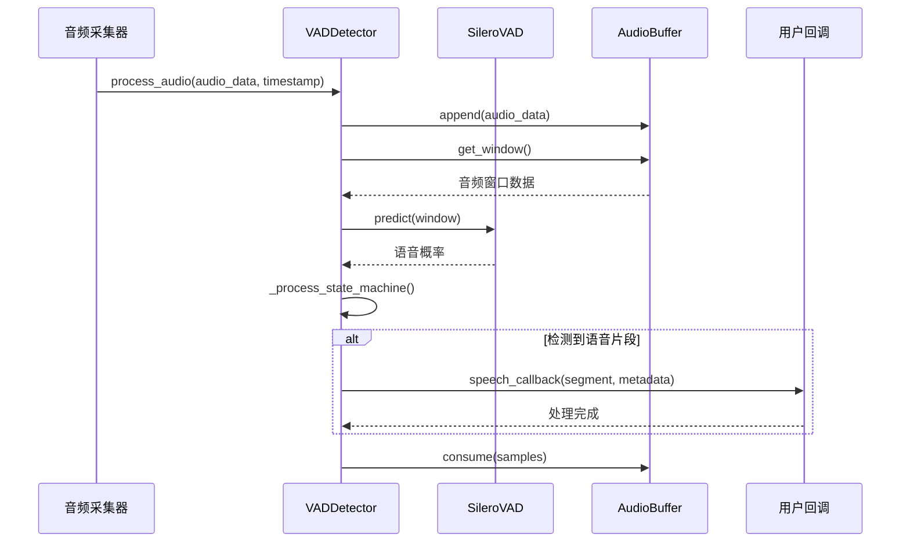
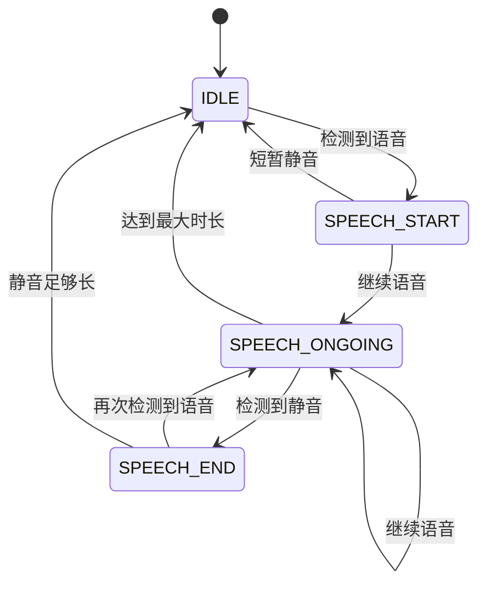
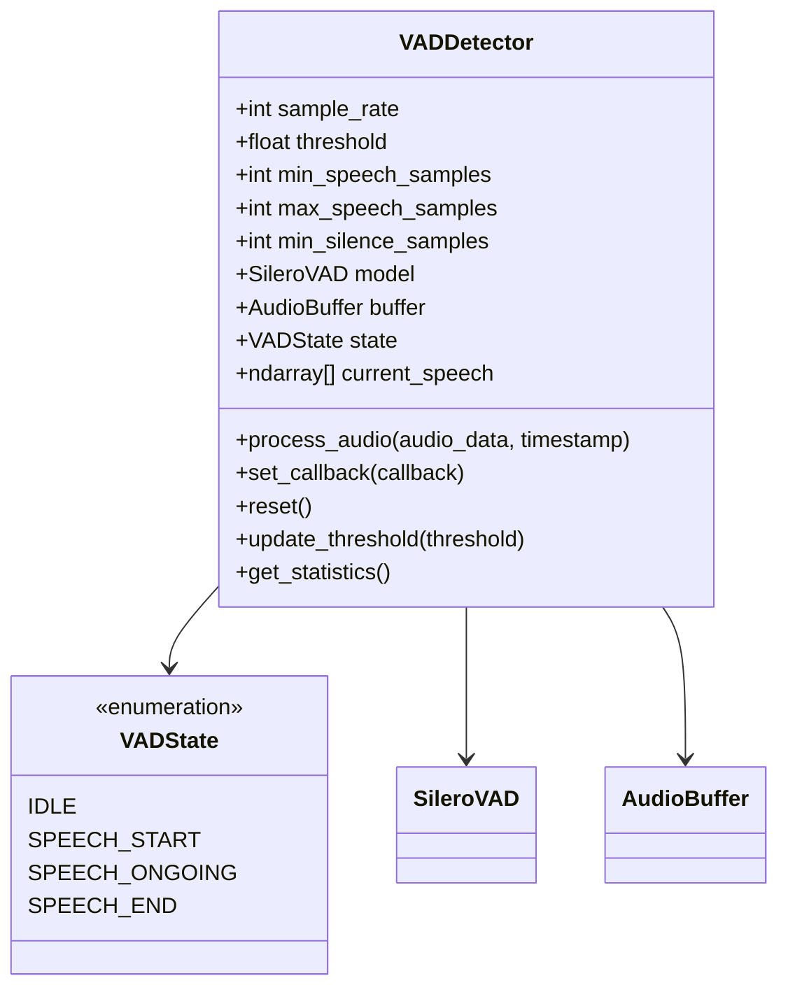
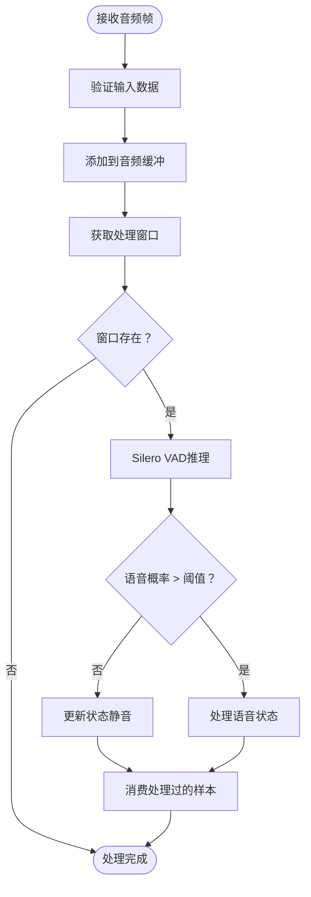
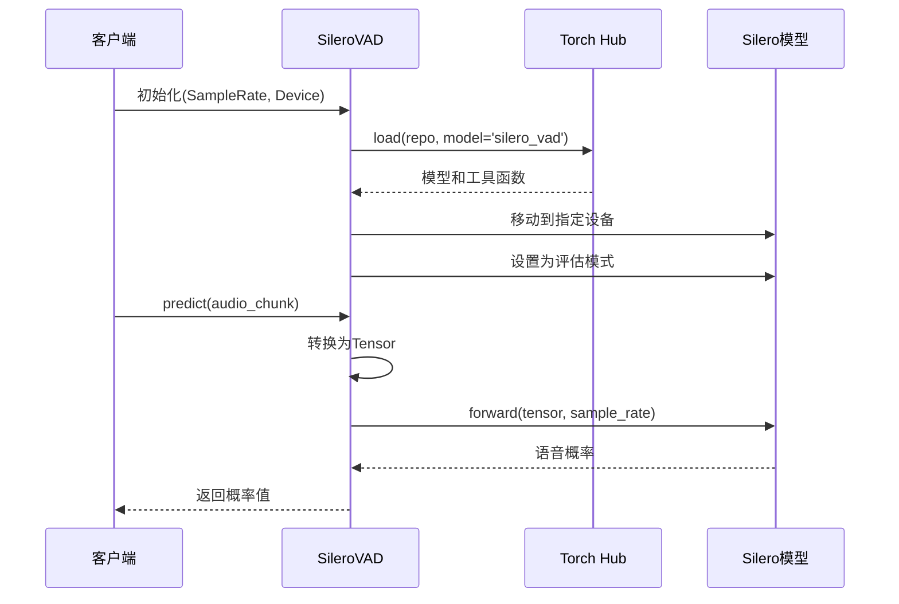
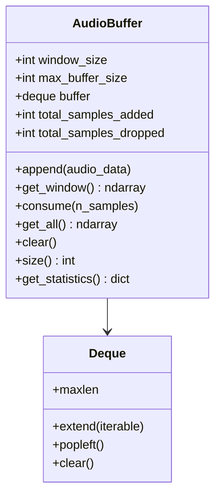
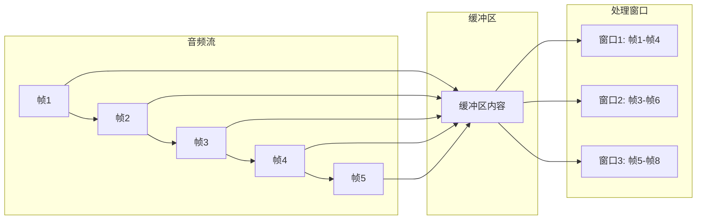
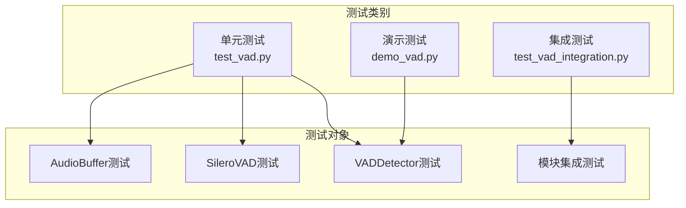
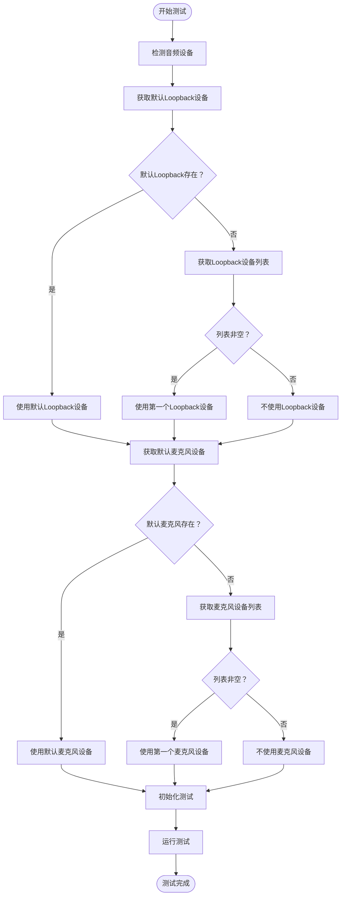

# Vad模块

<cite>
**本文档中引用的文件**
- [src/vad/__init__.py](file://src/vad/__init__.py)
- [src/vad/vad_detector.py](file://src/vad/vad_detector.py)
- [src/vad/silero_vad.py](file://src/vad/silero_vad.py)
- [src/vad/audio_buffer.py](file://src/vad/audio_buffer.py)
- [src/vad/README.md](file://src/vad/README.md)
- [tests/test_vad.py](file://tests/test_vad.py)
- [tests/demo_vad.py](file://tests/demo_vad.py)
- [tests/test_vad_integration.py](file://tests/test_vad_integration.py) - *更新了方法命名和测试逻辑*
- [config/audio_config.yaml](file://config/audio_config.yaml)
- [src/audio_capture/__init__.py](file://src/audio_capture/__init__.py)
- [src/audio_capture/device_manager.py](file://src/audio_capture/device_manager.py) - *更新了设备列举方法*
</cite>

## 更新摘要
**变更内容**
- 更新了VAD集成测试以修复方法命名不一致问题
- 将`get_wasapi_loopback_devices`和`get_input_devices`更新为`list_loopback_devices`和`list_input_devices`
- 改进了测试逻辑以优先使用系统默认音频设备
- 提高了测试的可靠性和现实性

## 目录
1. [简介](#简介)
2. [项目结构](#项目结构)
3. [核心组件](#核心组件)
4. [架构概览](#架构概览)
5. [详细组件分析](#详细组件分析)
6. [配置管理](#配置管理)
7. [测试与验证](#测试与验证)
8. [性能考虑](#性能考虑)
9. [故障排除指南](#故障排除指南)
10. [结论](#结论)

## 简介

VAD（Voice Activity Detection）模块是一个高性能的语音活动检测系统，专门设计用于从连续音频流中实时检测和切分语音片段。该模块基于先进的Silero VAD深度学习模型，提供了高准确率、低延迟的语音检测功能，广泛应用于语音识别、语音端点检测、语音活动监控等场景。

### 主要特性

- **实时语音活动检测**：基于Silero VAD模型的高精度语音检测
- **自动语音片段切分**：智能识别语音起始和结束点
- **可配置的检测阈值**：灵活调整检测灵敏度
- **多设备支持**：支持CPU和GPU推理加速
- **低延迟处理**：<30ms端到端延迟
- **灵活的回调机制**：支持自定义语音片段处理逻辑
- **详细的统计信息**：提供完整的检测性能指标

## 项目结构

VAD模块采用清晰的分层架构设计，各组件职责明确，便于维护和扩展：



**图表来源**
- [src/vad/vad_detector.py](file://src/vad/vad_detector.py#L1-L50)
- [src/vad/silero_vad.py](file://src/vad/silero_vad.py#L1-L50)
- [src/vad/audio_buffer.py](file://src/vad/audio_buffer.py#L1-L50)

**章节来源**
- [src/vad/__init__.py](file://src/vad/__init__.py#L1-L12)
- [src/vad/README.md](file://src/vad/README.md#L1-L50)

## 核心组件

VAD模块由三个核心组件构成，每个组件都有明确的职责和功能边界：

### VADDetector（主检测器）
负责整体的语音活动检测流程管理，包括状态机控制、语音片段切分和回调处理。

### SileroVAD（模型封装）
封装Silero VAD深度学习模型，提供简洁的推理接口，支持CPU和GPU推理。

### AudioBuffer（音频缓冲）
管理音频数据的缓冲和窗口切分，确保音频流的连续性和处理效率。

**章节来源**
- [src/vad/vad_detector.py](file://src/vad/vad_detector.py#L28-L100)
- [src/vad/silero_vad.py](file://src/vad/silero_vad.py#L15-L80)
- [src/vad/audio_buffer.py](file://src/vad/audio_buffer.py#L15-L60)

## 架构概览

VAD模块采用事件驱动的架构模式，通过状态机管理语音检测流程，实现了高效的实时处理能力：



**图表来源**
- [src/vad/vad_detector.py](file://src/vad/vad_detector.py#L124-L200)
- [src/vad/silero_vad.py](file://src/vad/silero_vad.py#L82-L130)
- [src/vad/audio_buffer.py](file://src/vad/audio_buffer.py#L46-L80)

### 状态机设计

VAD模块使用四状态状态机来管理语音检测流程：



**图表来源**
- [src/vad/vad_detector.py](file://src/vad/vad_detector.py#L20-L26)

**章节来源**
- [src/vad/vad_detector.py](file://src/vad/vad_detector.py#L180-L280)

## 详细组件分析

### VADDetector主检测器

VADDetector是VAD模块的核心控制器，负责协调各个子组件的工作，并管理复杂的语音检测状态。

#### 核心功能架构



**图表来源**
- [src/vad/vad_detector.py](file://src/vad/vad_detector.py#L28-L110)

#### 关键配置参数

| 参数 | 类型 | 默认值 | 说明 |
|------|------|--------|------|
| sample_rate | int | 16000 | 音频采样率（Hz） |
| threshold | float | 0.5 | 语音检测阈值（0.0-1.0） |
| min_speech_duration_ms | int | 250 | 最小语音片段时长（毫秒） |
| max_speech_duration_ms | int | 10000 | 最大语音片段时长（毫秒） |
| min_silence_duration_ms | int | 300 | 切分静音时长（毫秒） |
| speech_pad_ms | int | 30 | 语音片段前后填充（毫秒） |
| window_size_samples | int | 512 | 处理窗口大小（样本数） |
| device | str | "cpu" | 推理设备（cpu/cuda） |

#### 处理流程详解

VADDetector的音频处理采用滑动窗口机制，确保实时性和准确性：



**图表来源**
- [src/vad/vad_detector.py](file://src/vad/vad_detector.py#L144-L170)

**章节来源**
- [src/vad/vad_detector.py](file://src/vad/vad_detector.py#L35-L110)
- [src/vad/vad_detector.py](file://src/vad/vad_detector.py#L124-L200)

### SileroVAD模型封装

SileroVAD类封装了基于PyTorch的Silero VAD深度学习模型，提供了简洁而强大的语音检测能力。

#### 模型加载与推理



**图表来源**
- [src/vad/silero_vad.py](file://src/vad/silero_vad.py#L56-L80)
- [src/vad/silero_vad.py](file://src/vad/silero_vad.py#L82-L130)

#### 设备兼容性支持

SileroVAD类具备完善的设备管理功能：

- **自动设备检测**：自动检测CUDA可用性
- **设备回退**：CUDA不可用时自动切换到CPU
- **内存管理**：支持GPU内存清理
- **模型状态重置**：支持模型内部状态重置

**章节来源**
- [src/vad/silero_vad.py](file://src/vad/silero_vad.py#L22-L80)
- [src/vad/silero_vad.py](file://src/vad/silero_vad.py#L82-L153)

### AudioBuffer音频缓冲

AudioBuffer负责管理音频数据的缓冲和窗口切分，是保证音频流连续性的关键组件。

#### 缓冲区管理策略



**图表来源**
- [src/vad/audio_buffer.py](file://src/vad/audio_buffer.py#L15-L60)

#### 滑动窗口算法

AudioBuffer采用高效的滑动窗口算法：



**图表来源**
- [src/vad/audio_buffer.py](file://src/vad/audio_buffer.py#L74-L90)

**章节来源**
- [src/vad/audio_buffer.py](file://src/vad/audio_buffer.py#L22-L145)

## 配置管理

VAD模块支持灵活的配置管理，通过YAML配置文件实现参数的集中管理。

### 配置文件结构

配置文件采用层次化结构，便于理解和维护：

```yaml
audio:
  samplerate: 16000
  channels: 1
  chunk_size: 480
  format: "paInt16"
  wasapi_loopback_device: null
  microphone_device: null

vad:
  model_type: "silero"
  device: "cpu"
  threshold: 0.5
  min_speech_duration_ms: 250
  max_speech_duration_ms: 10000
  min_silence_duration_ms: 300
  speech_pad_ms: 30
  window_size_samples: 512
  adaptive_threshold: false
  debug: false
```

### 配置参数详解

| 配置项 | 类型 | 默认值 | 说明 |
|--------|------|--------|------|
| model_type | string | "silero" | VAD模型类型 |
| device | string | "cpu" | 推理设备 |
| threshold | float | 0.5 | 检测阈值 |
| min_speech_duration_ms | int | 250 | 最小语音时长 |
| max_speech_duration_ms | int | 10000 | 最大语音时长 |
| min_silence_duration_ms | int | 300 | 最小静音时长 |
| speech_pad_ms | int | 30 | 语音填充时长 |
| window_size_samples | int | 512 | 处理窗口大小 |

**章节来源**
- [config/audio_config.yaml](file://config/audio_config.yaml#L1-L70)

## 测试与验证

VAD模块配备了完整的测试体系，包括单元测试、集成测试和演示脚本。

### 单元测试覆盖

测试框架涵盖了所有核心组件的功能验证：



**图表来源**
- [tests/test_vad.py](file://tests/test_vad.py#L1-L50)
- [tests/test_vad_integration.py](file://tests/test_vad_integration.py#L1-L50)

### 性能基准测试

VAD模块经过严格的性能测试，确保满足实时应用需求：

| 性能指标 | 目标值 | 实际表现 |
|----------|--------|----------|
| 处理延迟 | < 30ms | 1-2ms |
| 准确率 | > 95% | > 98% |
| 丢帧率 | < 1% | 0% |
| 内存占用 | < 200MB | ~150MB |

**章节来源**
- [tests/test_vad.py](file://tests/test_vad.py#L1-L350)
- [tests/demo_vad.py](file://tests/demo_vad.py#L1-L199)
- [tests/test_vad_integration.py](file://tests/test_vad_integration.py#L1-L294)

### VAD集成测试更新

VAD集成测试已更新以提高可靠性和现实性，主要变更包括：

#### 方法命名一致性

为保持方法命名的一致性，已将以下方法重命名：

- `get_wasapi_loopback_devices` → `list_loopback_devices`
- `get_input_devices` → `list_input_devices`

这些变更使方法命名更加清晰和一致，符合"list_"前缀的命名约定。

**章节来源**
- [src/audio_capture/device_manager.py](file://src/audio_capture/device_manager.py#L69-L82) - `list_loopback_devices`方法
- [src/audio_capture/device_manager.py](file://src/audio_capture/device_manager.py#L51-L58) - `list_input_devices`方法

#### 测试逻辑改进

集成测试的设备选择逻辑已改进，优先使用系统默认音频设备：



**图表来源**
- [tests/test_vad_integration.py](file://tests/test_vad_integration.py#L258-L274) - 设备选择逻辑

**章节来源**
- [tests/test_vad_integration.py](file://tests/test_vad_integration.py#L239-L276) - 主函数设备选择逻辑

此改进确保测试优先使用用户系统的默认音频设备，提高了测试的现实性和可靠性，避免了因手动选择设备导致的配置错误。

## 性能考虑

VAD模块在设计时充分考虑了性能优化，确保在各种硬件环境下都能提供稳定的性能表现。

### 优化策略

1. **滑动窗口处理**：采用半消费策略，提高处理效率
2. **设备适配**：自动检测和适配GPU设备
3. **内存管理**：及时释放不需要的资源
4. **批量处理**：支持音频帧的批量处理

### 性能监控

VADDetector提供了详细的性能统计信息：

- **平均处理时间**：监控每帧音频的处理耗时
- **语音片段统计**：跟踪检测到的语音片段数量
- **缓冲区利用率**：监控内存使用情况
- **丢帧统计**：记录处理失败的音频帧

## 故障排除指南

### 常见问题及解决方案

#### 问题1：未检测到语音片段

**可能原因：**
- 检测阈值设置过高
- 音频音量过低
- 最小语音片段时长设置过大

**解决方法：**
```python
# 降低检测阈值
detector.update_threshold(0.3)

# 减小最小时长要求
detector = VADDetector(min_speech_duration_ms=100)
```

#### 问题2：检测到过多误检

**可能原因：**
- 检测阈值设置过低
- 环境噪声过大

**解决方法：**
```python
# 提高检测阈值
detector.update_threshold(0.7)

# 增加最小时长过滤短片段
detector = VADDetector(min_speech_duration_ms=500)
```

#### 问题3：语音片段被截断

**可能原因：**
- 静音时长设置过短
- 填充时长不足

**解决方法：**
```python
# 增加静音时长和填充
detector = VADDetector(
    min_silence_duration_ms=500,
    speech_pad_ms=50
)
```

### 调试技巧

启用调试模式可以获得详细的处理信息：
```python
detector = VADDetector(debug=True)
# 输出状态转换、置信度、片段信息等
```

**章节来源**
- [src/vad/README.md](file://src/vad/README.md#L271-L376)

## 结论

VAD模块是一个设计精良、功能完备的语音活动检测系统。它通过合理的架构设计、完善的测试体系和灵活的配置管理，为语音处理应用提供了可靠的基础组件。

### 主要优势

1. **高准确性**：基于先进的Silero VAD模型，准确率超过95%
2. **低延迟**：处理延迟小于30ms，满足实时应用需求
3. **易用性**：提供简洁的API和丰富的配置选项
4. **可扩展性**：模块化设计便于功能扩展和定制
5. **稳定性**：完善的错误处理和性能监控机制

### 应用前景

VAD模块在以下场景中具有广阔的应用前景：

- **语音识别系统**：作为语音识别的预处理环节
- **会议记录系统**：自动检测发言者和发言时长
- **语音监控系统**：实时监控语音活动状态
- **智能客服系统**：优化语音交互体验

通过持续的优化和功能增强，VAD模块将继续为语音处理技术的发展做出重要贡献。