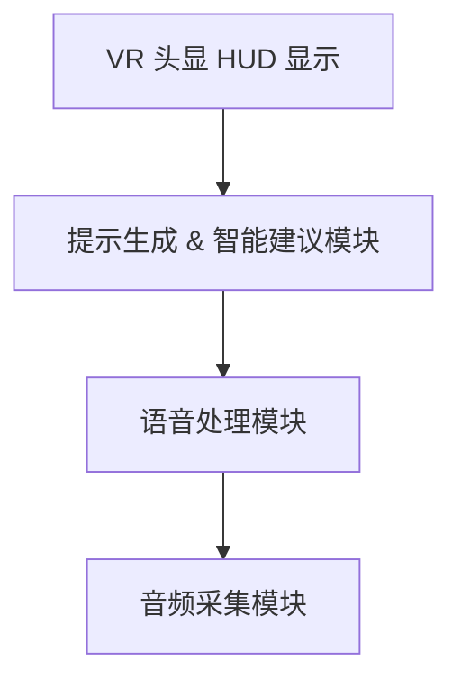
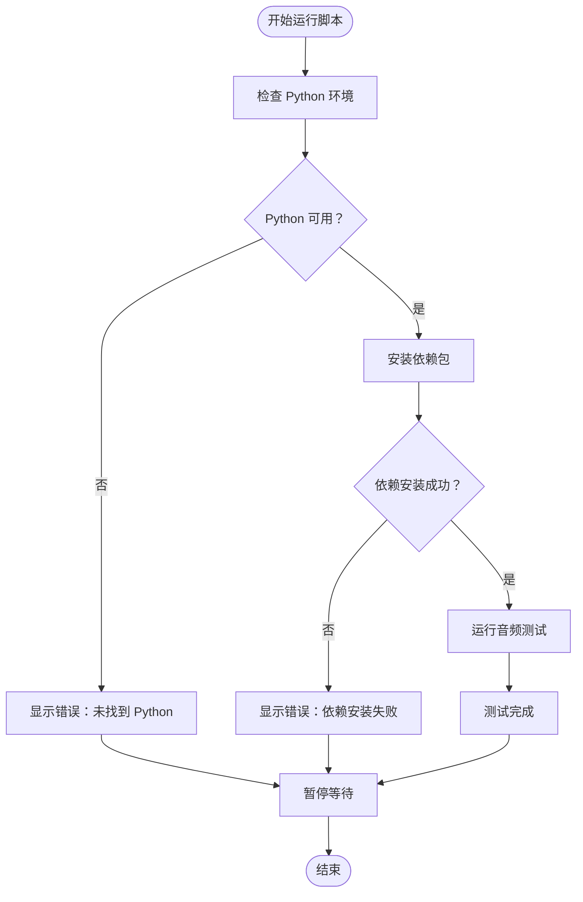
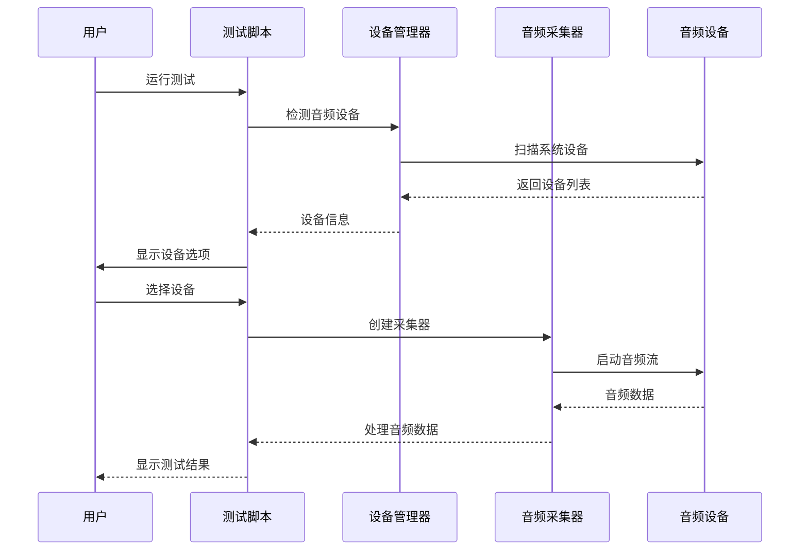
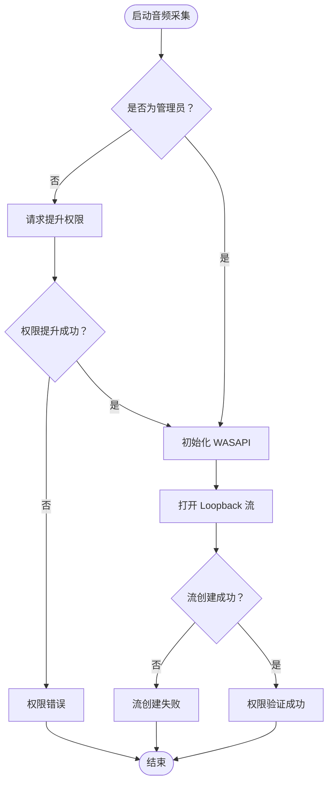
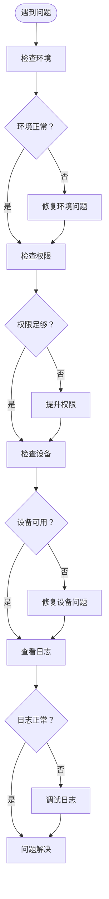

# 快速入门

<cite>
**本文档中引用的文件**
- [setup_and_test.bat](file://setup_and_test.bat)
- [requirements.txt](file://requirements.txt)
- [tests/test_audio_capture.py](file://tests/test_audio_capture.py)
- [src/audio_capture/audio_capturer.py](file://src/audio_capture/audio_capturer.py)
- [src/audio_capture/device_manager.py](file://src/audio_capture/device_manager.py)
- [config/audio_config.yaml](file://config/audio_config.yaml)
- [README.md](file://README.md)
- [doc/架构设计.md](file://doc/架构设计.md)
- [src/memory/README.md](file://src/memory/README.md)
</cite>

## 目录
1. [项目简介](#项目简介)
2. [环境准备](#环境准备)
3. [一键安装脚本](#一键安装脚本)
4. [首次运行指南](#首次运行指南)
5. [音频采集测试](#音频采集测试)
6. [测试输出解析](#测试输出解析)
7. [常见问题排查](#常见问题排查)
8. [权限要求详解](#权限要求详解)
9. [故障排除指南](#故障排除指南)
10. [总结](#总结)

## 项目简介

VRChat 社交助手是一个基于 AI 的 VRChat 社交辅助系统，通过实时语音识别、声纹识别和大语言模型，为用户提供智能社交提示。系统采用非侵入式设计，仅在用户头显中展示辅助信息，不修改 VRChat 客户端或影响其他玩家体验。

### 核心特性
- 🎤 **实时音频采集**：支持 WASAPI Loopback 采集系统音频和麦克风输入
- 🗣️ **语音活动检测（VAD）**：基于 Silero 模型的实时语音片段检测
- 👤 **说话人识别**：通过声纹识别区分不同说话人
- 📝 **语音转文本（STT）**：实时语音识别，支持中英文混合
- 🧠 **智能对话辅助**：基于 LLM 的上下文理解和建议生成
- 💾 **记忆管理**：RAG 向量检索，记住好友信息和对话历史
- 🥽 **VR 显示**：基于 OpenXR 的头显 HUD 提示展示

### 技术架构


**图表来源**
- [README.md](file://README.md#L35-L57)

#### 系统架构图
```
┌─────────────────────────────────────────────────────────┐
│                    VR 头显 HUD 显示                      │
└─────────────────────────────────────────────────────────┘
                            ▲
                            │
┌─────────────────────────────────────────────────────────┐
│              提示生成 & 智能建议模块                      │
│  - LLM推理引擎  - 记忆检索  - 提示格式化                 │
└─────────────────────────────────────────────────────────┘
                            ▲
                            │
┌─────────────────────────────────────────────────────────┐
│                   语音处理模块                           │
│  - VAD检测  - 说话人识别  - 流式STT                      │
└─────────────────────────────────────────────────────────┘
                            ▲
                            │
┌─────────────────────────────────────────────────────────┐
│                   音频采集模块                           │
│  - WASAPI Loopback  - 麦克风输入  - 音频预处理           │
└─────────────────────────────────────────────────────────┘
```

**图表来源**
- [README.md](file://README.md#L35-L57)

#### 数据流向
1. **音频采集** → 系统回环抓取 VRChat 扬声器输出 + 本地麦克风输入
2. **VAD 检测** → 切分连续语音流为 0.5-1 秒语音片段
3. **说话人识别** → 对每个语音片段提取声纹嵌入，与已注册好友对比
4. **流式 STT** → 通过门控的语音片段进行实时语音转文本
5. **会话理解** → 分析识别文本，提取事件、情绪、话题变化
6. **记忆检索** → 根据当前上下文从向量库检索相关好友信息
7. **LLM 推理** → 结合上下文与记忆生成结构化社交建议
8. **提示生成** → 根据优先级、安全策略格式化建议
9. **VR 展示** → 在头显 Overlay 中显示提示文本

**图表来源**
- [doc/架构设计.md](file://doc/架构设计.md#L71-L81)

## 环境准备

### 系统要求
- **操作系统**：Windows 10/11（WASAPI 特性支持）
- **Python 版本**：Python 3.8+（推荐 3.10+）
- **管理员权限**：首次运行需要管理员权限
- **音频驱动**：完整的音频驱动程序
- **GPU 支持**：支持 CUDA 的 GPU（可选，用于加速）

### 必需软件
1. **Python 3.8+**：从 python.org 下载最新稳定版本
2. **Visual C++ Redistributable**：某些依赖库需要此组件
3. **音频设备**：至少一个可用的音频输入/输出设备

### 技术选型
| 组件 | 技术选型 | 说明 |
|------|---------|------|
| 音频处理 | PyAudio + pyaudiowpatch | WASAPI Loopback 支持 |
| 语音检测 | Silero VAD | 轻量级、高精度 VAD 模型 |
| 语音识别 | faster-whisper | 本地部署的高效 STT |
| 声纹识别 | pyannote.audio | ECAPA-TDNN 声纹模型 |
| 向量数据库 | Chroma | 记忆存储和检索 |
| 大语言模型 | OpenAI API / 本地模型 | 对话理解和建议生成 |
| VR 渲染 | OpenXR + pyopenvr | 跨平台 VR 显示 |

**章节来源**
- [README.md](file://README.md#L23-L31)

## 一键安装脚本

项目提供了 `setup_and_test.bat` 批处理脚本，实现一键环境配置和测试：



**图表来源**
- [setup_and_test.bat](file://setup_and_test.bat#L1-L34)

### 脚本执行流程

1. **环境检查阶段**（第8-14行）
   - 验证 Python 是否已安装
   - 检查 Python 版本是否符合要求
   - 如未找到 Python，显示错误信息并退出

2. **依赖安装阶段**（第17-23行）
   - 自动安装 `requirements.txt` 中列出的依赖包
   - 包含：pyaudiowpatch、numpy、scipy
   - 如安装失败，显示错误信息并退出

3. **测试执行阶段**（第26-28行）
   - 运行音频采集测试脚本
   - 自动检测和配置音频设备
   - 显示测试结果和统计信息

**章节来源**
- [setup_and_test.bat](file://setup_and_test.bat#L1-L34)
- [requirements.txt](file://requirements.txt#L1-L4)

## 首次运行指南

### 步骤1：以管理员身份运行

1. **右键点击** `setup_and_test.bat`
2. 选择 **"以管理员身份运行"**
3. 确保脚本具有足够的权限访问系统音频设备

### 步骤2：等待脚本执行

脚本执行过程中会显示以下信息：
- Python 环境检查
- 依赖包安装进度
- 音频设备检测
- 测试执行状态

### 步骤3：观察控制台输出

重点关注以下关键信息：
- 设备列表显示
- 测试开始提示
- 成功/失败状态
- 统计信息输出

**章节来源**
- [setup_and_test.bat](file://setup_and_test.bat#L1-L34)

## 音频采集测试

### 测试脚本功能

测试脚本 `test_audio_capture.py` 提供了完整的音频采集功能验证：



**图表来源**
- [tests/test_audio_capture.py](file://tests/test_audio_capture.py#L193-L213)
- [src/audio_capture/device_manager.py](file://src/audio_capture/device_manager.py#L14-L21)
- [src/audio_capture/audio_capturer.py](file://src/audio_capture/audio_capturer.py#L19-L80)

### 设备选择流程

1. **设备列表显示**
   - 显示所有可用的音频设备
   - 区分输入设备（麦克风）和输出设备（扬声器）
   - 标识 WASAPI Loopback 设备

2. **设备选择界面**
   ```
   请选择要使用的设备：
   
   WASAPI Loopback 设备（系统音频）：
     1. [0] 音频适配器 (Realtek High Definition Audio)
   
   麦克风设备：
     1. [1] 麦克风 (Realtek High Definition Audio)
   
   选择 WASAPI Loopback 设备 (1-1, 默认 1, 或按回车跳过): 
   ```

3. **默认设备推荐**
   - 系统会自动推荐默认设备
   - 按回车可直接使用默认设备
   - 支持手动选择特定设备

### 测试参数配置

根据 `audio_config.yaml` 配置，测试使用以下参数：
- **采样率**：16000 Hz（STT 标准）
- **声道数**：1（单声道）
- **缓冲区大小**：480 样本（30ms @ 16kHz）
- **测试时长**：10 秒

**章节来源**
- [tests/test_audio_capture.py](file://tests/test_audio_capture.py#L58-L208)
- [config/audio_config.yaml](file://config/audio_config.yaml#L1-L32)

## 测试输出解析

### 关键输出信息

测试完成后，脚本会显示详细的统计信息和测试结果：

#### 1. 设备统计信息
```
采集统计信息：
============================
回环音频帧数: 160000
麦克风音频帧数: 16000
回环溢出次数: 0
麦克风溢出次数: 0
回环队列剩余: 0
麦克风队列剩余: 0
```

#### 2. 结果判断
- **成功条件**：至少采集到音频数据（帧数 > 0）
- **失败条件**：未采集到任何音频数据
- **警告情况**：存在溢出但仍有有效数据

#### 3. 日志输出示例
```
[WASAPI Loopback] 时间: 1.000, 音量: 0.0500, 样本数: 480
[麦克风] 时间: 1.000, 音量: 0.0200, 样本数: 480
```

### 输出信息含义

| 字段 | 含义 | 正常范围 |
|------|------|----------|
| 回环音频帧数 | 系统音频采集的总帧数 | > 0（取决于测试时长） |
| 麦克风音频帧数 | 麦克风采集的总帧数 | > 0（取决于测试时长） |
| 回环溢出次数 | 系统音频缓冲区溢出次数 | 0（理想状态） |
| 麦克风溢出次数 | 麦克风缓冲区溢出次数 | 0（理想状态） |
| 音量值 | 当前音频的 RMS 值 | 0.01-0.5（正常人声范围） |

**章节来源**
- [tests/test_audio_capture.py](file://tests/test_audio_capture.py#L169-L184)

## 常见问题排查

### 问题1：音频设备未识别

#### 症状
```
⚠️  未检测到 WASAPI Loopback 设备
请确保您的系统支持 WASAPI，且 pyaudiowpatch 库已正确安装
```

#### 解决方案
1. **检查音频驱动**
   - 更新声卡驱动程序
   - 确认音频设备正常工作

2. **验证 WASAPI 支持**
   - Windows 10/11 应该原生支持 WASAPI
   - 检查音频设置中的 WASAPI 选项

3. **重新安装依赖**
   ```bash
   pip uninstall pyaudiowpatch
   pip install pyaudiowpatch>=0.2.12.5
   ```

### 问题2：权限错误

#### 症状
```
Permission denied: Access is denied
```

#### 解决方案
1. **以管理员身份运行**
   - 右键点击 `setup_and_test.bat`
   - 选择 "以管理员身份运行"

2. **检查防病毒软件**
   - 暂时禁用实时保护
   - 将项目目录添加到白名单

3. **系统权限设置**
   - 确保当前用户有音频设备访问权限
   - 检查组策略设置

### 问题3：音频设备冲突

#### 症状
```
Error: Device busy or already in use
```

#### 解决方案
1. **关闭其他音频应用**
   - 关闭正在使用音频设备的其他程序
   - 包括浏览器、音乐播放器等

2. **重启音频服务**
   ```cmd
   net stop audiosrv
   net start audiosrv
   ```

3. **更换设备**
   - 尝试选择不同的音频设备
   - 使用不同的输入/输出设备组合

### 问题4：测试无音频输出

#### 症状
```
⚠️  未采集到音频数据，请检查设备设置
```

#### 解决方案
1. **播放测试音频**
   - 在测试期间播放音频（音乐、视频、VRChat 语音）
   - 确保音频设备有实际输出

2. **检查设备连接**
   - 确认音频设备物理连接正常
   - 检查音量设置

3. **调整测试参数**
   - 增加测试时长
   - 调整音量阈值

**章节来源**
- [tests/test_audio_capture.py](file://tests/test_audio_capture.py#L99-L102)
- [src/audio_capture/audio_capturer.py](file://src/audio_capture/audio_capturer.py#L184-L186)

## 权限要求详解

### WASAPI Loopback 权限

WASAPI Loopback 是 Windows 特有的音频技术，需要特殊权限才能访问系统音频输出：

#### 1. 管理员权限必要性
- **系统级访问**：WASAPI Loopback 需要访问系统音频流
- **安全限制**：防止恶意软件窃听系统音频
- **驱动程序限制**：某些音频驱动需要管理员权限

#### 2. 权限检查机制


**图表来源**
- [src/audio_capture/audio_capturer.py](file://src/audio_capture/audio_capturer.py#L162-L186)

#### 3. 权限提升方法
1. **右键菜单方式**
   - 右键点击 `setup_and_test.bat`
   - 选择 "以管理员身份运行"

2. **快捷方式方式**
   - 创建批处理文件的快捷方式
   - 右键属性，选择 "以管理员身份运行"

3. **命令行方式**
   ```cmd
   powershell -Command "Start-Process 'setup_and_test.bat' -Verb RunAs"
   ```

### 其他权限考虑

#### 1. 防火墙设置
- 确保 Python 和相关库的网络访问权限
- 某些依赖可能需要下载更新

#### 2. 驱动程序权限
- 音频驱动程序可能需要特殊权限
- 某些专业音频设备需要专用驱动

#### 3. 系统策略限制
- 企业环境可能有额外的安全策略
- 可能需要联系 IT 管理员

**章节来源**
- [setup_and_test.bat](file://setup_and_test.bat#L8-L14)
- [src/audio_capture/audio_capturer.py](file://src/audio_capture/audio_capturer.py#L162-L186)

## 故障排除指南

### 系统化排查流程



### 详细排查步骤

#### 第一步：环境验证
1. **Python 版本检查**
   ```cmd
   python --version
   ```
   - 确保版本 >= 3.10
   - 检查 PATH 环境变量

2. **依赖完整性检查**
   ```cmd
   pip list | findstr pyaudiowpatch
   pip list | findstr numpy
   pip list | findstr scipy
   ```

#### 第二步：权限验证
1. **管理员权限测试**
   ```cmd
   whoami /priv
   ```
   - 查看当前用户权限
   - 确认 SeDebugPrivilege 等权限

2. **音频设备访问测试**
   ```cmd
   nircmd micspeak 1
   ```
   - 测试麦克风访问权限
   - 检查系统音频输出

#### 第三步：设备诊断
1. **设备列表检查**
   ```cmd
   nircmd devicelist
   ```
   - 查看所有音频设备
   - 确认设备状态

2. **驱动程序验证**
   - 检查设备管理器
   - 更新音频驱动程序

#### 第四步：日志分析
1. **启用详细日志**
   - 修改日志级别为 DEBUG
   - 记录详细的错误信息

2. **关键日志点**
   - 设备发现过程
   - 流创建过程
   - 数据采集过程

### 性能优化建议

#### 1. 内存使用优化
- 调整缓冲区大小
- 及时清理音频队列
- 监控内存使用情况

#### 2. CPU 使用优化
- 降低采样率（如 8kHz）
- 减少并发处理线程
- 优化音频处理算法

#### 3. 延迟优化
- 减小缓冲区大小
- 使用更高效的音频格式
- 优化回调函数性能

**章节来源**
- [tests/test_audio_capture.py](file://tests/test_audio_capture.py#L188-L190)
- [src/audio_capture/audio_capturer.py](file://src/audio_capture/audio_capturer.py#L294-L308)

## 总结

通过本快速入门指南，您应该能够：

### 完成的任务
1. **环境搭建**：成功配置 Python 开发环境
2. **依赖安装**：正确安装所有必要的 Python 包
3. **权限设置**：理解并解决 WASAPI Loopback 权限问题
4. **设备配置**：熟练选择和配置音频设备
5. **功能验证**：成功运行音频采集测试

### 预期结果
- **成功案例**：测试显示采集到音频数据，帧数 > 0
- **失败案例**：明确的问题原因和解决方案
- **性能指标**：低延迟、高稳定性音频采集

### 后续步骤
1. **深入学习**：研究 `src/audio_capture/` 目录下的核心代码
2. **功能扩展**：基于测试结果进行功能定制
3. **生产部署**：将音频采集功能集成到 VRChat 社交助手项目中

### 注意事项
- **定期更新**：保持依赖库为最新稳定版本
- **权限管理**：谨慎处理管理员权限
- **设备兼容**：测试不同音频设备的兼容性
- **性能监控**：持续监控系统资源使用情况

通过遵循本指南，您应该能够在 5 分钟内完成基本的环境验证，并在 30 分钟内掌握音频采集的核心功能。如果遇到任何问题，请参考故障排除指南或寻求社区支持。