# 测试与调试

<cite>
**本文档引用的文件**
- [tests/test_audio_capture.py](file://tests/test_audio_capture.py)
- [src/audio_capture/audio_capturer.py](file://src/audio_capture/audio_capturer.py)
- [src/audio_capture/device_manager.py](file://src/audio_capture/device_manager.py)
- [config/audio_config.yaml](file://config/audio_config.yaml)
- [requirements.txt](file://requirements.txt)
- [setup_and_test.bat](file://setup_and_test.bat)
</cite>

## 目录
1. [简介](#简介)
2. [测试架构概述](#测试架构概述)
3. [核心测试组件分析](#核心测试组件分析)
4. [设备枚举测试](#设备枚举测试)
5. [音频流启动测试](#音频流启动测试)
6. [数据回调测试](#数据回调测试)
7. [调试技巧与工具](#调试技巧与工具)
8. [常见异常处理](#常见异常处理)
9. [性能监控与分析](#性能监控与分析)
10. [故障排除指南](#故障排除指南)
11. [最佳实践建议](#最佳实践建议)

## 简介

本文档详细介绍了VRChat社交助手音频采集模块的测试与调试方法。该系统采用Python实现，支持WASAPI Loopback音频采集和麦克风音频采集的同步处理。测试框架提供了全面的功能验证，包括设备枚举、音频流管理、数据回调处理等核心功能的单元测试和集成测试。

## 测试架构概述

音频采集模块采用分层架构设计，包含设备管理层和音频采集层。测试框架围绕这两个核心组件展开，确保系统的稳定性和可靠性。

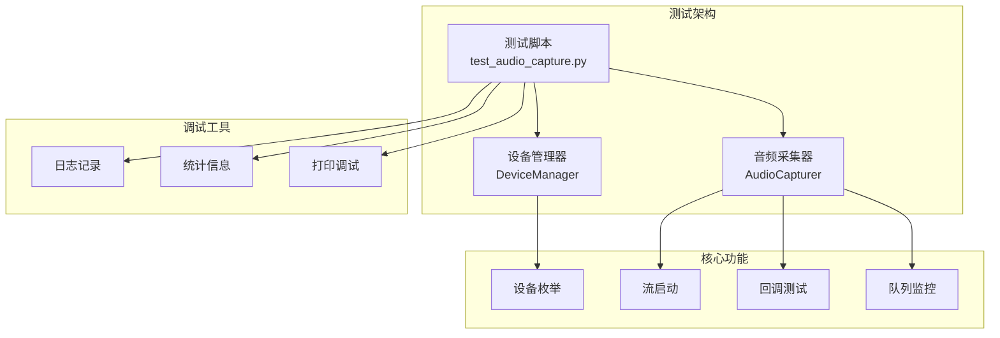

**图表来源**
- [tests/test_audio_capture.py](file://tests/test_audio_capture.py#L1-L213)
- [src/audio_capture/device_manager.py](file://src/audio_capture/device_manager.py#L1-L267)
- [src/audio_capture/audio_capturer.py](file://src/audio_capture/audio_capturer.py#L1-L325)

## 核心测试组件分析

### 测试脚本结构

测试脚本采用模块化设计，包含以下核心组件：

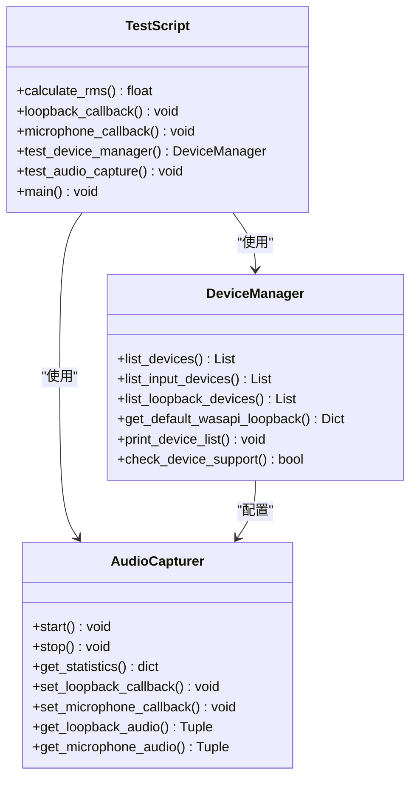

**图表来源**
- [tests/test_audio_capture.py](file://tests/test_audio_capture.py#L27-L44)
- [src/audio_capture/device_manager.py](file://src/audio_capture/device_manager.py#L14-L267)
- [src/audio_capture/audio_capturer.py](file://src/audio_capture/audio_capturer.py#L19-L325)

**章节来源**
- [tests/test_audio_capture.py](file://tests/test_audio_capture.py#L1-L213)

### 日志记录系统

测试框架集成了完整的日志记录系统，支持多级别日志输出和调试信息追踪：

| 日志级别 | 用途 | 示例场景 |
|---------|------|----------|
| DEBUG | 详细调试信息 | 音频数据流状态、队列深度 |
| INFO | 一般信息记录 | 设备连接状态、采集统计数据 |
| WARNING | 警告信息 | 设备冲突、缓冲区溢出 |
| ERROR | 错误信息 | 设备初始化失败、流异常 |

**章节来源**
- [tests/test_audio_capture.py](file://tests/test_audio_capture.py#L19-L24)

## 设备枚举测试

### 设备发现机制

设备枚举测试验证系统能够正确识别和列出所有可用的音频设备：

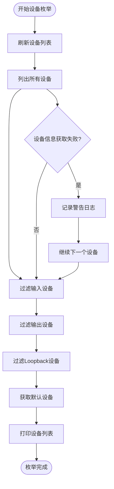

**图表来源**
- [src/audio_capture/device_manager.py](file://src/audio_capture/device_manager.py#L22-L50)
- [src/audio_capture/device_manager.py](file://src/audio_capture/device_manager.py#L223-L262)

### 设备类型分类

| 设备类型 | 检测方法 | 用途 | 特殊属性 |
|---------|----------|------|----------|
| 输入设备 | max_input_channels > 0 | 麦克风音频采集 | 支持的采样率范围 |
| 输出设备 | max_output_channels > 0 | 扬声器音频输出 | 默认输出设备标识 |
| Loopback设备 | is_loopback == True | 系统音频回环 | 自动创建标记 |
| 默认设备 | 系统API查询 | 快速设备选择 | 用户偏好设置 |

**章节来源**
- [src/audio_capture/device_manager.py](file://src/audio_capture/device_manager.py#L52-L83)

### 设备兼容性测试

设备兼容性测试确保选定设备支持指定的音频参数：

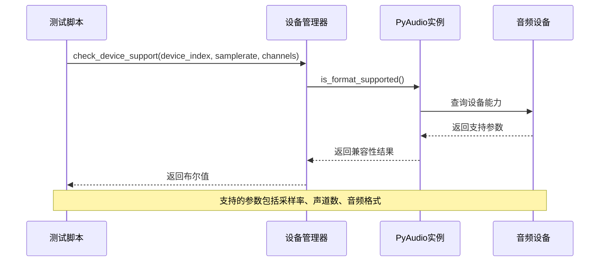

**图表来源**
- [src/audio_capture/device_manager.py](file://src/audio_capture/device_manager.py#L188-L221)

**章节来源**
- [src/audio_capture/device_manager.py](file://src/audio_capture/device_manager.py#L188-L221)

## 音频流启动测试

### WASAPI Loopback测试

WASAPI Loopback测试验证系统音频采集功能：

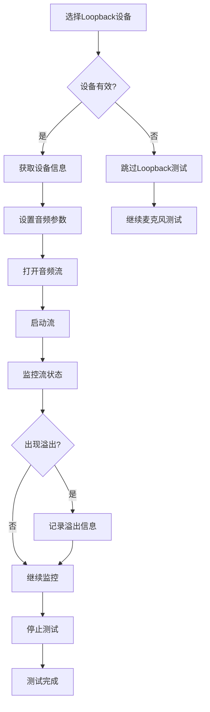

**图表来源**
- [src/audio_capture/audio_capturer.py](file://src/audio_capture/audio_capturer.py#L163-L186)

### 麦克风音频测试

麦克风音频测试验证输入设备功能：

| 参数配置 | 默认值 | 测试目标 | 异常处理 |
|---------|--------|----------|----------|
| 采样率 | 16000 Hz | STT标准采样率 | 自动降级 |
| 声道数 | 1 (单声道) | 减少处理开销 | 双声道自动转换 |
| 缓冲区大小 | 480 样本 | 30ms延迟 | 动态调整 |
| 音频格式 | paInt16 | 兼容性保证 | 格式转换 |

**章节来源**
- [src/audio_capture/audio_capturer.py](file://src/audio_capture/audio_capturer.py#L190-L210)

### 并发流管理

音频采集器支持同时管理多个音频流：

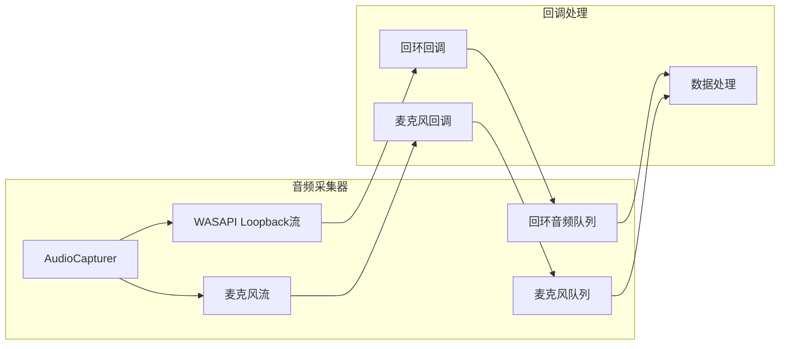

**图表来源**
- [src/audio_capture/audio_capturer.py](file://src/audio_capture/audio_capturer.py#L56-L62)
- [src/audio_capture/audio_capturer.py](file://src/audio_capture/audio_capturer.py#L98-L152)

**章节来源**
- [src/audio_capture/audio_capturer.py](file://src/audio_capture/audio_capturer.py#L154-L214)

## 数据回调测试

### 回调函数设计

数据回调测试验证音频数据的正确处理和传输：

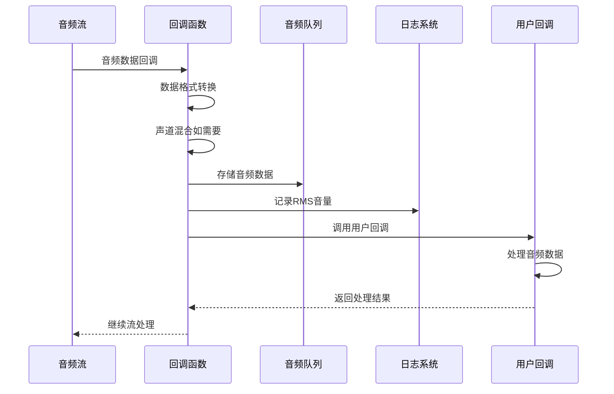

**图表来源**
- [src/audio_capture/audio_capturer.py](file://src/audio_capture/audio_capturer.py#L98-L152)
- [tests/test_audio_capture.py](file://tests/test_audio_capture.py#L32-L44)

### RMS音量计算

测试框架实现了RMS（均方根）音量计算功能：

| 计算步骤 | 公式 | 用途 | 阈值设置 |
|---------|------|------|----------|
| 平方运算 | audio_data² | 计算功率 | 避免负值影响 |
| 平均值计算 | mean() | 统计整体水平 | 32位整数范围 |
| 平方根运算 | √() | 得到RMS值 | 物理意义明确 |
| 静音检测 | RMS > 0.01 | 过滤噪声 | 0.01为经验值 |

**章节来源**
- [tests/test_audio_capture.py](file://tests/test_audio_capture.py#L27-L30)

### 数据完整性验证

回调测试确保音频数据的完整性和一致性：

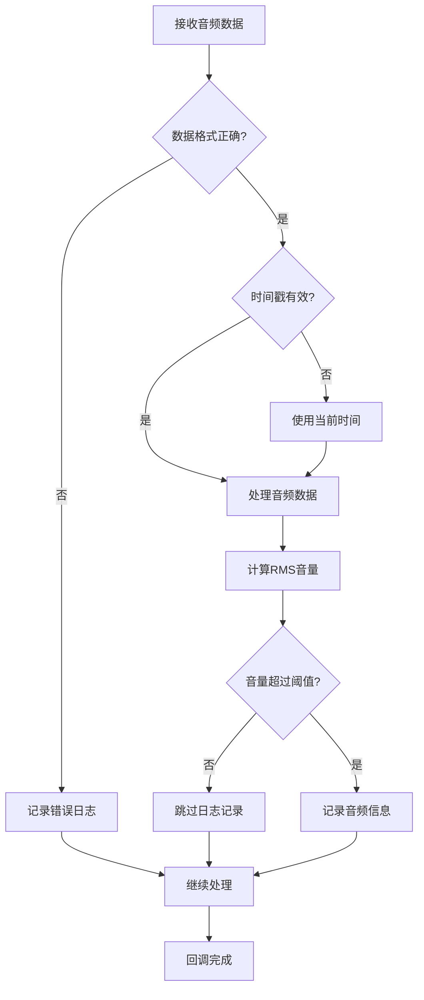

**图表来源**
- [tests/test_audio_capture.py](file://tests/test_audio_capture.py#L32-L44)

**章节来源**
- [tests/test_audio_capture.py](file://tests/test_audio_capture.py#L32-L44)

## 调试技巧与工具

### 日志记录策略

系统采用分级日志记录策略，支持不同级别的调试信息：

| 日志级别 | 关键词 | 输出内容 | 调试用途 |
|---------|--------|----------|----------|
| INFO | "初始化" | 组件启动信息 | 系统状态跟踪 |
| INFO | "已启动" | 流启动成功 | 功能验证 |
| INFO | "已停止" | 流停止信息 | 资源清理确认 |
| WARNING | "状态" | 流状态异常 | 性能问题诊断 |
| WARNING | "警告" | 设备冲突警告 | 配置问题排查 |
| ERROR | "错误" | 异常堆栈信息 | 故障定位 |

### 音频队列监控

实时监控音频队列状态对于调试至关重要：

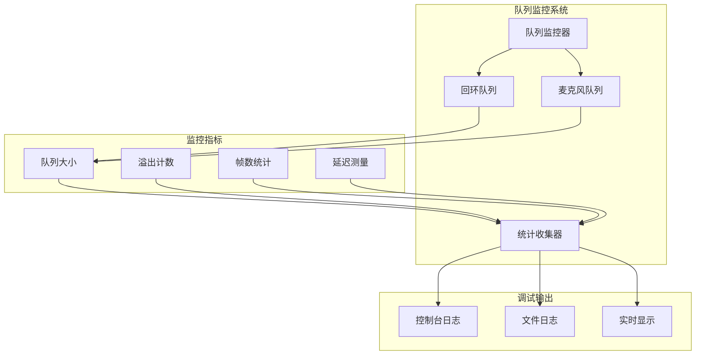

**图表来源**
- [src/audio_capture/audio_capturer.py](file://src/audio_capture/audio_capturer.py#L278-L293)

### 缓冲区溢出检测

缓冲区溢出是音频采集中的常见问题：

| 溢出类型 | 触发条件 | 检测方法 | 处理策略 |
|---------|----------|----------|----------|
| 回环溢出 | 队列满载 | status != 0 | 增加缓冲区 |
| 麦克风溢出 | 处理延迟 | 状态码检查 | 优化回调 |
| 内存溢出 | 长时间运行 | 队列深度监控 | 定期清理 |
| 网络溢出 | 传输超时 | 超时检测 | 重试机制 |

**章节来源**
- [src/audio_capture/audio_capturer.py](file://src/audio_capture/audio_capturer.py#L100-L102)
- [src/audio_capture/audio_capturer.py](file://src/audio_capture/audio_capturer.py#L128-L130)

### 采集延迟分析

延迟分析帮助优化音频处理性能：

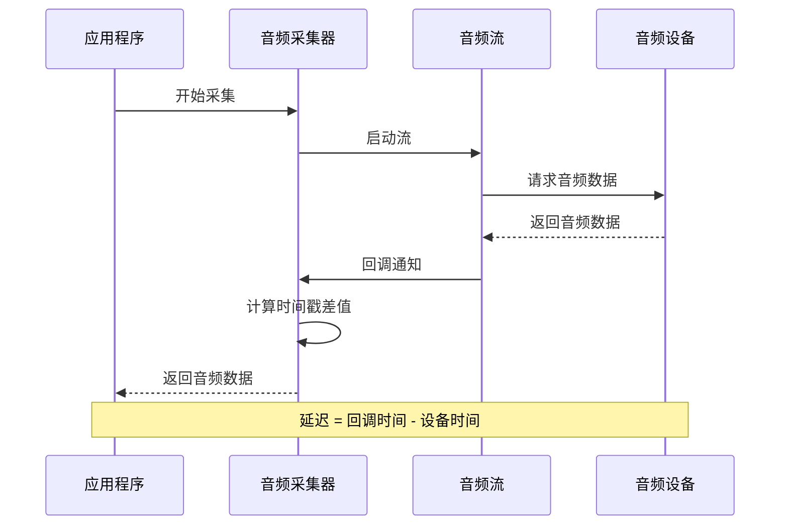

**图表来源**
- [src/audio_capture/audio_capturer.py](file://src/audio_capture/audio_capturer.py#L104-L105)
- [src/audio_capture/audio_capturer.py](file://src/audio_capture/audio_capturer.py#L132-L133)

**章节来源**
- [src/audio_capture/audio_capturer.py](file://src/audio_capture/audio_capturer.py#L104-L105)
- [src/audio_capture/audio_capturer.py](file://src/audio_capture/audio_capturer.py#L132-L133)

## 常见异常处理

### 设备占用异常

设备占用是最常见的异常情况之一：

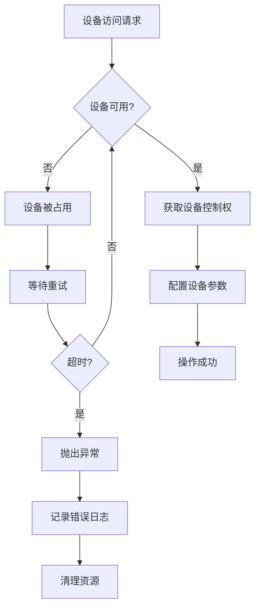

**图表来源**
- [src/audio_capture/audio_capturer.py](file://src/audio_capture/audio_capturer.py#L164-L186)
- [src/audio_capture/audio_capturer.py](file://src/audio_capture/audio_capturer.py#L191-L210)

### 权限不足处理

权限不足异常需要特殊处理：

| 异常类型 | 症状 | 解决方案 | 预防措施 |
|---------|------|----------|----------|
| 管理员权限 | 访问被拒绝 | 以管理员身份运行 | 提前检查权限 |
| 设备锁定 | 设备无法打开 | 关闭其他应用程序 | 设备独占检测 |
| 驱动程序问题 | 设备不可用 | 更新驱动程序 | 驱动兼容性检查 |
| 系统限制 | 权限被阻止 | 修改安全策略 | 权限预检查 |

### 采样率不支持

采样率兼容性问题是音频设备的常见问题：

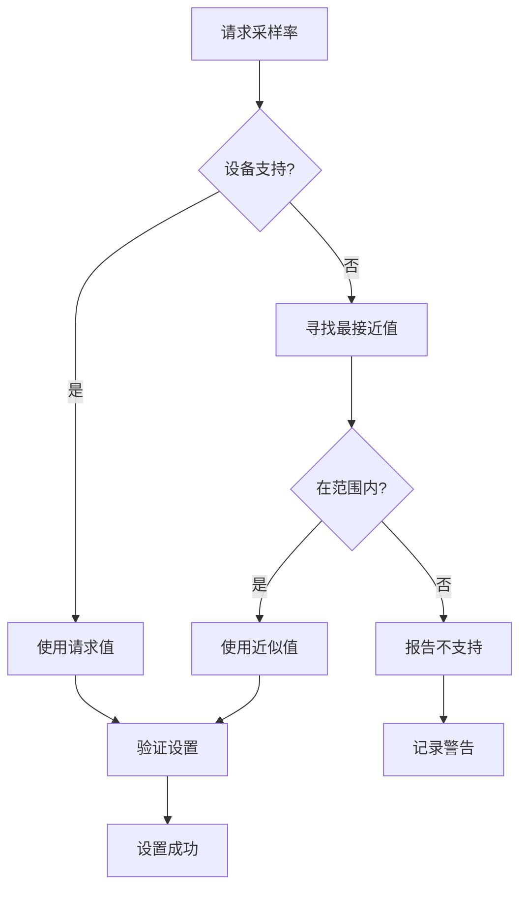

**图表来源**
- [src/audio_capture/device_manager.py](file://src/audio_capture/device_manager.py#L188-L221)

**章节来源**
- [src/audio_capture/device_manager.py](file://src/audio_capture/device_manager.py#L188-L221)

### 网络相关异常

虽然主要关注本地音频处理，但网络异常也可能影响音频采集：

| 异常类型 | 检测方法 | 处理策略 | 恢复机制 |
|---------|----------|----------|----------|
| 网络中断 | 连接状态检查 | 缓存音频数据 | 断线重连 |
| 带宽不足 | 传输速率监控 | 降低采样率 | 优先级调度 |
| 服务器无响应 | 超时检测 | 本地处理 | 离线模式 |
| 协议错误 | 数据包验证 | 重新协商协议 | 协议降级 |

## 性能监控与分析

### 统计信息收集

系统提供详细的性能统计信息：

| 统计指标 | 含义 | 正常范围 | 异常阈值 |
|---------|------|----------|----------|
| 帧捕获数 | 已捕获的音频帧数量 | 持续增长 | 0帧表示无数据 |
| 溢出次数 | 缓冲区溢出事件 | 接近0 | >10次/分钟 |
| 队列大小 | 当前队列中的音频数据 | 0-100帧 | >200帧可能阻塞 |
| 运行状态 | 采集器运行状态 | True/False | False表示停止 |

**章节来源**
- [src/audio_capture/audio_capturer.py](file://src/audio_capture/audio_capturer.py#L278-L293)

### 性能基准测试

建立性能基准有助于识别性能瓶颈：

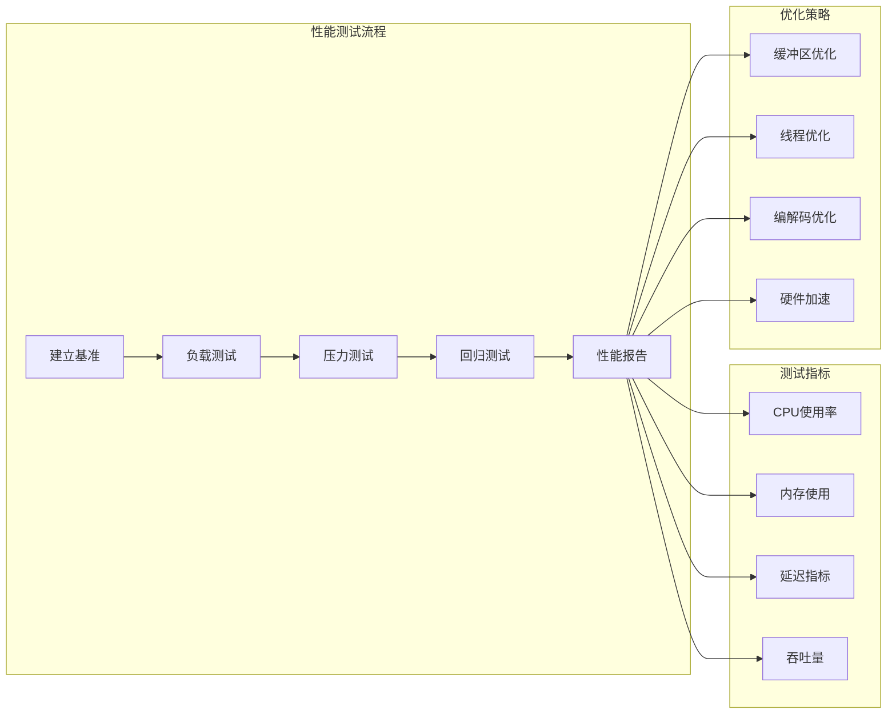

**图表来源**
- [tests/test_audio_capture.py](file://tests/test_audio_capture.py#L168-L179)

### 内存使用监控

内存使用监控防止内存泄漏和过度消耗：

| 监控项目 | 检测方法 | 告警阈值 | 处理措施 |
|---------|----------|----------|----------|
| 队列内存 | 队列大小检查 | >100MB | 清理旧数据 |
| 堆内存 | 系统内存监控 | >80% | 强制垃圾回收 |
| 缓冲区 | 缓冲区使用率 | >90% | 动态调整大小 |
| 文件句柄 | 句柄计数监控 | >1000 | 关闭未使用句柄 |

**章节来源**
- [src/audio_capture/audio_capturer.py](file://src/audio_capture/audio_capturer.py#L295-L308)

## 故障排除指南

### 设备连接问题

设备连接问题的诊断流程：

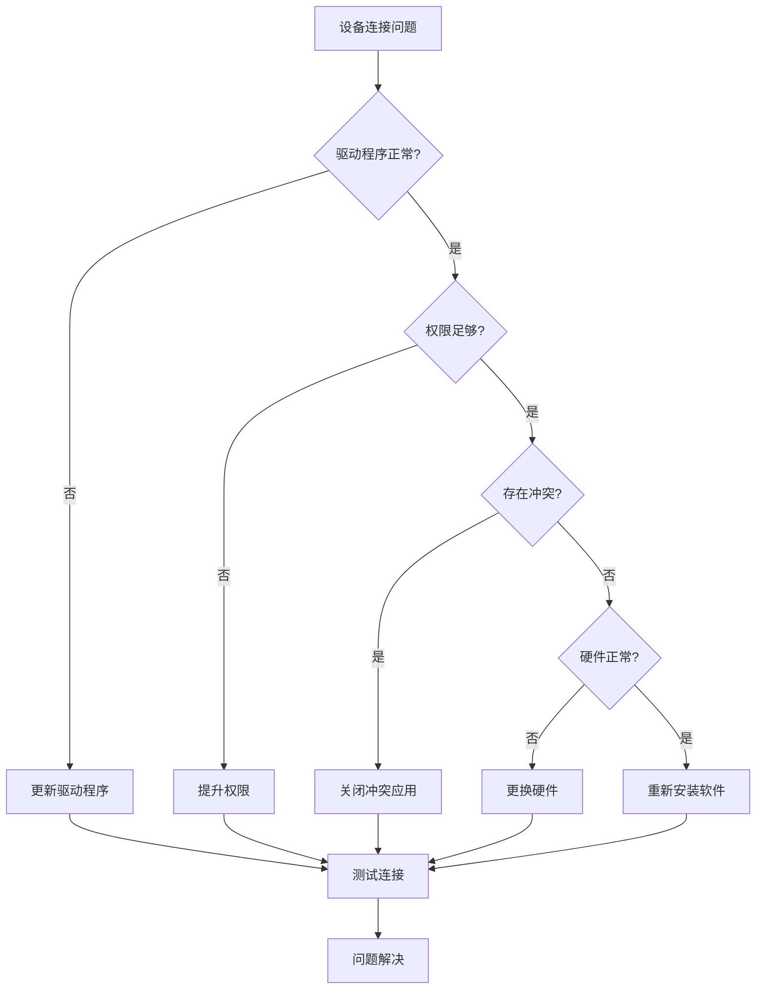

### 音频质量诊断

音频质量问题的系统化诊断：

| 问题类型 | 症状描述 | 可能原因 | 解决方案 |
|---------|----------|----------|----------|
| 静音 | 无音频输出 | 设备静音、音量过低 | 检查设备设置 |
| 噪声 | 背景噪声过大 | 电磁干扰、设备老化 | 屏蔽干扰源 |
| 失真 | 音频失真 | 采样率过高、缓冲区溢出 | 降低采样率 |
| 延迟 | 音画不同步 | 缓冲区过大、处理延迟 | 优化缓冲区 |

### 系统兼容性问题

跨平台兼容性问题的解决方案：

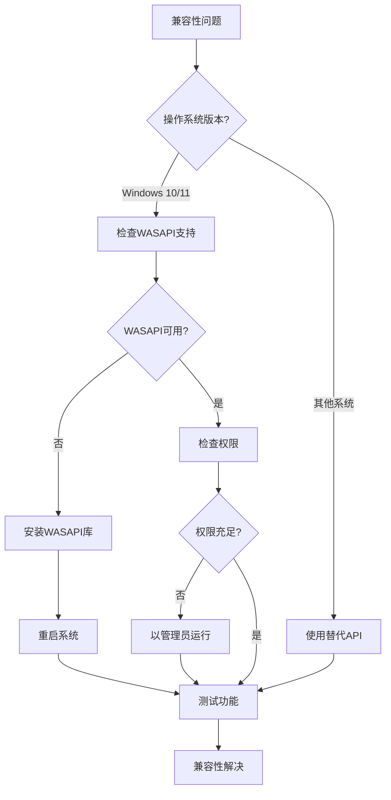

**章节来源**
- [requirements.txt](file://requirements.txt#L1)

## 最佳实践建议

### 测试环境配置

建立标准化的测试环境：

| 配置项 | 推荐设置 | 说明 | 影响因素 |
|-------|----------|------|----------|
| Python版本 | 3.10+ | 新特性支持 | 兼容性要求 |
| 依赖库版本 | 最新稳定版 | 功能和稳定性 | 安全更新 |
| 音频设备 | 多种型号 | 兼容性验证 | 硬件差异 |
| 测试数据 | 多样化音频 | 全面覆盖 | 测试有效性 |

### 自动化测试策略

实施自动化测试提高效率：

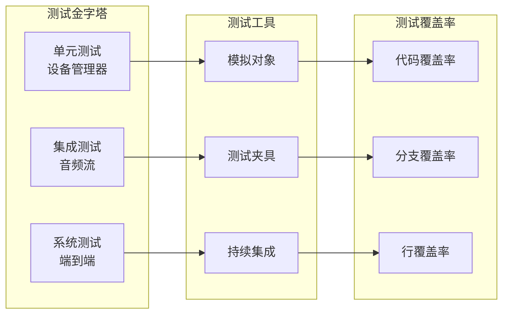

### 监控和告警

建立完善的监控和告警机制：

| 监控项目 | 告警阈值 | 告警方式 | 处理流程 |
|---------|----------|----------|----------|
| 设备状态 | 设备断开 | 邮件+短信 | 自动重试 |
| 性能指标 | 延迟>100ms | 系统通知 | 性能优化 |
| 错误频率 | >10次/小时 | 实时告警 | 故障排查 |
| 资源使用 | CPU>80% | 预警通知 | 资源调整 |

### 文档和知识管理

维护完整的文档体系：

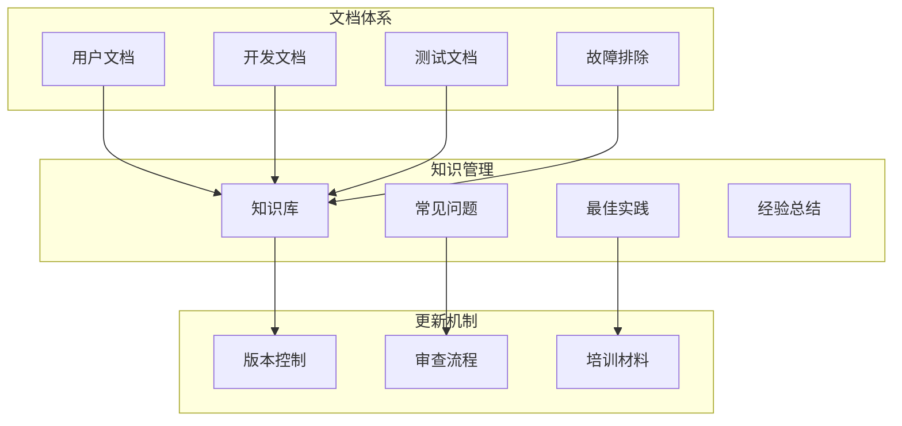

**章节来源**
- [setup_and_test.bat](file://setup_and_test.bat#L1-L34)

### 性能优化建议

针对音频采集的性能优化策略：

| 优化领域 | 具体措施 | 预期效果 | 实施难度 |
|---------|----------|----------|----------|
| 缓冲区优化 | 动态调整缓冲区大小 | 减少延迟和溢出 | 中等 |
| 线程优化 | 分离I/O和处理线程 | 提高并发性能 | 较高 |
| 内存管理 | 对象池和缓存 | 减少GC压力 | 中等 |
| 算法优化 | 高效的音频处理算法 | 提升处理速度 | 较高 |

通过遵循这些最佳实践，可以显著提高音频采集系统的稳定性、性能和可维护性。定期回顾和更新测试策略，确保系统能够适应不断变化的需求和技术发展。