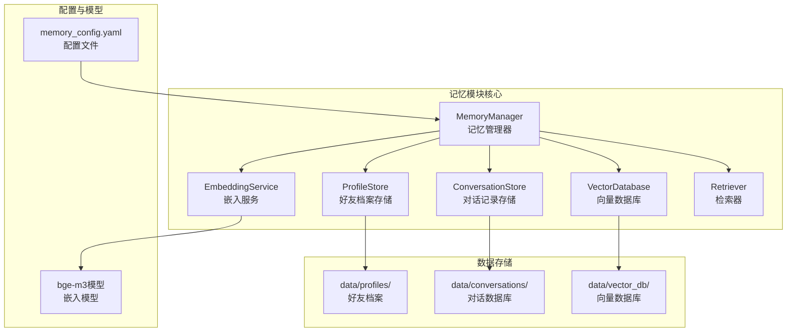
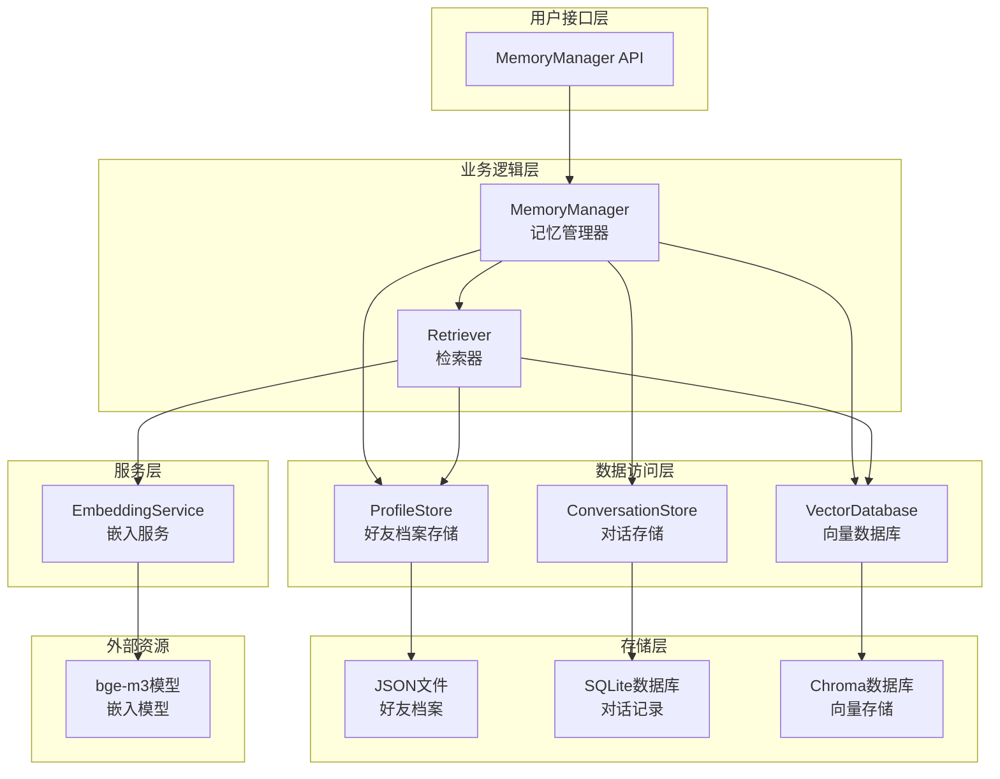
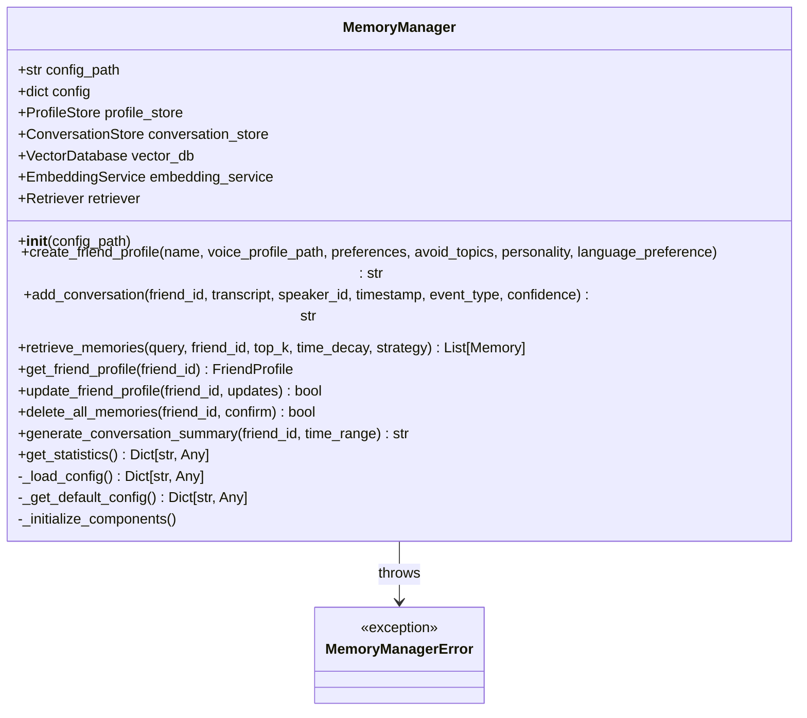
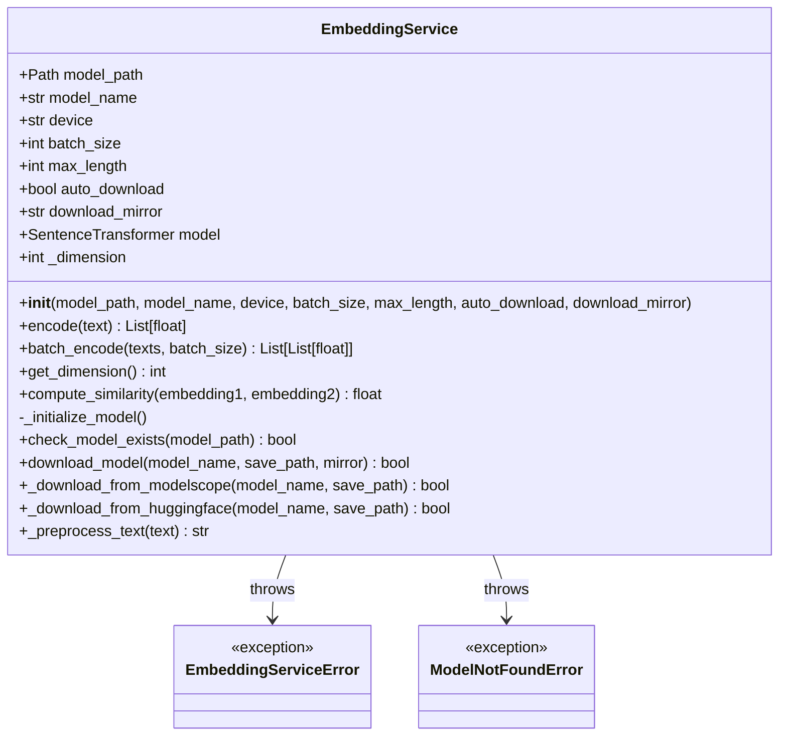
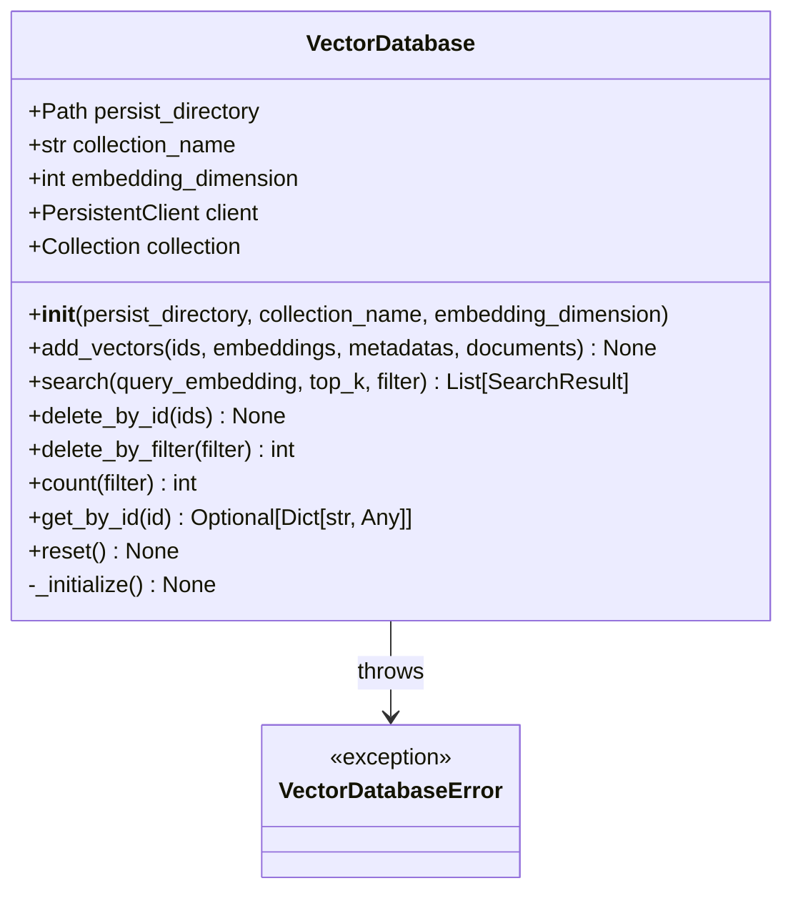
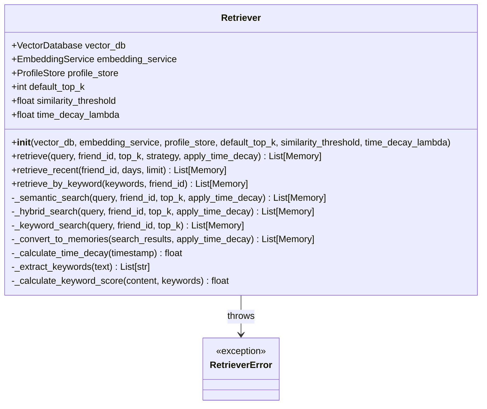
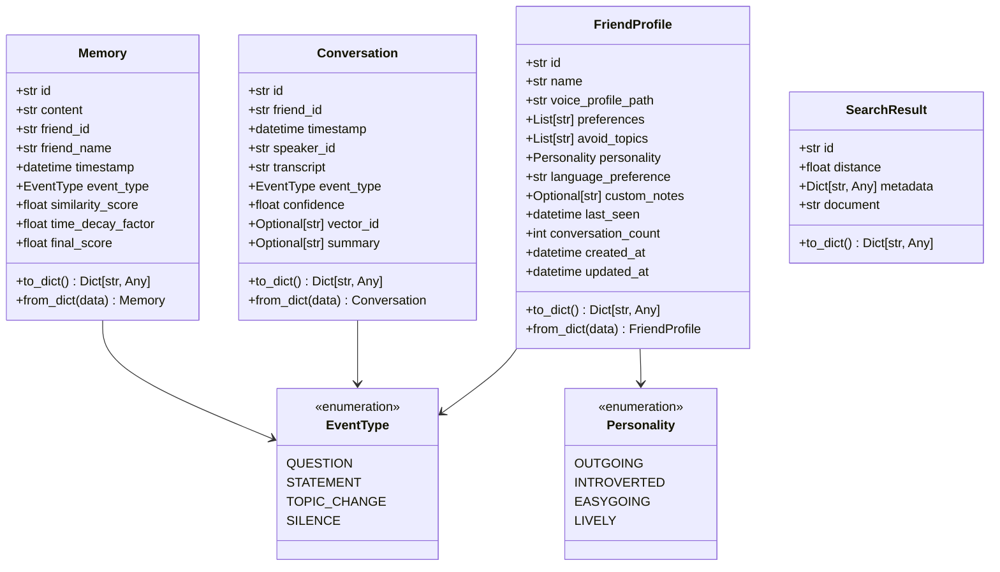
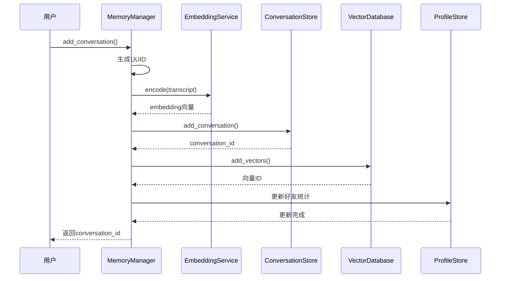
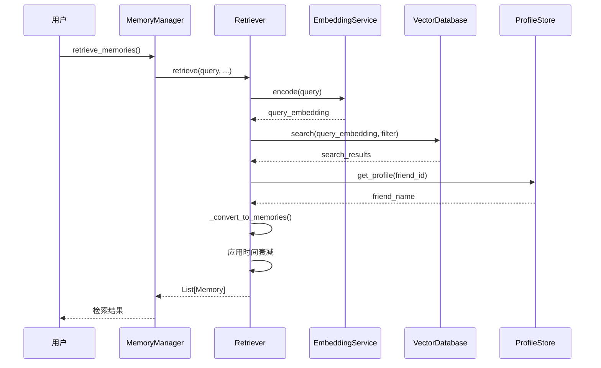

# 记忆与检索模块

<cite>
**本文档引用的文件**
- [src/memory/__init__.py](file://src/memory/__init__.py)
- [src/memory/memory_manager.py](file://src/memory/memory_manager.py)
- [src/memory/retriever.py](file://src/memory/retriever.py)
- [src/memory/vector_database.py](file://src/memory/vector_database.py)
- [src/memory/embedding_service.py](file://src/memory/embedding_service.py)
- [src/memory/models.py](file://src/memory/models.py)
- [src/memory/profile_store.py](file://src/memory/profile_store.py)
- [src/memory/conversation_store.py](file://src/memory/conversation_store.py)
- [config/memory_config.yaml](file://config/memory_config.yaml)
- [src/memory/README.md](file://src/memory/README.md)
- [tests/test_memory_basic.py](file://tests/test_memory_basic.py)
</cite>

## 目录
1. [简介](#简介)
2. [项目结构](#项目结构)
3. [核心组件](#核心组件)
4. [架构概览](#架构概览)
5. [详细组件分析](#详细组件分析)
6. [数据流分析](#数据流分析)
7. [检索策略](#检索策略)
8. [性能考虑](#性能考虑)
9. [配置说明](#配置说明)
10. [故障排除指南](#故障排除指南)
11. [总结](#总结)

## 简介

记忆与检索模块是VRChat社交助手系统的核心智能组件，负责存储、管理和检索好友相关信息及对话历史。该模块为LLM推理层提供上下文增强能力（RAG），通过语义检索技术帮助AI更好地理解和回应用户的社交需求。

### 主要功能特性

- **好友档案管理**：创建、读取、更新、删除好友档案
- **对话记录存储**：SQLite数据库存储对话历史
- **语义检索**：基于文本嵌入的相似度检索
- **时间衰减**：优先检索近期对话
- **多种检索策略**：语义检索、混合检索、关键词检索
- **模型自动下载**：首次运行自动下载bge-m3嵌入模型

## 项目结构



**图表来源**
- [src/memory/__init__.py](file://src/memory/__init__.py#L1-L29)
- [src/memory/memory_manager.py](file://src/memory/memory_manager.py#L31-L478)

**章节来源**
- [src/memory/__init__.py](file://src/memory/__init__.py#L1-L29)
- [src/memory/README.md](file://src/memory/README.md#L70-L80)

## 核心组件

### MemoryManager（记忆管理器）

记忆管理器是整个模块的协调中心，提供统一的记忆操作接口，协调各子组件的交互。

**主要职责：**
- 统一的记忆操作入口
- 协调ProfileStore、ConversationStore、VectorDatabase、EmbeddingService和Retriever
- 提供高层抽象接口

**核心方法：**
- `create_friend_profile()`：创建好友档案
- `add_conversation()`：添加对话记录
- `retrieve_memories()`：检索相关记忆
- `get_friend_profile()`：获取好友档案
- `update_friend_profile()`：更新好友档案
- `delete_all_memories()`：删除记忆

### EmbeddingService（嵌入服务）

负责将文本转换为向量表示，管理嵌入模型的下载、加载与推理。

**核心功能：**
- 文本嵌入生成
- 模型自动下载与管理
- 批量处理支持
- 设备优化（CPU/GPU）

### VectorDatabase（向量数据库）

使用Chroma作为向量数据库后端，提供向量的插入、检索、删除等操作。

**主要特性：**
- 向量持久化存储
- 相似度检索
- 元数据过滤
- 批量操作支持

### Retriever（检索器）

实现多种检索策略，包括语义检索、混合检索、时间衰减等。

**检索策略：**
- **语义检索**：基于向量相似度
- **混合检索**：语义 + 关键词
- **时间衰减检索**：优先检索近期对话
- **关键词检索**：降级方案

**章节来源**
- [src/memory/memory_manager.py](file://src/memory/memory_manager.py#L31-L478)
- [src/memory/embedding_service.py](file://src/memory/embedding_service.py#L28-L351)
- [src/memory/vector_database.py](file://src/memory/vector_database.py#L22-L307)
- [src/memory/retriever.py](file://src/memory/retriever.py#L26-L398)

## 架构概览



**图表来源**
- [src/memory/memory_manager.py](file://src/memory/memory_manager.py#L31-L160)
- [src/memory/retriever.py](file://src/memory/retriever.py#L26-L65)

## 详细组件分析

### MemoryManager（记忆管理器）

MemoryManager是整个模块的核心协调者，提供了统一的记忆操作接口。



**图表来源**
- [src/memory/memory_manager.py](file://src/memory/memory_manager.py#L31-L160)

**核心流程：**

1. **初始化阶段**：加载配置，初始化各个子组件
2. **对话添加流程**：生成向量 → 保存到数据库 → 更新好友档案
3. **检索流程**：解析查询 → 生成查询向量 → 向量检索 → 结果转换 → 时间衰减处理

**章节来源**
- [src/memory/memory_manager.py](file://src/memory/memory_manager.py#L31-L478)

### EmbeddingService（嵌入服务）

嵌入服务负责将文本转换为高维向量表示，是语义检索的基础。



**图表来源**
- [src/memory/embedding_service.py](file://src/memory/embedding_service.py#L28-L351)

**模型管理特性：**
- 支持自动下载（ModelScope/HuggingFace）
- 本地模型缓存
- 设备优化（CUDA/CPU）
- 批处理优化

**章节来源**
- [src/memory/embedding_service.py](file://src/memory/embedding_service.py#L28-L351)

### VectorDatabase（向量数据库）

向量数据库封装了Chroma作为后端，提供高效的向量存储和检索功能。



**图表来源**
- [src/memory/vector_database.py](file://src/memory/vector_database.py#L22-L307)

**核心功能：**
- 向量插入和批量操作
- 相似度检索（余弦距离）
- 元数据过滤
- 持久化存储
- 数据清理和重置

**章节来源**
- [src/memory/vector_database.py](file://src/memory/vector_database.py#L22-L307)

### Retriever（检索器）

检索器实现了多种检索策略，能够根据不同的需求提供灵活的检索能力。



**图表来源**
- [src/memory/retriever.py](file://src/memory/retriever.py#L26-L398)

**检索策略详解：**

1. **语义检索**：基于向量相似度的纯语义匹配
2. **混合检索**：结合语义相似度和关键词匹配
3. **时间衰减检索**：优先考虑近期的对话
4. **关键词检索**：基于关键词匹配的降级方案

**章节来源**
- [src/memory/retriever.py](file://src/memory/retriever.py#L26-L398)

### 数据模型

模块使用Pydantic定义了清晰的数据模型结构。



**图表来源**
- [src/memory/models.py](file://src/memory/models.py#L13-L141)

**章节来源**
- [src/memory/models.py](file://src/memory/models.py#L13-L141)

## 数据流分析

### 对话添加流程



**图表来源**
- [src/memory/memory_manager.py](file://src/memory/memory_manager.py#L161-L246)

### 检索流程



**图表来源**
- [src/memory/memory_manager.py](file://src/memory/memory_manager.py#L247-L295)
- [src/memory/retriever.py](file://src/memory/retriever.py#L66-L102)

**章节来源**
- [src/memory/memory_manager.py](file://src/memory/memory_manager.py#L161-L246)
- [src/memory/retriever.py](file://src/memory/retriever.py#L66-L102)

## 检索策略

### 语义检索（Semantic Search）

语义检索是最常用的检索策略，基于向量相似度进行匹配。

**算法流程：**
1. 将查询文本编码为向量
2. 在向量数据库中进行相似度搜索
3. 应用相似度阈值过滤
4. 按最终得分排序返回

**优势：**
- 理解语义含义
- 能够处理同义表达
- 适合自然语言查询

### 混合检索（Hybrid Search）

混合检索结合了语义相似度和关键词匹配，提供更精确的结果。

**评分公式：**
```
最终得分 = 0.7 × 语义相似度 + 0.3 × 关键词匹配度
```

**适用场景：**
- 需要精确匹配关键词
- 结合语义和关键词的优势
- 提高检索准确性

### 时间衰减机制

时间衰减机制确保近期的对话在检索结果中获得更高的权重。

**衰减公式：**
```
衰减因子 = exp(-λ × 时间差（天）)
```

**参数说明：**
- λ（time_decay_lambda）：衰减系数，默认0.1
- 时间差：与当前时间的时间差（天）

**章节来源**
- [src/memory/retriever.py](file://src/memory/retriever.py#L103-L186)
- [src/memory/retriever.py](file://src/memory/retriever.py#L339-L357)

## 性能考虑

### 响应时间优化

| 操作类型 | 目标延迟 | 实现策略 |
|---------|---------|---------|
| 添加对话（含嵌入） | < 100ms | 批处理、GPU加速 |
| 检索 Top-5 记忆 | < 80ms | 向量索引、缓存 |
| 获取好友档案 | < 20ms | LRU缓存 |
| 向量检索 | < 50ms | Chroma优化 |

### 内存使用优化

1. **LRU缓存**：ProfileStore使用LRU缓存减少磁盘IO
2. **批处理**：EmbeddingService支持批量处理
3. **增量持久化**：VectorDatabase支持增量保存
4. **内存映射**：SQLite使用内存映射提高性能

### GPU加速支持

- **CUDA支持**：自动检测和使用GPU加速
- **模型卸载**：空闲时释放GPU内存
- **混合精度**：支持FP16降低显存占用

## 配置说明

### 主要配置项

```yaml
storage:
  profiles_dir: "data/profiles"           # 好友档案存储目录
  conversations_db: "data/conversations/conversations.db"  # 对话数据库路径
  vector_db_dir: "data/vector_db"         # 向量数据库目录
  enable_encryption: false                # 是否启用加密

embedding:
  model_name: "BAAI/bge-m3"               # 嵌入模型名称
  model_path: "models/embeddings/bge-m3"  # 模型本地路径
  device: "cuda"                          # 运行设备
  batch_size: 32                          # 批处理大小
  max_length: 512                         # 文本最大长度

retrieval:
  default_top_k: 5                        # 默认检索数量
  similarity_threshold: 0.6               # 相似度阈值
  time_decay_lambda: 0.1                  # 时间衰减系数
  default_strategy: "semantic"            # 默认检索策略
```

### 性能调优建议

1. **设备选择**：
   - 有GPU：设置`device: "cuda"`
   - 无GPU：设置`device: "cpu"`

2. **批处理优化**：
   - 增加`batch_size`参数
   - 根据GPU内存调整批次大小

3. **检索优化**：
   - 增加`default_top_k`获得更多候选
   - 调整`similarity_threshold`平衡准确性和召回率

**章节来源**
- [config/memory_config.yaml](file://config/memory_config.yaml#L1-L68)

## 故障排除指南

### 常见问题及解决方案

#### 1. 模型下载失败

**症状**：首次运行时模型下载中断或失败

**解决方案**：
- 检查网络连接
- 手动下载模型到`models/embeddings/bge-m3/`
- 修改配置使用HuggingFace镜像源

#### 2. GPU内存不足

**症状**：CUDA out of memory错误

**解决方案**：
- 减少`batch_size`参数
- 设置`device: "cpu"`
- 降低`max_length`限制

#### 3. 检索结果质量差

**症状**：检索到不相关的结果

**解决方案**：
- 调整`similarity_threshold`阈值
- 使用混合检索策略
- 增加训练数据丰富语料库

#### 4. 性能问题

**症状**：响应时间过长

**解决方案**：
- 启用GPU加速
- 增加缓存大小
- 优化数据库索引

### 调试技巧

1. **启用详细日志**：
```python
import logging
logging.basicConfig(level=logging.DEBUG)
```

2. **检查统计数据**：
```python
stats = manager.get_statistics()
print(f"向量数量: {stats['total_vectors']}")
print(f"好友数量: {stats['total_friends']}")
```

3. **验证模型加载**：
```python
try:
    dimension = manager.embedding_service.get_dimension()
    print(f"模型维度: {dimension}")
except Exception as e:
    print(f"模型加载失败: {e}")
```

**章节来源**
- [tests/test_memory_basic.py](file://tests/test_memory_basic.py#L108-L131)

## 总结

VRChat社交助手的记忆与检索模块是一个功能完整、设计精良的智能系统。它通过以下特点实现了高效的记忆管理：

### 核心优势

1. **模块化设计**：清晰的职责分离，便于维护和扩展
2. **多种检索策略**：适应不同场景的检索需求
3. **高性能优化**：GPU加速、缓存机制、批处理优化
4. **自动化管理**：模型自动下载、数据自动清理
5. **隐私保护**：本地存储，支持完全删除

### 技术亮点

- **语义理解**：基于先进的bge-m3嵌入模型
- **智能检索**：时间衰减、混合策略、相似度过滤
- **高效存储**：Chroma向量数据库 + SQLite关系数据库
- **灵活配置**：丰富的配置选项适应不同需求

### 应用价值

该模块为VRChat社交助手提供了强大的记忆能力，使AI能够：
- 理解用户的好友关系
- 记住重要的对话细节
- 提供个性化的社交建议
- 维持连贯的对话上下文

通过持续的优化和扩展，这个模块将继续为VRChat社交助手提供可靠的记忆服务，提升用户体验和交互质量。