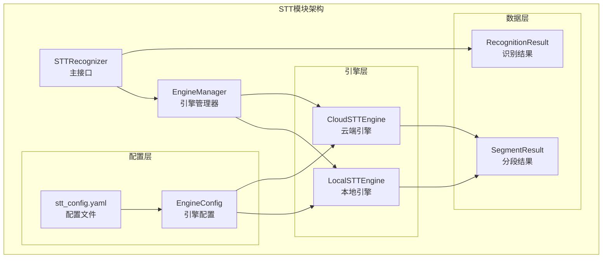
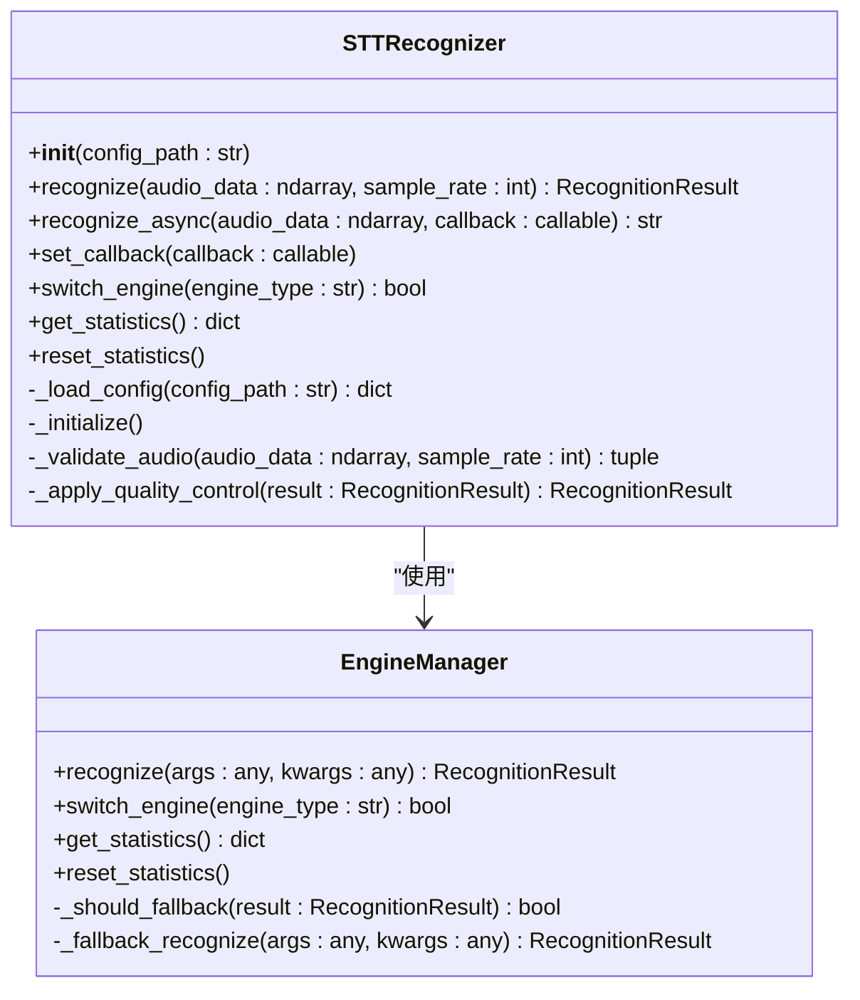
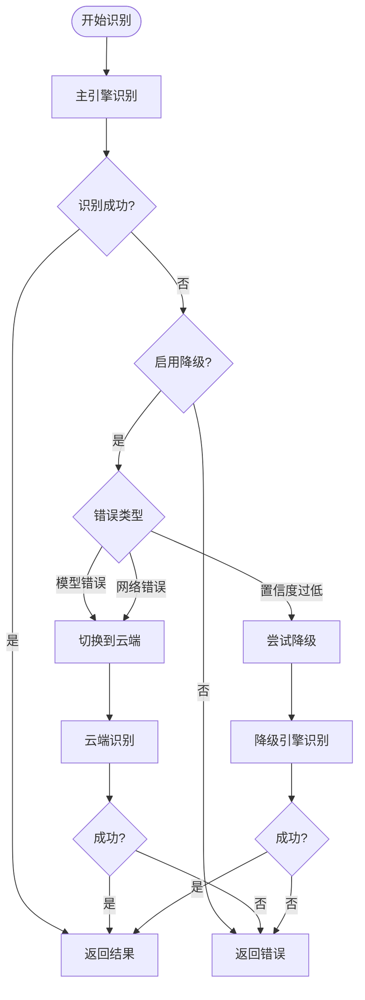

# 语音转文本模块

<cite>
**本文档中引用的文件**
- [README.md](file://README.md)
- [src/stt/__init__.py](file://src/stt/__init__.py)
- [src/stt/stt_recognizer.py](file://src/stt/stt_recognizer.py)
- [src/stt/engine_manager.py](file://src/stt/engine_manager.py)
- [src/stt/local_engine.py](file://src/stt/local_engine.py)
- [src/stt/cloud_engine.py](file://src/stt/cloud_engine.py)
- [src/stt/models.py](file://src/stt/models.py)
- [config/stt_config.yaml](file://config/stt_config.yaml)
- [src/stt/README.md](file://src/stt/README.md)
- [tests/test_stt.py](file://tests/test_stt.py)
</cite>

## 目录
1. [项目概述](#项目概述)
2. [模块架构](#模块架构)
3. [核心组件分析](#核心组件分析)
4. [引擎管理](#引擎管理)
5. [配置系统](#配置系统)
6. [API参考](#api参考)
7. [性能优化](#性能优化)
8. [错误处理](#错误处理)
9. [测试与示例](#测试与示例)
10. [最佳实践](#最佳实践)

## 项目概述

语音转文本（STT）模块是VRChat社交辅助系统的核心组件之一，负责将语音片段转换为文本。该模块采用双引擎架构，支持本地Faster-Whisper引擎和云端阿里云/腾讯云引擎，并具备智能降级策略以确保高可用性。

### 核心特性

- **实时语音识别**：支持中英混合语音的实时转文本
- **双引擎架构**：本地引擎（Faster-Whisper）+ 云端引擎（阿里云/腾讯云）
- **自动降级**：引擎失败时自动切换备用引擎
- **质量控制**：置信度评估、文本长度限制
- **统计监控**：识别成功率、延迟等性能指标
- **异步处理**：支持同步和异步识别模式

## 模块架构



**图表来源**
- [src/stt/stt_recognizer.py](file://src/stt/stt_recognizer.py#L25-L55)
- [src/stt/engine_manager.py](file://src/stt/engine_manager.py#L24-L68)

**章节来源**
- [src/stt/__init__.py](file://src/stt/__init__.py#L1-L24)
- [src/stt/README.md](file://src/stt/README.md#L1-L50)

## 核心组件分析

### STTRecognizer - 主识别器

STTRecognizer是STT模块的主要接口，提供统一的语音识别入口。

#### 主要功能

- **初始化管理**：加载配置、创建引擎实例
- **识别接口**：同步和异步语音识别
- **回调机制**：支持结果回调通知
- **引擎切换**：动态切换本地/云端引擎
- **统计监控**：识别成功率、性能指标

#### 核心方法



**图表来源**
- [src/stt/stt_recognizer.py](file://src/stt/stt_recognizer.py#L25-L425)
- [src/stt/engine_manager.py](file://src/stt/engine_manager.py#L24-L313)

**章节来源**
- [src/stt/stt_recognizer.py](file://src/stt/stt_recognizer.py#L25-L425)

### LocalSTTEngine - 本地引擎

基于Faster-Whisper的本地语音识别引擎，提供高性能的离线语音识别能力。

#### 技术特点

- **模型支持**：支持tiny、base、small、medium、large等多种模型
- **硬件加速**：支持CPU和GPU（CUDA）加速
- **混合精度**：支持float16、float32、int8计算类型
- **语言检测**：支持自动语言检测和指定语言识别

#### 性能参数

| 模型大小 | 参数量 | 显存需求 | 处理延迟 | 准确率 | 推荐场景 |
|---------|-------|---------|---------|--------|---------|
| tiny | 39M | ~1GB | ~200ms | 较低 | 测试/低配 |
| base | 74M | ~1GB | ~300ms | 一般 | 快速原型 |
| small | 244M | ~2GB | ~500ms | 良好 | 平衡性能 |
| **medium** | 769M | ~5GB | ~800ms | **优秀** | **推荐配置** |
| large | 1550M | ~10GB | ~1200ms | 最优 | 高配环境 |

**章节来源**
- [src/stt/local_engine.py](file://src/stt/local_engine.py#L16-L321)

### CloudSTTEngine - 云端引擎

支持阿里云和腾讯云的云端语音识别服务。

#### 云端服务对比

| 特性 | 阿里云 | 腾讯云 |
|------|--------|--------|
| 识别速度 | ~600ms | ~600ms |
| 支持语言 | 中文、英文、日文等 | 中文、英文 |
| 价格模式 | 按时长计费 | 按调用次数计费 |
| API稳定性 | 高 | 高 |
| 配置复杂度 | 中等 | 简单 |

**章节来源**
- [src/stt/cloud_engine.py](file://src/stt/cloud_engine.py#L18-L316)

## 引擎管理

### 引擎切换策略



**图表来源**
- [src/stt/engine_manager.py](file://src/stt/engine_manager.py#L110-L222)

### 降级策略配置

引擎管理器支持多种降级策略：

- **AUTO**：自动选择（优先本地）
- **LOCAL_TO_CLOUD**：本地失败降级到云端
- **CLOUD_TO_LOCAL**：云端失败降级到本地
- **NONE**：不降级

**章节来源**
- [src/stt/engine_manager.py](file://src/stt/engine_manager.py#L16-L22)

## 配置系统

### 配置文件结构

STT模块使用YAML格式的配置文件，支持灵活的参数调整。

#### 核心配置项

```yaml
stt:
  # 通用配置
  default_engine: local              # 默认引擎（local/cloud）
  fallback_enabled: true             # 启用降级策略
  max_audio_duration: 30.0          # 最大音频时长（秒）
  min_audio_duration: 0.3           # 最小音频时长（秒）
  
  # 本地引擎配置
  local:
    model_size: medium              # 模型大小
    device: auto                    # 设备类型
    compute_type: float16           # 计算类型
    language: auto                  # 语言设置
    beam_size: 5                    # Beam搜索宽度
    temperature: 0.0                # 采样温度
  
  # 云端引擎配置
  cloud:
    provider: aliyun                # 云服务商
    timeout: 5                      # 超时时间
    retry_count: 3                  # 重试次数
```

#### 性能配置选项

| 配置项 | 默认值 | 说明 |
|--------|--------|------|
| enable_cache | false | 启用结果缓存 |
| max_audio_duration | 30.0 | 最大音频时长 |
| min_audio_duration | 0.3 | 最小音频时长 |
| enable_async | true | 启用异步识别 |
| queue_size | 100 | 任务队列大小 |
| worker_threads | 2 | 工作线程数 |

**章节来源**
- [config/stt_config.yaml](file://config/stt_config.yaml#L1-L63)

## API参考

### STTRecognizer 类

#### 初始化

```python
STTRecognizer(config_path: Optional[str] = None)
```

**参数：**
- `config_path`: 配置文件路径（可选，默认 `config/stt_config.yaml`）

#### 同步识别

```python
recognize(
    audio_data: np.ndarray,
    sample_rate: int = 16000,
    **kwargs
) -> RecognitionResult
```

**参数：**
- `audio_data`: 音频数据（numpy array, float32, 一维）
- `sample_rate`: 采样率（默认 16000）
- `language`: 语言提示（可选，'zh'/'en'/'auto'）
- `speaker_id`: 说话人ID（可选）

**返回：** `RecognitionResult` 对象

#### 异步识别

```python
recognize_async(
    audio_data: np.ndarray,
    callback: Callable[[RecognitionResult], None],
    sample_rate: int = 16000,
    **kwargs
) -> str
```

**返回：** 请求ID（字符串）

#### 回调函数设置

```python
set_callback(callback: Callable[[RecognitionResult], None])
```

#### 引擎切换

```python
switch_engine(engine_type: str) -> bool
```

**参数：**
- `engine_type`: 'local' 或 'cloud'

**返回：** 是否切换成功

#### 统计信息获取

```python
get_statistics() -> dict
```

**返回：** 统计数据字典

### RecognitionResult 类

识别结果对象包含以下字段：

| 字段 | 类型 | 说明 |
|------|------|------|
| request_id | str | 请求唯一标识 |
| success | bool | 识别是否成功 |
| text | str | 识别的文本内容 |
| confidence | float | 置信度（0.0-1.0） |
| language | str | 检测到的语言 |
| duration | float | 音频时长（秒） |
| processing_time | float | 处理耗时（毫秒） |
| engine_type | str | 使用的引擎 |
| speaker_id | str | 说话人ID |
| segments | list | 分段结果（可选） |
| error_message | str | 错误信息（失败时） |

**章节来源**
- [src/stt/models.py](file://src/stt/models.py#L11-L190)
- [src/stt/README.md](file://src/stt/README.md#L146-L290)

## 性能优化

### GPU加速配置

```yaml
stt:
  local:
    device: cuda          # 强制使用 GPU
    compute_type: float16 # 使用混合精度（节省显存）
```

### 模型选择策略

#### 提高识别速度
```yaml
stt:
  local:
    model_size: small     # 使用小模型
    beam_size: 1          # 减小 beam size
    temperature: 0.0      # 贪婪解码
```

#### 提高识别准确率
```yaml
stt:
  local:
    model_size: medium    # 使用中等或大模型
    beam_size: 5          # 增加 beam size
    language: zh          # 指定语言（不使用 auto）
```

### 性能基准测试

| 硬件配置 | medium模型 | 处理延迟 | 准确率 |
|----------|------------|----------|--------|
| CPU (Intel i7) | CPU | ~2000ms | 90% |
| GPU (RTX 3060) | CUDA | ~800ms | 92% |
| 云端API | 无 | ~600ms | 95% |

**章节来源**
- [src/stt/README.md](file://src/stt/README.md#L318-L417)

## 错误处理

### 常见错误类型

| 错误信息 | 原因 | 解决方法 |
|---------|------|---------|
| 音频过短 | 时长 < 0.3s | 增加音频长度 |
| 音频过长 | 时长 > 30s | 分段处理 |
| 模型加载失败 | 模型文件损坏/缺失 | 重新下载模型 |
| CUDA out of memory | GPU 显存不足 | 使用小模型或切换 CPU |
| 未识别到文本 | 音频质量差/静音 | 检查音频内容 |

### 降级处理机制

```python
# 本地引擎失败会自动降级到云端
result = recognizer.recognize(audio_data)

if not result.success:
    print(f"识别失败: {result.error_message}")
    # 检查是否发生降级
    stats = recognizer.get_statistics()
    print(f"降级次数: {stats['engine']['fallback_count']}")
```

**章节来源**
- [src/stt/README.md](file://src/stt/README.md#L360-L383)

## 测试与示例

### 基础使用示例

```python
from src.stt import STTRecognizer
import numpy as np

# 初始化识别器
recognizer = STTRecognizer()

# 准备音频数据（16kHz, float32）
audio_data = np.random.randn(16000).astype(np.float32)

# 执行识别
result = recognizer.recognize(audio_data)

if result.success:
    print(f"识别文本: {result.text}")
    print(f"置信度: {result.confidence:.3f}")
    print(f"语言: {result.language}")
else:
    print(f"识别失败: {result.error_message}")
```

### 回调函数使用

```python
def on_recognition_result(result):
    print(f"收到识别结果: {result.text}")

# 设置回调
recognizer.set_callback(on_recognition_result)

# 识别时自动调用回调
recognizer.recognize(audio_data)
```

### 异步识别示例

```python
def handle_result(result):
    print(f"异步识别完成: {result.text}")

# 提交异步识别任务
request_id = recognizer.recognize_async(
    audio_data,
    callback=handle_result
)

print(f"任务已提交: {request_id}")
```

**章节来源**
- [src/stt/README.md](file://src/stt/README.md#L42-L91)
- [tests/test_stt.py](file://tests/test_stt.py#L1-L287)

## 最佳实践

### 音频预处理建议

1. **采样率**：推荐使用16000Hz
2. **音频格式**：numpy.ndarray, float32, 一维数组
3. **时长范围**：0.3s - 30s
4. **噪声处理**：在VAD模块中进行噪声过滤

### 配置优化建议

1. **生产环境**：使用medium模型，启用降级策略
2. **测试环境**：可使用small模型以提高速度
3. **云端配置**：根据预算选择合适的云服务商
4. **监控设置**：定期检查识别成功率和延迟指标

### 集成建议

1. **与VAD模块集成**：STT模块接收VAD模块的语音片段输出
2. **与说话人识别集成**：传递说话人ID以提高识别准确性
3. **错误处理**：实现完善的错误恢复机制
4. **性能监控**：建立识别性能的实时监控体系

**章节来源**
- [src/stt/README.md](file://src/stt/README.md#L401-L462)

## 总结

语音转文本模块通过精心设计的双引擎架构和智能降级策略，为VRChat社交辅助系统提供了稳定可靠的语音识别能力。模块具有良好的扩展性、可配置性和容错能力，能够适应不同的应用场景和性能要求。

主要优势：
- **高可用性**：双引擎架构和自动降级确保服务连续性
- **高性能**：支持GPU加速和多种模型配置
- **易集成**：简洁的API设计便于与其他模块集成
- **可监控**：完善的统计和监控功能支持运维管理

未来发展方向：
- 支持流式识别（边说边转）
- 支持自定义热词
- 支持更多云服务商
- 优化模型加载速度
- 支持多语言自动检测