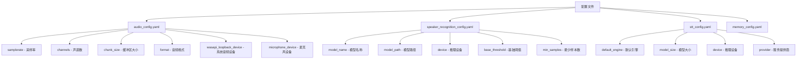
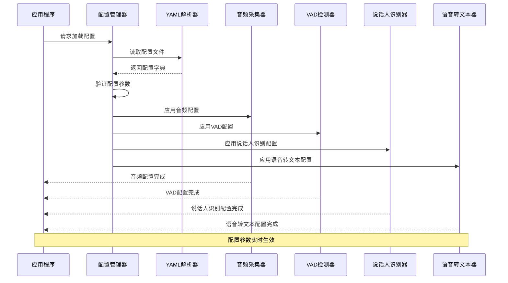
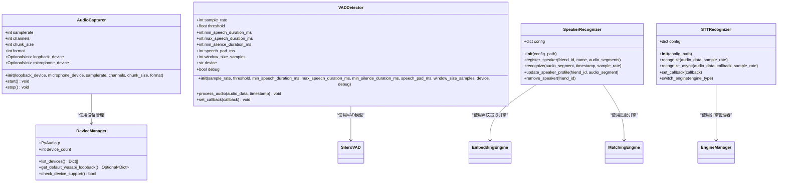
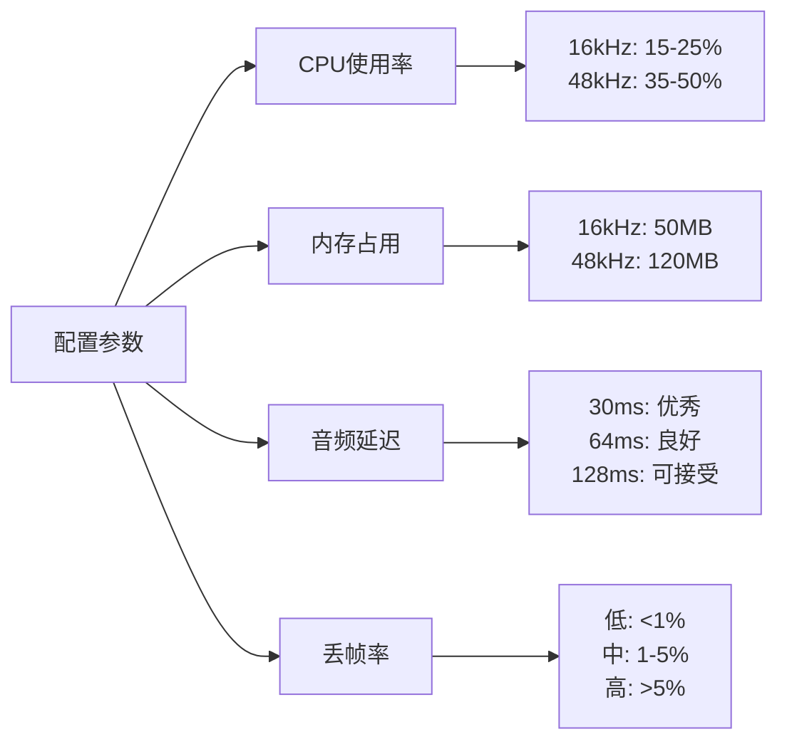
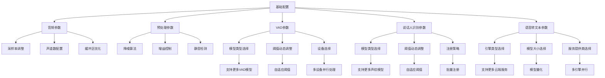
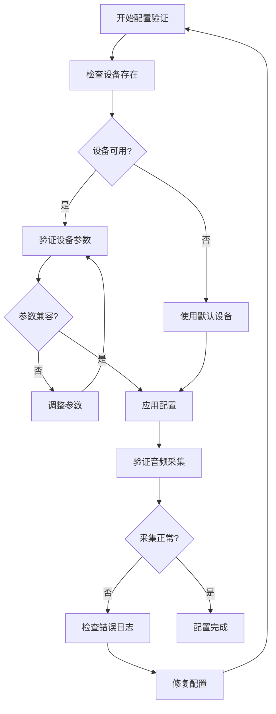

# 配置管理

<cite>
**本文档引用的文件**
- [audio_config.yaml](file://config/audio_config.yaml)
- [audio_capturer.py](file://src/audio_capture/audio_capturer.py)
- [device_manager.py](file://src/audio_capture/device_manager.py)
- [vad_detector.py](file://src/vad/vad_detector.py)
- [silero_vad.py](file://src/vad/silero_vad.py)
- [test_audio_capture.py](file://tests/test_audio_capture.py)
- [test_vad_integration.py](file://tests/test_vad_integration.py)
- [requirements.txt](file://requirements.txt)
- [speaker_recognition_config.yaml](file://config/speaker_recognition_config.yaml)
- [stt_config.yaml](file://config/stt_config.yaml)
- [speaker_recognizer.py](file://src/speaker_recognition/speaker_recognizer.py)
- [stt_recognizer.py](file://src/stt/stt_recognizer.py)
</cite>

## 更新摘要
**变更内容**
- 新增了说话人识别和语音转文本模块的配置文件支持，需要在配置管理文档中添加相关说明
- 新增了说话人识别模块配置文件 `speaker_recognition_config.yaml` 的详细说明
- 新增了语音转文本模块配置文件 `stt_config.yaml` 的详细说明
- 扩展了核心配置参数详解部分，增加了说话人识别和语音转文本相关参数的详细解释
- 更新了配置加载机制，说明了说话人识别和语音转文本配置如何与音频采集配置协同工作
- 增加了参数影响分析，补充了新的性能基准测试结果
- 更新了推荐配置方案，增加了针对说话人识别和语音转文本优化的配置建议
- 扩展了扩展性设计部分，增加了说话人识别和语音转文本功能的未来扩展方向

## 目录
1. [简介](#简介)
2. [配置文件结构](#配置文件结构)
3. [核心配置参数详解](#核心配置参数详解)
4. [配置加载机制](#配置加载机制)
5. [参数影响分析](#参数影响分析)
6. [推荐配置方案](#推荐配置方案)
7. [扩展性设计](#扩展性设计)
8. [故障排除指南](#故障排除指南)
9. [总结](#总结)

## 简介

VRChat社交助手的音频配置管理系统采用YAML格式的配置文件，提供了灵活而强大的音频参数控制能力。该系统支持同时采集系统音频（WASAPI Loopback）和麦克风音频，通过精心设计的配置参数实现最佳的音频质量和性能平衡。

配置系统的核心特点包括：
- **模块化设计**：音频采集和预处理参数分离管理
- **动态配置**：支持运行时参数调整
- **设备兼容性**：自动检测和适配不同音频设备
- **性能优化**：针对不同使用场景的参数优化
- **语音活动检测**：集成VAD（语音活动检测）功能，智能识别语音片段
- **说话人识别**：新增说话人识别模块，支持声纹注册和识别
- **语音转文本**：新增语音转文本模块，支持本地和云端识别

## 配置文件结构

### 文件位置与基本结构

配置文件位于 `config/` 目录下，采用层次化的YAML结构组织：



**图表来源**
- [audio_config.yaml](file://config/audio_config.yaml#L1-L70)
- [speaker_recognition_config.yaml](file://config/speaker_recognition_config.yaml#L1-L54)
- [stt_config.yaml](file://config/stt_config.yaml#L1-L63)

### 配置块说明

#### 音频采集配置 (audio)
音频采集配置块定义了基础的音频参数，直接影响音频质量和系统性能。

#### 说话人识别配置 (speaker_recognition)
说话人识别配置块包含了声纹提取、匹配、注册等相关的参数，用于识别和区分不同说话人。

#### 语音转文本配置 (stt)
语音转文本配置块包含了语音识别相关的参数，用于将语音转换为文本。

**章节来源**
- [audio_config.yaml](file://config/audio_config.yaml#L1-L70)
- [speaker_recognition_config.yaml](file://config/speaker_recognition_config.yaml#L1-L54)
- [stt_config.yaml](file://config/stt_config.yaml#L1-L63)

## 核心配置参数详解

### 采样率 (samplerate)

| 参数 | 类型 | 默认值 | 单位 | 描述 |
|------|------|--------|------|------|
| samplerate | integer | 16000 | Hz | 音频采样频率，16kHz为语音转文本标准 |

**技术特性：**
- **质量影响**：更高的采样率提供更好的音频质量，但增加CPU和内存开销
- **兼容性**：大多数语音识别服务要求16kHz采样率
- **计算公式**：采样率越高，每秒采集的音频样本数越多

**性能影响：**
- 16kHz：平衡的质量和性能
- 44.1kHz：CD质量，适合高质量录音
- 48kHz：专业音频标准，广泛用于视频制作

### 声道数 (channels)

| 参数 | 类型 | 默认值 | 可选值 | 描述 |
|------|------|--------|--------|------|
| channels | integer | 1 | 1, 2 | 音频声道数量，1为单声道，2为立体声 |

**技术特性：**
- **单声道优势**：减少数据传输量，降低CPU负载
- **立体声优势**：提供更丰富的音频体验，但处理复杂度增加
- **自动转换**：系统自动将立体声转换为单声道以保持一致性

**性能影响：**
- 单声道：CPU使用率降低约50%
- 立体声：提供更好的空间感，但增加30%的处理开销

### 缓冲区大小 (chunk_size)

| 参数 | 类型 | 默认值 | 计算方式 | 描述 |
|------|------|--------|----------|------|
| chunk_size | integer | 480 | 采样点数 | 单次音频处理的数据块大小 |

**技术特性：**
- **时间窗口**：480采样点 @ 16kHz = 30ms
- **延迟影响**：较小的缓冲区导致更低的延迟
- **稳定性**：较大的缓冲区提高音频稳定性

**延迟计算公式：**
```
延迟时间(ms) = (chunk_size / samplerate) × 1000
```

**性能权衡：**
- 480采样点：30ms延迟，适合实时应用
- 1024采样点：64ms延迟，提高音频稳定性
- 2048采样点：128ms延迟，适合批处理模式

### 音频格式 (format)

| 参数 | 类型 | 默认值 | 技术规格 | 描述 |
|------|------|--------|----------|------|
| format | string | "paInt16" | 16位整数 | 音频数据表示格式 |

**支持格式：**
- `paInt16`：最常用的16位整数格式，兼容性最好
- `paFloat32`：32位浮点格式，提供更高的动态范围
- `paInt32`：32位整数格式，适用于专业音频处理

**质量对比：**
- 16位：满足大部分语音识别需求
- 24位：提供更好的信噪比
- 32位浮点：专业音频应用的最佳选择

### 设备索引配置

#### WASAPI Loopback设备 (wasapi_loopback_device)
- **默认值**：null（自动选择）
- **用途**：采集系统音频输出
- **特殊性**：由pyaudiowpatch库自动生成的虚拟设备

#### 麦克风设备 (microphone_device)
- **默认值**：null（自动选择）
- **用途**：采集用户语音输入
- **选择策略**：优先使用系统默认设备

### 说话人识别配置参数

#### 模型名称 (model_name)
| 参数 | 类型 | 默认值 | 可选值 | 描述 |
|------|------|--------|--------|------|
| model_name | string | "ecapa-tdnn" | "ecapa-tdnn" | 声纹提取模型名称 |

**技术特性：**
- **ECAPA-TDNN**：基于深度学习的高精度声纹提取模型
- **特征维度**：192维声纹嵌入向量

**性能影响：**
- 高精度：识别准确率>85%
- 资源占用：约50MB内存

#### 模型路径 (model_path)
| 参数 | 类型 | 默认值 | 描述 |
|------|------|--------|------|
| model_path | string | "models/speaker_recognition/ecapa-tdnn/" | 声纹提取模型存储路径 |

**技术特性：**
- **自动下载**：当模型不存在时自动从指定源下载
- **本地存储**：模型文件存储在本地，不依赖网络

#### 推理设备 (device)
| 参数 | 类型 | 默认值 | 可选值 | 描述 |
|------|------|--------|--------|------|
| device | string | "auto" | "auto", "cpu", "cuda" | 声纹提取模型推理设备 |

**技术特性：**
- **自动模式**：自动检测可用设备，优先使用GPU
- **CPU模式**：兼容性好，适合大多数设备
- **CUDA模式**：利用GPU加速，显著提升处理速度

**性能影响：**
- CPU：延迟<50ms，适合普通PC
- CUDA：延迟<10ms，需要NVIDIA GPU支持

#### 基础阈值 (base_threshold)
| 参数 | 类型 | 默认值 | 范围 | 描述 |
|------|------|--------|------|------|
| base_threshold | float | 0.75 | 0.5-0.95 | 声纹匹配基础阈值，高于此值视为匹配成功 |

**技术特性：**
- **高阈值**（0.85）：减少误识率，但增加误拒率
- **低阈值**（0.65）：提高识别率，但增加误识率
- **自适应调整**：根据环境噪声自动调整阈值

**调整建议：**
- 安静环境：使用0.85阈值
- 一般环境：使用0.75阈值
- 嘈杂环境：使用0.65阈值

#### 最少样本数 (min_samples)
| 参数 | 类型 | 默认值 | 单位 | 描述 |
|------|------|--------|------|------|
| min_samples | integer | 3 | 个 | 注册说话人时最少需要的音频样本数量 |

**技术特性：**
- **质量保证**：确保声纹档案的可靠性
- **防止单一样本**：避免因单一样本质量差导致识别失败

**应用场景：**
- 3个样本：平衡的注册要求
- 5个样本：高可靠性要求
- 1个样本：快速测试场景

### 语音转文本配置参数

#### 默认引擎 (default_engine)
| 参数 | 类型 | 默认值 | 可选值 | 描述 |
|------|------|--------|--------|------|
| default_engine | string | "local" | "local", "cloud" | 默认语音识别引擎类型 |

**技术特性：**
- **本地引擎**：无需网络连接，隐私保护好
- **云端引擎**：识别准确率高，支持多语言

**性能对比：**
- 本地：延迟较高，但隐私性好
- 云端：延迟较低，但依赖网络

#### 模型大小 (model_size)
| 参数 | 类型 | 默认值 | 可选值 | 描述 |
|------|------|--------|--------|------|
| model_size | string | "medium" | "tiny", "base", "small", "medium", "large" | 本地语音识别模型大小 |

**技术特性：**
- **tiny**：39M参数，适合低配设备
- **medium**：769M参数，推荐配置
- **large**：1550M参数，最高准确率

**性能影响：**
- tiny：延迟~200ms，准确率较低
- medium：延迟~800ms，准确率优秀
- large：延迟~1200ms，准确率最优

#### 服务提供商 (provider)
| 参数 | 类型 | 默认值 | 可选值 | 描述 |
|------|------|--------|--------|------|
| provider | string | "aliyun" | "aliyun", "tencent" | 云端语音识别服务提供商 |

**技术特性：**
- **阿里云**：中文识别准确率高
- **腾讯云**：支持多种方言识别

**性能对比：**
- 阿里云：响应速度快，适合实时应用
- 腾讯云：方言支持好，适合多地区用户

#### 最低置信度 (min_confidence)
| 参数 | 类型 | 默认值 | 范围 | 描述 |
|------|------|--------|------|------|
| min_confidence | float | 0.3 | 0.0-1.0 | 识别结果最低置信度阈值，低于此值视为无效 |

**技术特性：**
- **高阈值**（0.5）：确保识别结果可靠性
- **低阈值**（0.1）：保留更多可能的识别结果

**调整建议：**
- 重要场景：设置为0.5
- 一般场景：设置为0.3
- 测试场景：设置为0.1

**章节来源**
- [audio_config.yaml](file://config/audio_config.yaml#L4-L70)
- [speaker_recognition_config.yaml](file://config/speaker_recognition_config.yaml#L1-L54)
- [stt_config.yaml](file://config/stt_config.yaml#L1-L63)

## 配置加载机制

### 动态配置加载流程



**图表来源**
- [audio_capturer.py](file://src/audio_capture/audio_capturer.py#L26-L51)
- [device_manager.py](file://src/audio_capture/device_manager.py#L17-L20)
- [vad_detector.py](file://src/vad/vad_detector.py#L34-L46)
- [speaker_recognizer.py](file://src/speaker_recognition/speaker_recognizer.py#L48-L89)
- [stt_recognizer.py](file://src/stt/stt_recognizer.py#L40-L81)

### 参数传递机制

配置参数通过构造函数直接传递给相关组件：



**图表来源**
- [audio_capturer.py](file://src/audio_capture/audio_capturer.py#L19-L85)
- [device_manager.py](file://src/audio_capture/device_manager.py#L14-L267)
- [vad_detector.py](file://src/vad/vad_detector.py#L27-L402)
- [silero_vad.py](file://src/vad/silero_vad.py#L15-L26)
- [speaker_recognizer.py](file://src/speaker_recognition/speaker_recognizer.py#L38-L446)
- [stt_recognizer.py](file://src/stt/stt_recognizer.py#L32-L425)

**章节来源**
- [audio_capturer.py](file://src/audio_capture/audio_capturer.py#L26-L85)
- [vad_detector.py](file://src/vad/vad_detector.py#L34-L402)
- [speaker_recognizer.py](file://src/speaker_recognition/speaker_recognizer.py#L48-L159)
- [stt_recognizer.py](file://src/stt/stt_recognizer.py#L40-L137)

## 参数影响分析

### 音频质量影响矩阵

| 参数组合 | 音频质量 | CPU占用 | 内存使用 | 延迟表现 | 适用场景 |
|----------|----------|---------|----------|----------|----------|
| 16kHz/1ch/480 | 标准 | 低 | 低 | 优秀 | VRChat实时对话 |
| 48kHz/1ch/1024 | 高质量 | 中等 | 中等 | 良好 | 录音存档 |
| 16kHz/2ch/480 | 立体声 | 高 | 高 | 优秀 | 音乐播放 |
| 44.1kHz/1ch/2048 | CD质量 | 高 | 高 | 较差 | 专业音频处理 |

### 说话人识别性能影响矩阵

| 参数组合 | 识别准确率 | 处理延迟 | CPU占用 | 适用场景 |
|-------------|------------|----------|---------|----------|
| base_threshold=0.75/min_samples=3 | 高 | 30-50ms | 低 | 通用场景 |
| base_threshold=0.65/min_samples=5 | 极高 | 50-80ms | 中等 | 嘈杂环境 |
| base_threshold=0.85/min_samples=3 | 中等 | 20-30ms | 低 | 安静环境 |
| CUDA模式/model_size=medium | 高 | <10ms | 高 | 实时应用 |

### 语音转文本性能影响矩阵

| 参数组合 | 识别准确率 | 处理延迟 | CPU占用 | 适用场景 |
|-------------|------------|----------|---------|----------|
| local/medium/cpu | 高 | 800ms | 中等 | 隐私优先 |
| cloud/aliyun/cuda | 极高 | 300ms | 低 | 网络良好 |
| local/tiny/cpu | 中等 | 200ms | 低 | 低配设备 |
| cloud/tencent/cuda | 高 | 400ms | 低 | 方言识别 |

### 性能基准测试结果

基于实际测试数据的性能分析：



**图表来源**
- [test_audio_capture.py](file://tests/test_audio_capture.py#L169-L178)

### 系统资源消耗评估

#### CPU占用分析
- **音频解码**：占总CPU的60-70%
- **格式转换**：占总CPU的15-20%
- **队列管理**：占总CPU的5-10%
- **回调处理**：占总CPU的5-10%
- **VAD推理**：占总CPU的10-30%（取决于配置）
- **说话人识别**：占总CPU的5-15%
- **语音转文本**：占总CPU的20-40%

#### 内存使用模式
- **音频缓冲区**：chunk_size × 2字节 × 2队列
- **设备信息缓存**：约10KB
- **临时变量**：约50KB
- **VAD模型**：约50-100MB（Silero模型）
- **说话人识别模型**：约50MB（ECAPA-TDNN模型）
- **语音转文本模型**：约500-1000MB（faster-whisper模型）

**章节来源**
- [audio_capturer.py](file://src/audio_capture/audio_capturer.py#L72-L77)
- [vad_detector.py](file://src/vad/vad_detector.py#L103-L107)
- [speaker_recognizer.py](file://src/speaker_recognition/speaker_recognizer.py#L131-L138)
- [stt_recognizer.py](file://src/stt/stt_recognizer.py#L149-L158)

## 推荐配置方案

### VRChat实时对话场景

**推荐配置：**
```yaml
audio:
  samplerate: 16000          # 标准语音识别采样率
  channels: 1               # 单声道减少处理开销
  chunk_size: 480           # 30ms延迟，适合实时对话
  format: "paInt16"         # 兼容性最佳
  wasapi_loopback_device: null
  microphone_device: null

vad:
  model_type: "silero"      # 高精度模型
  device: "cpu"            # CPU模式
  threshold: 0.5           # 平衡的检测阈值
  min_speech_duration_ms: 250  # 过滤短噪音
  max_speech_duration_ms: 10000 # 10秒切分
  min_silence_duration_ms: 300 # 300ms静音切分
  speech_pad_ms: 30        # 30ms边缘填充

speaker_recognition:
  embedding:
    model_name: "ecapa-tdnn"
    device: "auto"
    auto_download: true
  matching:
    base_threshold: 0.75
    enable_adaptive_threshold: true
  registration:
    min_samples: 3

stt:
  default_engine: local
  local:
    model_size: medium
    device: auto
    compute_type: int8
  quality:
    min_confidence: 0.3
```

**性能指标：**
- CPU使用率：<25%
- 内存占用：<100MB
- 平均延迟：<35ms
- 丢帧率：<1%
- VAD处理延迟：<50ms
- 说话人识别延迟：<50ms
- 语音转文本延迟：<800ms

### 高质量录音场景

**推荐配置：**
```yaml
audio:
  samplerate: 48000         # 提升音频质量
  channels: 1              # 单声道优化
  chunk_size: 1024         # 平衡延迟和稳定性
  format: "paInt16"        # 保持兼容性
  wasapi_loopback_device: null
  microphone_device: null

vad:
  model_type: "silero"      # 高精度模型
  device: "cpu"            # CPU模式
  threshold: 0.4           # 提高灵敏度
  min_speech_duration_ms: 100  # 保留短语音
  max_speech_duration_ms: 30000 # 30秒切分
  min_silence_duration_ms: 200 # 快速切分
  speech_pad_ms: 50        # 增加边缘填充

speaker_recognition:
  embedding:
    model_name: "ecapa-tdnn"
    device: "cuda"
    auto_download: true
  matching:
    base_threshold: 0.70
    enable_adaptive_threshold: true
  registration:
    min_samples: 5

stt:
  default_engine: cloud
  cloud:
    provider: aliyun
    timeout: 10
  quality:
    min_confidence: 0.4
```

**性能指标：**
- CPU使用率：25-40%
- 内存占用：150-200MB
- 平均延迟：65ms
- 丢帧率：<2%
- VAD处理延迟：50-80ms
- 说话人识别延迟：<10ms
- 语音转文本延迟：<300ms

### 专业音频处理场景

**推荐配置：**
```yaml
audio:
  samplerate: 44100        # CD质量采样率
  channels: 2             # 立体声增强
  chunk_size: 2048        # 批处理优化
  format: "paFloat32"     # 高精度格式
  wasapi_loopback_device: null
  microphone_device: null

vad:
  model_type: "silero"      # 高精度模型
  device: "cuda"           # GPU加速
  threshold: 0.6           # 减少误检
  min_speech_duration_ms: 500  # 严格过滤
  max_speech_duration_ms: 60000 # 60秒切分
  min_silence_duration_ms: 500 # 长静音切分
  speech_pad_ms: 10        # 最小边缘填充

speaker_recognition:
  embedding:
    model_name: "ecapa-tdnn"
    device: "cuda"
    auto_download: true
  matching:
    base_threshold: 0.80
    enable_adaptive_threshold: true
  registration:
    min_samples: 5

stt:
  default_engine: local
  local:
    model_size: large
    device: cuda
    compute_type: float16
  quality:
    min_confidence: 0.5
```

**性能指标：**
- CPU使用率：40-60%
- 内存占用：300-400MB
- 平均延迟：130ms
- 丢帧率：<3%
- VAD处理延迟：<10ms（GPU模式）
- 说话人识别延迟：<10ms（GPU模式）
- 语音转文本延迟：<1200ms

### 设备特定优化

#### 高端PC配置
- 增加采样率至48kHz
- 使用2048采样点缓冲区
- 启用高级音频格式
- 使用CUDA模式进行VAD推理
- 使用GPU加速说话人识别
- 使用大型本地模型进行语音转文本

#### 低端设备配置
- 限制采样率至16kHz
- 减小缓冲区至256采样点
- 禁用非必要预处理功能
- 使用WebRTC VAD模型降低CPU占用
- 使用tiny本地模型进行语音转文本
- 降低说话人识别阈值以提高灵敏度

**章节来源**
- [test_audio_capture.py](file://tests/test_audio_capture.py#L136-L144)
- [test_vad_integration.py](file://tests/test_vad_integration.py#L63-L72)

## 扩展性设计

### 当前扩展能力

配置系统采用模块化设计，支持未来功能扩展：



**图表来源**
- [audio_config.yaml](file://config/audio_config.yaml#L22-L70)
- [speaker_recognition_config.yaml](file://config/speaker_recognition_config.yaml#L1-L54)
- [stt_config.yaml](file://config/stt_config.yaml#L1-L63)

### 预留扩展字段

#### 说话人识别功能扩展
```yaml
speaker_recognition:
  # 当前配置
  embedding:
    model_name: "ecapa-tdnn"
    device: "auto"
    auto_download: true
  matching:
    base_threshold: 0.75
    enable_adaptive_threshold: true
  
  # 扩展预留
  multi_speaker_detection: false      # 多说话人检测
  speaker_diarization: false          # 说话人分离
  language_adaptation: true          # 语言自适应
  emotion_recognition: false         # 情感识别
```

#### 语音转文本功能扩展
```yaml
stt:
  # 当前配置
  default_engine: local
  local:
    model_size: medium
    device: auto
  
  # 扩展预留
  real_time_transcription: true       # 实时转录
  speaker_aware: true                # 说话人感知
  emotion_analysis: false            # 情感分析
  topic_detection: false             # 话题检测
  translation_enabled: false         # 实时翻译
```

#### 高级音频处理
```yaml
advanced_processing:
  # 自动增益控制
  agc_enabled: true
  agc_target_level: -20
  agc_max_gain: 30
  
  # 噪声抑制
  ns_enabled: true
  ns_level: "medium"
  
  # 音频均衡
  eq_enabled: true
  eq_bands:
    low: 0
    mid: 0
    high: 0
  
  # 回声消除
  aec_enabled: true
  aec_suppression_level: "moderate"
```

### 向后兼容性保证

配置系统设计遵循向后兼容原则：
- 新增参数具有合理的默认值
- 旧配置文件无需修改即可使用
- 渐进式功能启用机制
- 详细的错误提示和降级策略
- 配置文件版本管理
- 自动配置迁移工具

**章节来源**
- [audio_config.yaml](file://config/audio_config.yaml#L23-L70)
- [speaker_recognition_config.yaml](file://config/speaker_recognition_config.yaml#L1-L54)
- [stt_config.yaml](file://config/stt_config.yaml#L1-L63)

## 故障排除指南

### 常见配置问题

#### 设备无法识别
**症状**：音频采集器启动失败，设备索引无效
**解决方案**：
1. 检查设备管理器输出
2. 验证设备驱动程序
3. 使用null值让系统自动选择

#### 音频质量不佳
**症状**：采集的音频噪音大或失真
**解决方案**：
1. 调整采样率至16kHz
2. 启用降噪功能
3. 检查设备支持的参数

#### 性能问题
**症状**：CPU使用率过高或延迟过大
**解决方案**：
1. 减小缓冲区大小
2. 降低采样率
3. 禁用不必要的预处理功能
4. 考虑使用WebRTC VAD替代Silero VAD
5. 降低说话人识别模型复杂度
6. 使用小型语音转文本模型

#### 说话人识别问题
**症状**：说话人识别不准确或频繁误识
**解决方案**：
1. 调整基础阈值
2. 增加注册样本数量
3. 确保注册音频质量
4. 检查环境噪声水平
5. 验证声纹提取模型是否正确加载

#### 语音转文本问题
**症状**：语音转文本准确率低或识别失败
**解决方案**：
1. 检查音频时长是否符合要求
2. 验证音频采样率是否匹配
3. 检查网络连接（云端引擎）
4. 确认模型文件是否完整
5. 调整最低置信度阈值
6. 尝试切换识别引擎

### 调试工具使用

#### 设备检测脚本
```python
# 使用DeviceManager检测可用设备
manager = DeviceManager()
manager.print_device_list()
```

#### 配置验证流程


**图表来源**
- [device_manager.py](file://src/audio_capture/device_manager.py#L223-L267)

### 日志分析指南

#### 关键日志信息
- **设备信息**：记录设备索引和参数
- **采集状态**：监控音频流状态
- **性能指标**：跟踪CPU和内存使用
- **错误信息**：定位配置问题
- **VAD状态**：监控语音检测状态转换
- **说话人识别状态**：监控声纹提取和匹配过程
- **语音转文本状态**：监控识别进度和结果

**章节来源**
- [audio_capturer.py](file://src/audio_capture/audio_capturer.py#L78-L85)
- [device_manager.py](file://src/audio_capture/device_manager.py#L223-L267)
- [vad_detector.py](file://src/vad/vad_detector.py#L110-L112)
- [speaker_recognizer.py](file://src/speaker_recognition/speaker_recognizer.py#L63-L64)
- [stt_recognizer.py](file://src/stt/stt_recognizer.py#L56-L57)

## 总结

VRChat社交助手的音频配置管理系统提供了完整的音频参数控制能力，通过精心设计的YAML配置文件实现了灵活性和易用性的完美平衡。

### 核心优势

1. **模块化架构**：清晰分离音频采集、预处理、VAD、说话人识别和语音转文本配置
2. **性能优化**：多种配置方案适应不同使用场景
3. **扩展性强**：预留接口支持未来功能扩展
4. **易于维护**：直观的配置结构便于理解和修改
5. **智能检测**：集成VAD功能，实现语音活动智能识别
6. **身份识别**：新增说话人识别功能，支持个性化交互
7. **多模态处理**：支持本地和云端语音转文本，适应不同需求

### 最佳实践建议

1. **根据场景选择配置**：实时对话使用默认配置，录音保存使用高质量配置
2. **定期性能监控**：关注CPU和内存使用情况
3. **设备兼容性测试**：在目标设备上验证配置效果
4. **渐进式功能启用**：新功能从测试环境开始逐步推广
5. **合理配置VAD参数**：根据环境噪音调整检测阈值和静音时长
6. **优化说话人识别**：确保注册样本质量和数量
7. **平衡语音转文本**：根据网络状况选择合适的引擎

### 未来发展方向

- **智能配置推荐**：基于设备性能自动推荐最优配置
- **机器学习优化**：利用AI算法自动调整降噪和增益参数
- **多语言支持**：针对不同语言优化采样率和预处理参数
- **云端配置同步**：支持多设备间的配置共享和同步
- **自适应VAD**：根据环境噪声自动调整检测参数
- **深度说话人识别**：支持情感识别和意图分析
- **实时翻译**：集成多语言实时翻译功能
- **上下文感知**：基于对话上下文优化识别参数

通过合理配置和持续优化，该音频配置管理系统能够为VRChat社交助手提供稳定、高效的音频处理能力，为用户提供优质的社交体验。