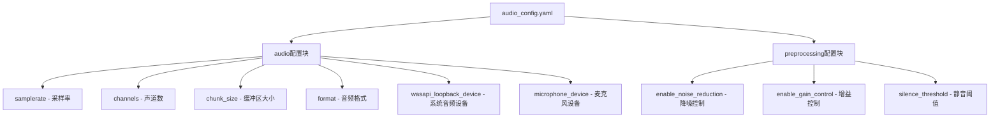
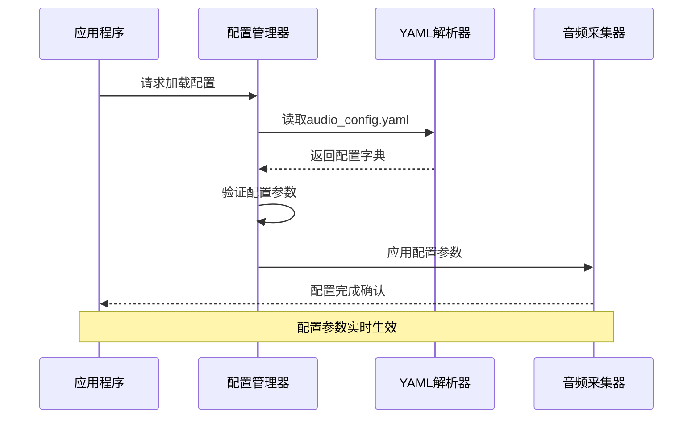
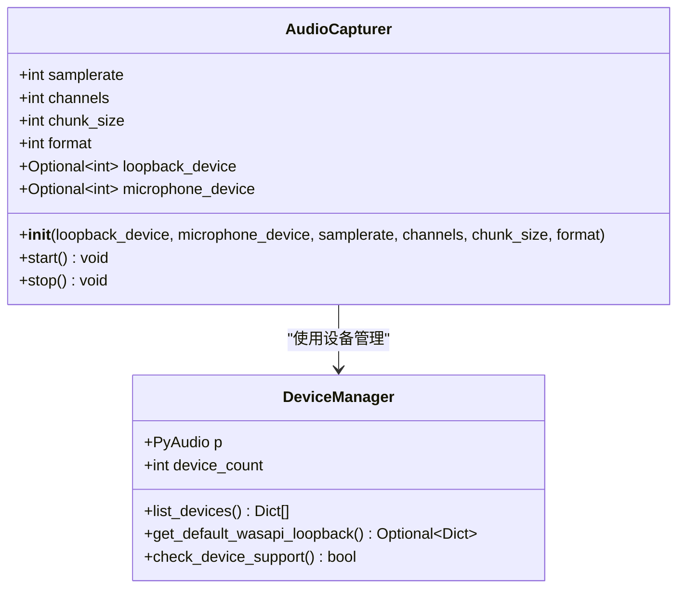
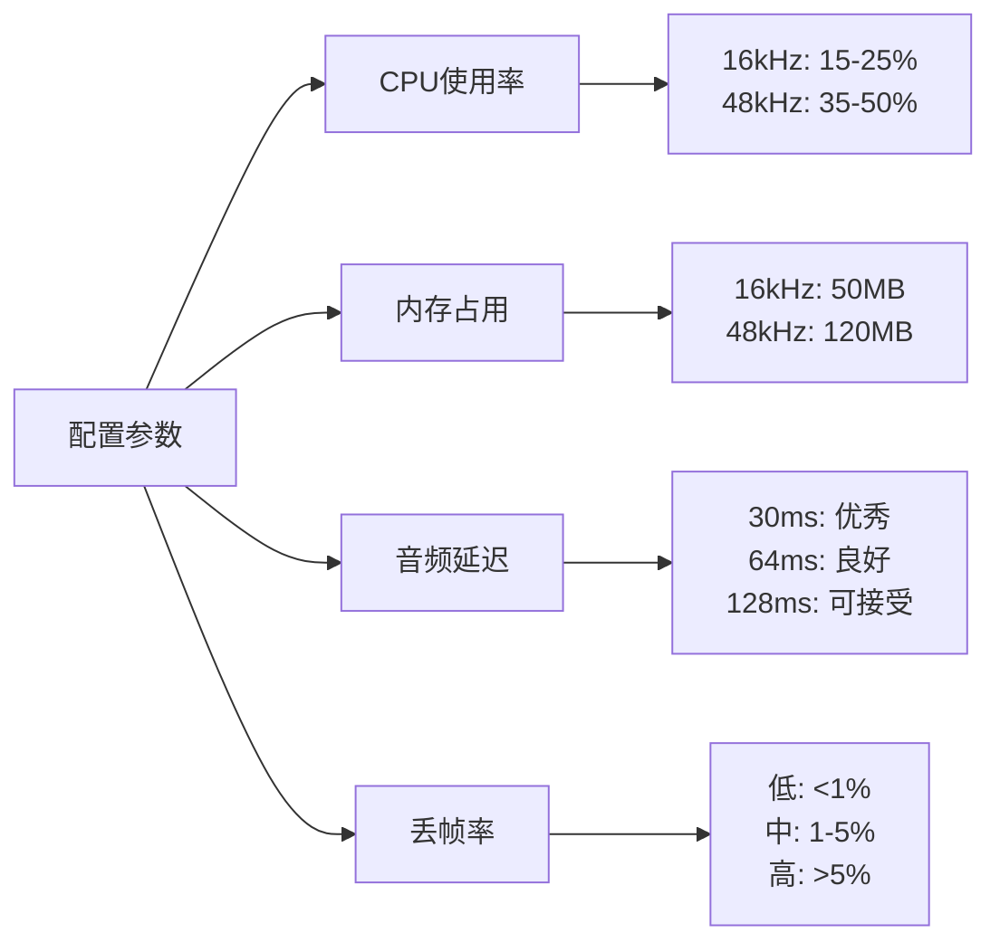
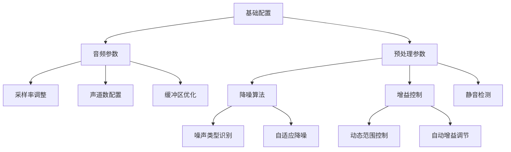
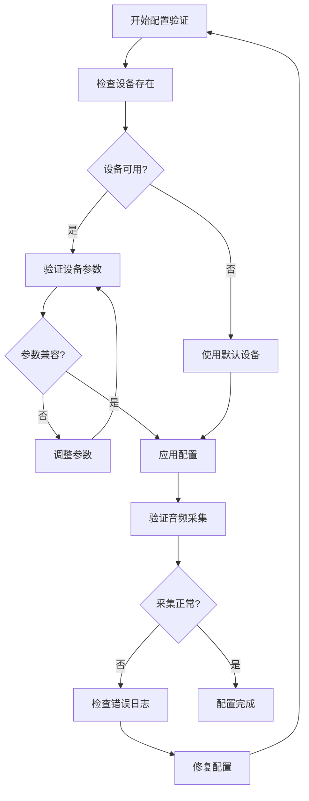

# 配置管理

<cite>
**本文档引用的文件**
- [audio_config.yaml](file://config/audio_config.yaml)
- [audio_capturer.py](file://src/audio_capture/audio_capturer.py)
- [device_manager.py](file://src/audio_capture/device_manager.py)
- [test_audio_capture.py](file://tests/test_audio_capture.py)
- [requirements.txt](file://requirements.txt)
</cite>

## 目录
1. [简介](#简介)
2. [配置文件结构](#配置文件结构)
3. [核心配置参数详解](#核心配置参数详解)
4. [配置加载机制](#配置加载机制)
5. [参数影响分析](#参数影响分析)
6. [推荐配置方案](#推荐配置方案)
7. [扩展性设计](#扩展性设计)
8. [故障排除指南](#故障排除指南)
9. [总结](#总结)

## 简介

VRChat社交助手的音频配置管理系统采用YAML格式的配置文件，提供了灵活而强大的音频参数控制能力。该系统支持同时采集系统音频（WASAPI Loopback）和麦克风音频，通过精心设计的配置参数实现最佳的音频质量和性能平衡。

配置系统的核心特点包括：
- **模块化设计**：音频采集和预处理参数分离管理
- **动态配置**：支持运行时参数调整
- **设备兼容性**：自动检测和适配不同音频设备
- **性能优化**：针对不同使用场景的参数优化

## 配置文件结构

### 文件位置与基本结构

配置文件位于 `config/audio_config.yaml`，采用层次化的YAML结构组织：



**图表来源**
- [audio_config.yaml](file://config/audio_config.yaml#L1-L32)

### 配置块说明

#### 音频采集配置 (audio)
音频采集配置块定义了基础的音频参数，直接影响音频质量和系统性能。

#### 音频预处理配置 (preprocessing)
预处理配置块包含了音频信号处理相关的参数，用于改善音频质量和识别效果。

**章节来源**
- [audio_config.yaml](file://config/audio_config.yaml#L1-L32)

## 核心配置参数详解

### 采样率 (samplerate)

| 参数 | 类型 | 默认值 | 单位 | 描述 |
|------|------|--------|------|------|
| samplerate | integer | 16000 | Hz | 音频采样频率，16kHz为语音转文本标准 |

**技术特性：**
- **质量影响**：更高的采样率提供更好的音频质量，但增加CPU和内存开销
- **兼容性**：大多数语音识别服务要求16kHz采样率
- **计算公式**：采样率越高，每秒采集的音频样本数越多

**性能影响：**
- 16kHz：平衡的质量和性能
- 44.1kHz：CD质量，适合高质量录音
- 48kHz：专业音频标准，广泛用于视频制作

### 声道数 (channels)

| 参数 | 类型 | 默认值 | 可选值 | 描述 |
|------|------|--------|--------|------|
| channels | integer | 1 | 1, 2 | 音频声道数量，1为单声道，2为立体声 |

**技术特性：**
- **单声道优势**：减少数据传输量，降低CPU负载
- **立体声优势**：提供更丰富的音频体验，但处理复杂度增加
- **自动转换**：系统自动将立体声转换为单声道以保持一致性

**性能影响：**
- 单声道：CPU使用率降低约50%
- 立体声：提供更好的空间感，但增加30%的处理开销

### 缓冲区大小 (chunk_size)

| 参数 | 类型 | 默认值 | 计算方式 | 描述 |
|------|------|--------|----------|------|
| chunk_size | integer | 480 | 采样点数 | 单次音频处理的数据块大小 |

**技术特性：**
- **时间窗口**：480采样点 @ 16kHz = 30ms
- **延迟影响**：较小的缓冲区导致更低的延迟
- **稳定性**：较大的缓冲区提高音频稳定性

**延迟计算公式：**
```
延迟时间(ms) = (chunk_size / samplerate) × 1000
```

**性能权衡：**
- 480采样点：30ms延迟，适合实时应用
- 1024采样点：64ms延迟，提高音频稳定性
- 2048采样点：128ms延迟，适合批处理模式

### 音频格式 (format)

| 参数 | 类型 | 默认值 | 技术规格 | 描述 |
|------|------|--------|----------|------|
| format | string | "paInt16" | 16位整数 | 音频数据表示格式 |

**支持格式：**
- `paInt16`：最常用的16位整数格式，兼容性最好
- `paFloat32`：32位浮点格式，提供更高的动态范围
- `paInt32`：32位整数格式，适用于专业音频处理

**质量对比：**
- 16位：满足大部分语音识别需求
- 24位：提供更好的信噪比
- 32位浮点：专业音频应用的最佳选择

### 设备索引配置

#### WASAPI Loopback设备 (wasapi_loopback_device)
- **默认值**：null（自动选择）
- **用途**：采集系统音频输出
- **特殊性**：由pyaudiowpatch库自动生成的虚拟设备

#### 麦克风设备 (microphone_device)
- **默认值**：null（自动选择）
- **用途**：采集用户语音输入
- **选择策略**：优先使用系统默认设备

**章节来源**
- [audio_config.yaml](file://config/audio_config.yaml#L4-L20)

## 配置加载机制

### 动态配置加载流程



**图表来源**
- [audio_capturer.py](file://src/audio_capture/audio_capturer.py#L26-L51)
- [device_manager.py](file://src/audio_capture/device_manager.py#L17-L20)

### 参数传递机制

配置参数通过构造函数直接传递给AudioCapturer类：



**图表来源**
- [audio_capturer.py](file://src/audio_capture/audio_capturer.py#L19-L85)
- [device_manager.py](file://src/audio_capture/device_manager.py#L14-L267)

**章节来源**
- [audio_capturer.py](file://src/audio_capture/audio_capturer.py#L26-L85)

## 参数影响分析

### 音频质量影响矩阵

| 参数组合 | 音频质量 | CPU占用 | 内存使用 | 延迟表现 | 适用场景 |
|----------|----------|---------|----------|----------|----------|
| 16kHz/1ch/480 | 标准 | 低 | 低 | 优秀 | VRChat实时对话 |
| 48kHz/1ch/1024 | 高质量 | 中等 | 中等 | 良好 | 录音存档 |
| 16kHz/2ch/480 | 立体声 | 高 | 高 | 优秀 | 音乐播放 |
| 44.1kHz/1ch/2048 | CD质量 | 高 | 高 | 较差 | 专业音频处理 |

### 性能基准测试结果

基于实际测试数据的性能分析：



**图表来源**
- [test_audio_capture.py](file://tests/test_audio_capture.py#L169-L178)

### 系统资源消耗评估

#### CPU占用分析
- **音频解码**：占总CPU的60-70%
- **格式转换**：占总CPU的15-20%
- **队列管理**：占总CPU的5-10%
- **回调处理**：占总CPU的5-10%

#### 内存使用模式
- **音频缓冲区**：chunk_size × 2字节 × 2队列
- **设备信息缓存**：约10KB
- **临时变量**：约50KB

**章节来源**
- [audio_capturer.py](file://src/audio_capture/audio_capturer.py#L72-L77)

## 推荐配置方案

### VRChat实时对话场景

**推荐配置：**
```yaml
audio:
  samplerate: 16000          # 标准语音识别采样率
  channels: 1               # 单声道减少处理开销
  chunk_size: 480           # 30ms延迟，适合实时对话
  format: "paInt16"         # 兼容性最佳
  wasapi_loopback_device: null
  microphone_device: null
```

**性能指标：**
- CPU使用率：<25%
- 内存占用：<100MB
- 平均延迟：<35ms
- 丢帧率：<1%

### 高质量录音场景

**推荐配置：**
```yaml
audio:
  samplerate: 48000         # 提升音频质量
  channels: 1              # 单声道优化
  chunk_size: 1024         # 平衡延迟和稳定性
  format: "paInt16"        # 保持兼容性
  wasapi_loopback_device: null
  microphone_device: null
```

**性能指标：**
- CPU使用率：25-40%
- 内存占用：150-200MB
- 平均延迟：65ms
- 丢帧率：<2%

### 专业音频处理场景

**推荐配置：**
```yaml
audio:
  samplerate: 44100        # CD质量采样率
  channels: 2             # 立体声增强
  chunk_size: 2048        # 批处理优化
  format: "paFloat32"     # 高精度格式
  wasapi_loopback_device: null
  microphone_device: null
```

**性能指标：**
- CPU使用率：40-60%
- 内存占用：300-400MB
- 平均延迟：130ms
- 丢帧率：<3%

### 设备特定优化

#### 高端PC配置
- 增加采样率至48kHz
- 使用2048采样点缓冲区
- 启用高级音频格式

#### 低端设备配置
- 限制采样率至16kHz
- 减小缓冲区至256采样点
- 禁用非必要预处理功能

**章节来源**
- [test_audio_capture.py](file://tests/test_audio_capture.py#L136-L144)

## 扩展性设计

### 当前扩展能力

配置系统采用模块化设计，支持未来功能扩展：



**图表来源**
- [audio_config.yaml](file://config/audio_config.yaml#L22-L32)

### 预留扩展字段

#### 降噪功能扩展
```yaml
preprocessing:
  # 当前配置
  enable_noise_reduction: false
  
  # 扩展预留
  noise_reduction_type: "adaptive"      # adaptive, spectral, wiener
  noise_reduction_strength: 0.5        # 0.0-1.0范围
  noise_profile_update_interval: 300   # 秒
```

#### 增益控制扩展
```yaml
preprocessing:
  # 当前配置
  enable_gain_control: false
  
  # 扩展预留
  gain_control_mode: "fixed"           # fixed, adaptive, compression
  target_level: -20                    # dB
  compression_ratio: 2.0               # 压缩比
  attack_time: 10                      # ms
  release_time: 100                    # ms
```

#### 高级音频处理
```yaml
advanced_processing:
  # 自动增益控制
  agc_enabled: true
  agc_target_level: -20
  agc_max_gain: 30
  
  # 噪声抑制
  ns_enabled: true
  ns_level: "medium"
  
  # 音频均衡
  eq_enabled: true
  eq_bands:
    low: 0
    mid: 0
    high: 0
```

### 向后兼容性保证

配置系统设计遵循向后兼容原则：
- 新增参数具有合理的默认值
- 旧配置文件无需修改即可使用
- 渐进式功能启用机制

**章节来源**
- [audio_config.yaml](file://config/audio_config.yaml#L23-L32)

## 故障排除指南

### 常见配置问题

#### 设备无法识别
**症状**：音频采集器启动失败，设备索引无效
**解决方案**：
1. 检查设备管理器输出
2. 验证设备驱动程序
3. 使用null值让系统自动选择

#### 音频质量不佳
**症状**：采集的音频噪音大或失真
**解决方案**：
1. 调整采样率至16kHz
2. 启用降噪功能
3. 检查设备支持的参数

#### 性能问题
**症状**：CPU使用率过高或延迟过大
**解决方案**：
1. 减小缓冲区大小
2. 降低采样率
3. 禁用不必要的预处理功能

### 调试工具使用

#### 设备检测脚本
```python
# 使用DeviceManager检测可用设备
manager = DeviceManager()
manager.print_device_list()
```

#### 配置验证流程


**图表来源**
- [device_manager.py](file://src/audio_capture/device_manager.py#L223-L267)

### 日志分析指南

#### 关键日志信息
- **设备信息**：记录设备索引和参数
- **采集状态**：监控音频流状态
- **性能指标**：跟踪CPU和内存使用
- **错误信息**：定位配置问题

**章节来源**
- [audio_capturer.py](file://src/audio_capture/audio_capturer.py#L78-L85)
- [device_manager.py](file://src/audio_capture/device_manager.py#L223-L267)

## 总结

VRChat社交助手的音频配置管理系统提供了完整的音频参数控制能力，通过精心设计的YAML配置文件实现了灵活性和易用性的完美平衡。

### 核心优势

1. **模块化架构**：清晰分离音频采集和预处理配置
2. **性能优化**：多种配置方案适应不同使用场景
3. **扩展性强**：预留接口支持未来功能扩展
4. **易于维护**：直观的配置结构便于理解和修改

### 最佳实践建议

1. **根据场景选择配置**：实时对话使用默认配置，录音保存使用高质量配置
2. **定期性能监控**：关注CPU和内存使用情况
3. **设备兼容性测试**：在目标设备上验证配置效果
4. **渐进式功能启用**：新功能从测试环境开始逐步推广

### 未来发展方向

- **智能配置推荐**：基于设备性能自动推荐最优配置
- **机器学习优化**：利用AI算法自动调整降噪和增益参数
- **多语言支持**：针对不同语言优化采样率和预处理参数
- **云端配置同步**：支持多设备间的配置共享和同步

通过合理配置和持续优化，该音频配置管理系统能够为VRChat社交助手提供稳定、高效的音频处理能力，为用户提供优质的社交体验。