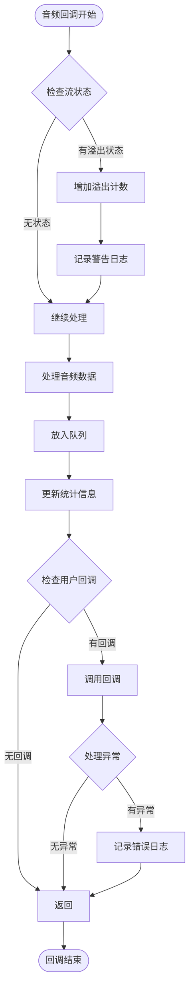

# AudioCapturer类架构与工作流程详解

<cite>
**本文档引用的文件**
- [audio_capturer.py](file://src/audio_capture/audio_capturer.py)
- [device_manager.py](file://src/audio_capture/device_manager.py)
- [audio_config.yaml](file://config/audio_config.yaml)
- [test_audio_capture.py](file://tests/test_audio_capture.py)
- [__init__.py](file://src/audio_capture/__init__.py)
</cite>

## 目录
1. [简介](#简介)
2. [项目结构概览](#项目结构概览)
3. [AudioCapturer类核心架构](#audiocapturer类核心架构)
4. [初始化参数配置详解](#初始化参数配置详解)
5. [音频采集工作流程](#音频采集工作流程)
6. [回调函数处理机制](#回调函数处理机制)
7. [性能监控与统计](#性能监控与统计)
8. [配置优化指南](#配置优化指南)
9. [上下文管理器使用模式](#上下文管理器使用模式)
10. [故障排除指南](#故障排除指南)
11. [总结](#总结)

## 简介

AudioCapturer类是VRChat社交助手项目中实现双路音频同步采集的核心组件。它能够同时采集WASAPI Loopback音频（系统音频输出）和麦克风音频输入，为语音识别和音频处理提供高质量的音频数据流。该类采用多线程架构，通过回调函数机制实现非阻塞式音频采集，并提供了完善的性能监控和资源管理功能。最近更新中，该类增加了自动音频重采样功能，支持从WASAPI loopback设备的原生采样率（通常为48kHz）转换到目标处理采样率（16kHz），并修正了帧计数逻辑以使用重采样后的音频数据长度。

## 项目结构概览

**图表来源**
- [audio_capturer.py](file://src/audio_capture/audio_capturer.py#L1-L359)
- [device_manager.py](file://src/audio_capture/device_manager.py#L1-L267)
- [audio_config.yaml](file://config/audio_config.yaml#L1-L70)

**章节来源**
- [audio_capturer.py](file://src/audio_capture/audio_capturer.py#L1-L359)
- [device_manager.py](file://src/audio_capture/device_manager.py#L1-L267)
- [__init__.py](file://src/audio_capture/__init__.py#L1-L10)

## AudioCapturer类核心架构

AudioCapturer类采用了模块化的架构设计，主要包含以下核心组件：

**图表来源**
- [audio_capturer.py](file://src/audio_capture/audio_capturer.py#L19-L359)
- [device_manager.py](file://src/audio_capture/device_manager.py#L14-L267)

**章节来源**
- [audio_capturer.py](file://src/audio_capture/audio_capturer.py#L19-L359)
- [device_manager.py](file://src/audio_capture/device_manager.py#L14-L267)

## 初始化参数配置详解

AudioCapturer的__init__方法提供了灵活的参数配置，每个参数都对音频质量和性能产生重要影响：

### 核心参数说明

| 参数 | 类型 | 默认值 | 描述 | 性能影响 |
|------|------|--------|------|----------|
| loopback_device | Optional[int] | None | WASAPI Loopback设备索引 | 影响系统音频采集质量 |
| microphone_device | Optional[int] | None | 麦克风设备索引 | 影响语音采集质量 |
| samplerate | int | 16000 | 采样率（Hz） | STT标准采样率，影响识别精度 |
| channels | int | 1 | 声道数（1=单声道，2=立体声） | 单声道可减少数据量 |
| chunk_size | int | 480 | 缓冲区大小（样本数） | 30ms@16kHz，影响延迟 |
| format | int | pyaudio.paInt16 | 音频格式 | 影响数据精度和内存使用 |

### 参数配置策略

**图表来源**
- [audio_capturer.py](file://src/audio_capture/audio_capturer.py#L26-L82)
- [audio_config.yaml](file://config/audio_config.yaml#L5-L12)

**章节来源**
- [audio_capturer.py](file://src/audio_capture/audio_capturer.py#L26-L82)
- [audio_config.yaml](file://config/audio_config.yaml#L5-L12)

## 音频采集工作流程

AudioCapturer的start方法实现了双路音频流的并发采集，采用异步回调机制确保音频数据的实时处理：

**图表来源**
- [audio_capturer.py](file://src/audio_capture/audio_capturer.py#L185-L249)

### WASAPI Loopback流配置

WASAPI Loopback流专门用于采集系统音频输出，具有以下特点：
- **设备选择**：优先使用默认WASAPI Loopback设备，支持多声道输出
- **采样率适配**：使用设备的默认采样率而非固定值
- **声道处理**：通常为双声道，支持自动转换为单声道
- **重采样机制**：新增了从设备原生采样率到目标处理采样率的自动重采样功能

### 麦克风音频流配置

麦克风音频流针对语音输入优化：
- **采样率固定**：使用配置的固定采样率（默认16kHz）
- **声道适配**：根据设备能力调整声道数
- **格式统一**：使用16位整数格式保证兼容性

**章节来源**
- [audio_capturer.py](file://src/audio_capture/audio_capturer.py#L185-L249)

## 回调函数处理机制

AudioCapturer实现了两套独立的回调函数处理机制，分别对应WASAPI Loopback和麦克风音频流：

### _loopback_audio_callback回调处理

**图表来源**
- [audio_capturer.py](file://src/audio_capture/audio_capturer.py#L125-L155)

### 数据处理流程详解

回调函数执行以下关键步骤：

1. **状态检查与溢出处理**
   - 检查音频流状态码
   - 记录溢出事件并更新统计信息
   - 提供错误恢复机制

2. **时间戳生成**
   - 使用time.time()获取精确时间戳
   - 为音频同步提供时间基准

3. **数据格式转换**
   - 字节数据转换为numpy数组
   - 数据类型标准化为float32
   - 幅度归一化到[-1.0, 1.0]范围

4. **声道转换**
   - 检测双声道数据（frame_count × 2）
   - 使用均值算法转换为单声道
   - 保持音频质量的同时减少数据量

5. **重采样处理**（新增功能）
   - 检查设备原生采样率与目标采样率是否不同
   - 调用_resample_audio方法执行重采样
   - 使用scipy.signal.resample进行高质量重采样

6. **队列管理**
   - 将处理后的音频数据和时间戳打包
   - 放入对应的音频队列
   - 支持异步数据获取

7. **用户回调调用**
   - 检查并调用用户自定义回调函数
   - 异常捕获和日志记录
   - 保证主流程不受影响

### set_loopback_callback和set_microphone_callback

这两个方法允许上层应用注入自定义处理逻辑：

**图表来源**
- [audio_capturer.py](file://src/audio_capture/audio_capturer.py#L84-L101)

**章节来源**
- [audio_capturer.py](file://src/audio_capture/audio_capturer.py#L125-L155)

## 性能监控与统计

AudioCapturer提供了全面的性能监控和统计功能，帮助开发者了解音频采集系统的运行状态：

### 统计信息收集

**图表来源**
- [audio_capturer.py](file://src/audio_capture/audio_capturer.py#L313-L328)

### 性能指标详解

| 指标 | 类型 | 描述 | 监控意义 |
|------|------|------|----------|
| loopback_frames_captured | int | 已捕获的WASAPI Loopback音频帧数 | 评估系统负载和数据完整性 |
| microphone_frames_captured | int | 已捕获的麦克风音频帧数 | 监控语音采集质量 |
| loopback_overflows | int | WASAPI Loopback音频流溢出次数 | 检测缓冲区溢出问题 |
| microphone_overflows | int | 麦克风音频流溢出次数 | 识别音频采集瓶颈 |
| loopback_queue_size | int | WASAPI Loopback队列当前大小 | 监控数据积压情况 |
| microphone_queue_size | int | 麦克风队列当前大小 | 评估处理延迟 |
| is_running | bool | 音频采集器运行状态 | 系统健康状态指示 |

### 溢出检测机制

**图表来源**
- [audio_capturer.py](file://src/audio_capture/audio_capturer.py#L129-L131)
- [audio_capturer.py](file://src/audio_capture/audio_capturer.py#L147-L148)

### 性能优化建议

基于统计信息的性能优化策略：

**章节来源**
- [audio_capturer.py](file://src/audio_capture/audio_capturer.py#L313-L328)
- [audio_capturer.py](file://src/audio_capture/audio_capturer.py#L129-L131)
- [audio_capturer.py](file://src/audio_capture/audio_capturer.py#L147-L148)

## 配置优化指南

基于audio_config.yaml文件的配置优化策略，帮助用户根据具体需求调整音频采集参数：

### 标准配置分析

audio_config.yaml提供了经过验证的最佳实践配置：

| 配置项 | 推荐值 | 用途 | 性能影响 |
|--------|--------|------|----------|
| samplerate | 16000 | 语音转文本标准采样率 | 平衡识别精度和性能 |
| channels | 1 | 单声道处理 | 减少数据量和处理复杂度 |
| chunk_size | 480 | 30ms缓冲区 | 降低延迟，适合实时应用 |
| format | "paInt16" | 16位整数格式 | 兼容性好，内存效率高 |

### 配置优化策略

**图表来源**
- [audio_config.yaml](file://config/audio_config.yaml#L5-L70)

### 设备配置优化

基于DeviceManager的设备发现和配置功能：

**图表来源**
- [device_manager.py](file://src/audio_capture/device_manager.py#L14-L267)

**章节来源**
- [audio_config.yaml](file://config/audio_config.yaml#L5-L70)
- [device_manager.py](file://src/audio_capture/device_manager.py#L14-L267)

## 上下文管理器使用模式

AudioCapturer实现了Python的上下文管理器协议，提供了简洁的资源管理接口：

### 上下文管理器实现

**图表来源**
- [audio_capturer.py](file://src/audio_capture/audio_capturer.py#L346-L353)

### 使用模式对比

传统方式vs上下文管理器方式：

| 方式 | 优点 | 缺点 | 适用场景 |
|------|------|------|----------|
| 传统方式 | 灵活性高 | 需要手动管理资源 | 复杂应用场景 |
| 上下文管理器 | 自动资源管理 | 灵活性较低 | 简单应用场景 |

### 上下文管理器工作流程

**图表来源**
- [audio_capturer.py](file://src/audio_capture/audio_capturer.py#L346-L353)

### 资源自动管理机制

**图表来源**
- [audio_capturer.py](file://src/audio_capture/audio_capturer.py#L346-L359)

**章节来源**
- [audio_capturer.py](file://src/audio_capture/audio_capturer.py#L346-L353)
- [audio_capturer.py](file://src/audio_capture/audio_capturer.py#L351-L353)

## 故障排除指南

基于实际使用经验和常见问题，提供AudioCapturer的故障排除指南：

### 常见问题诊断

### 错误代码对照表

| 错误类型 | 可能原因 | 解决方案 | 预防措施 |
|----------|----------|----------|----------|
| 设备未找到 | 设备索引错误 | 使用DeviceManager验证设备列表 | 定期检查设备状态 |
| 权限拒绝 | 缺少管理员权限 | 以管理员身份运行程序 | 配置UAC设置 |
| 驱动程序问题 | 驱动过时或损坏 | 更新音频驱动程序 | 定期更新系统 |
| PyAudio库错误 | 库文件损坏 | 重新安装pyaudiowpatch | 使用包管理器安装 |
| 内存不足 | 缓冲区过大 | 减小chunk_size参数 | 监控系统内存使用 |
| CPU占用过高 | 处理负载过大 | 优化回调函数逻辑 | 使用异步处理 |

### 性能调优建议

基于实际测试经验的性能优化建议：

**章节来源**
- [test_audio_capture.py](file://tests/test_audio_capture.py#L193-L212)
- [audio_capturer.py](file://src/audio_capture/audio_capturer.py#L185-L249)

## 总结

AudioCapturer类作为VRChat社交助手项目的核心音频采集组件，展现了优秀的架构设计和工程实践：

### 核心优势

1. **双路同步采集**：同时处理系统音频和麦克风音频，满足复杂的音频处理需求
2. **模块化设计**：清晰的职责分离，便于维护和扩展
3. **异步处理**：采用回调机制和队列管理，确保高性能和低延迟
4. **资源管理**：完善的上下文管理和自动清理机制
5. **性能监控**：全面的统计信息和溢出检测
6. **自动重采样**：新增的重采样功能确保音频数据在统一采样率下处理

### 技术亮点

- **灵活的参数配置**：支持多种采样率、声道数和缓冲区大小组合
- **智能的设备适配**：自动检测和适配不同音频设备的能力
- **健壮的错误处理**：完善的异常捕获和恢复机制
- **可扩展的回调系统**：支持用户自定义音频处理逻辑
- **高质量重采样**：使用scipy.signal.resample实现从48kHz到16kHz的高质量音频重采样

### 应用价值

AudioCapturer类不仅为VRChat社交助手提供了可靠的音频采集基础，也为其他需要双路音频同步处理的应用场景提供了优秀的参考实现。其设计理念和实现方式体现了现代软件开发的最佳实践，值得在类似项目中借鉴和应用。

通过深入理解AudioCapturer的设计原理和实现细节，开发者可以更好地利用这一组件构建高质量的音频处理应用，同时也能为后续的功能扩展和性能优化奠定坚实的基础。