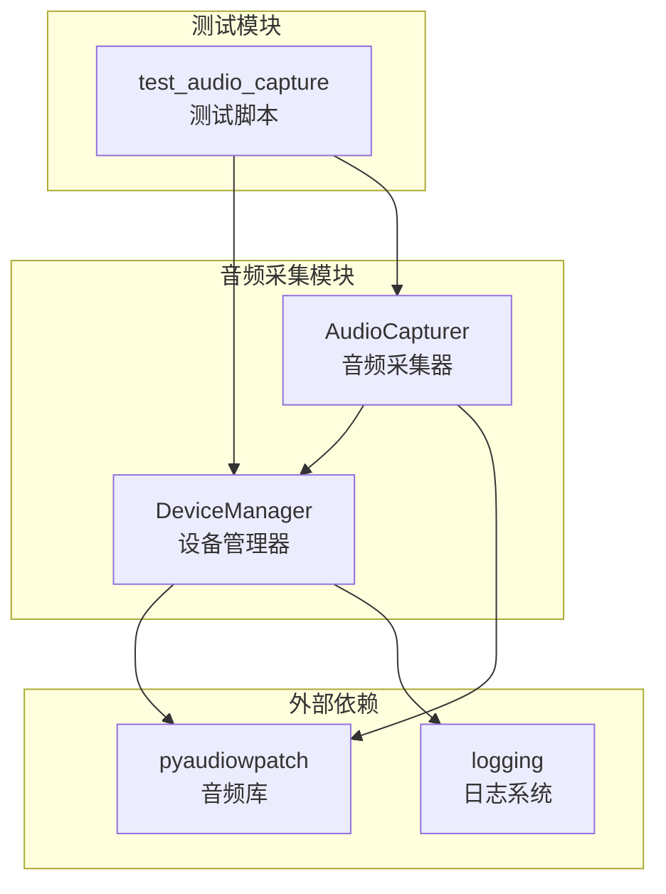
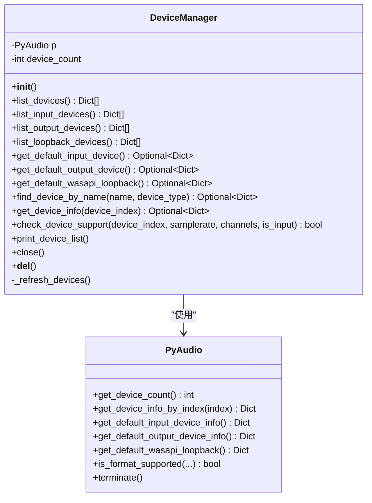
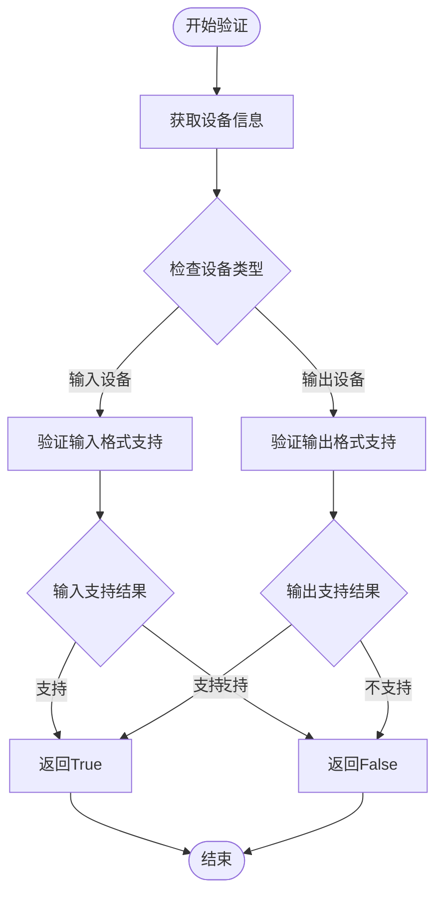
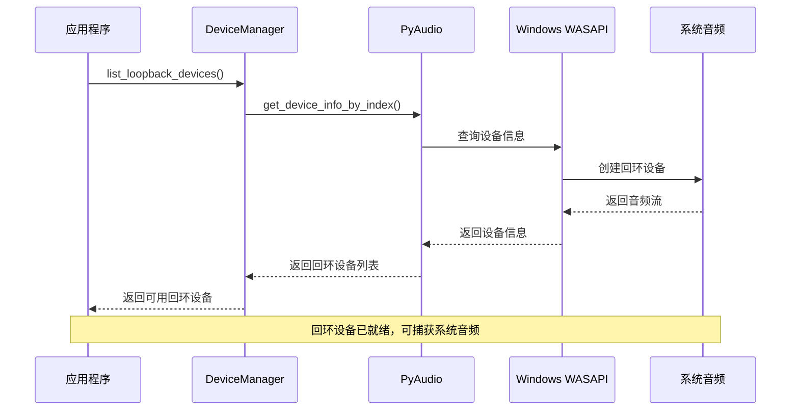
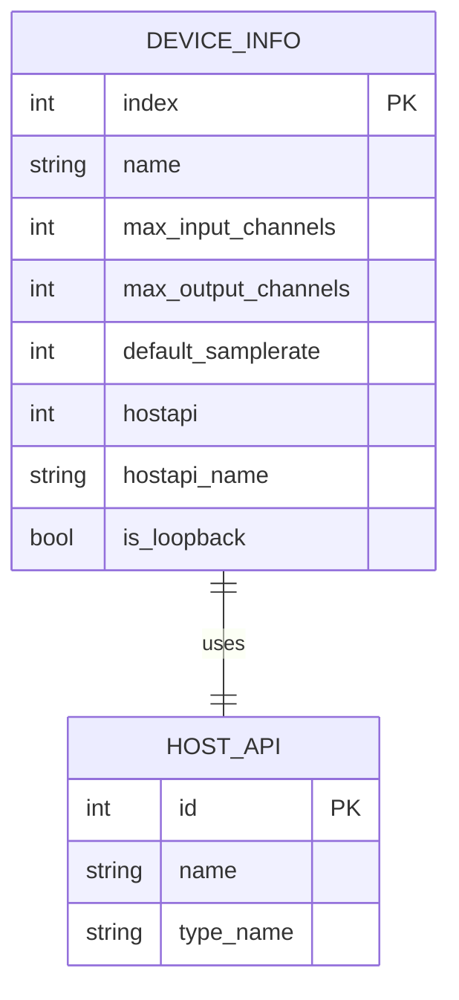
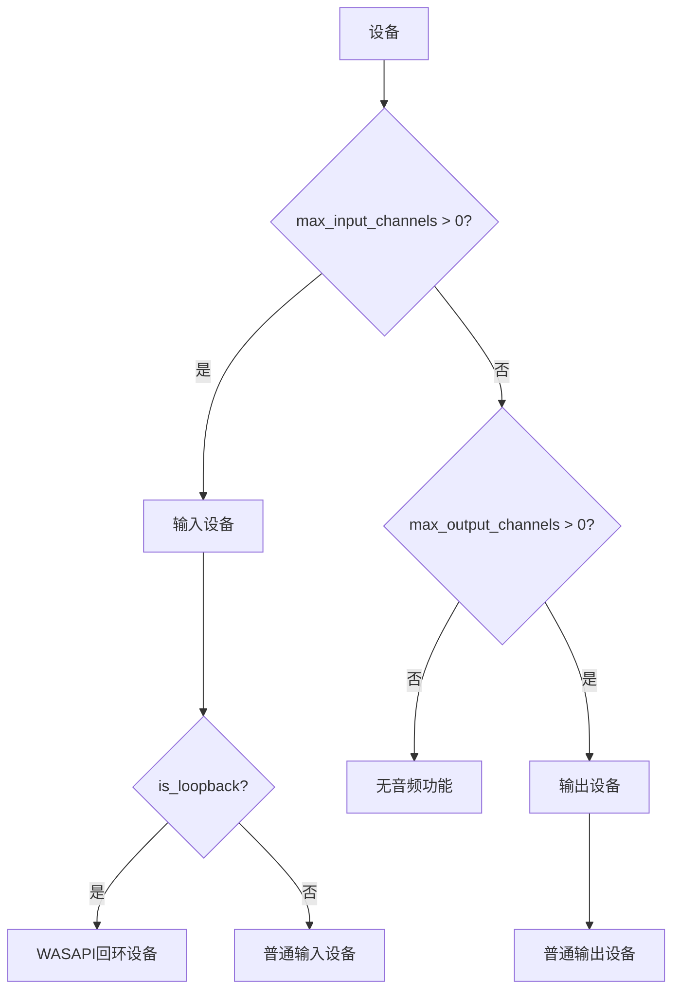
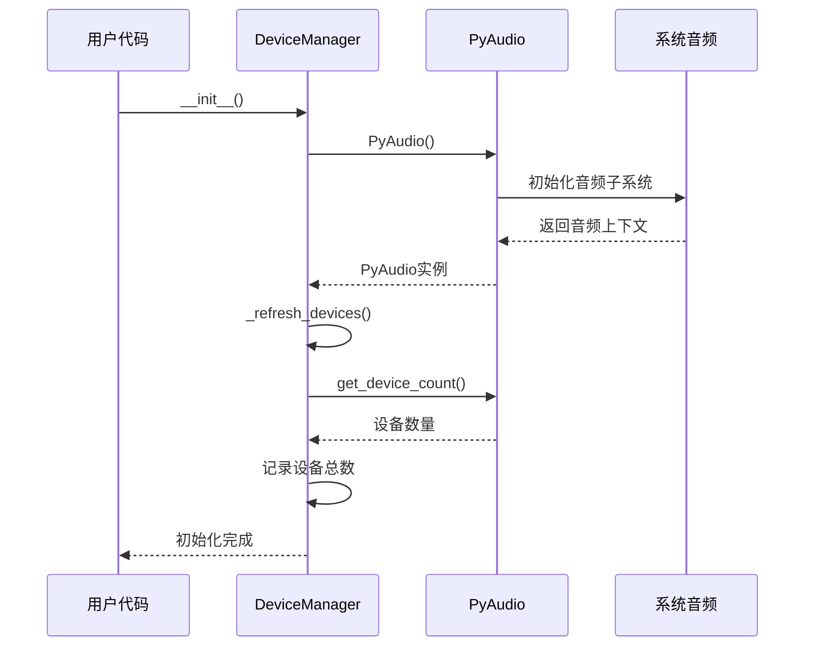
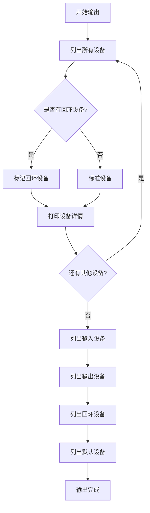
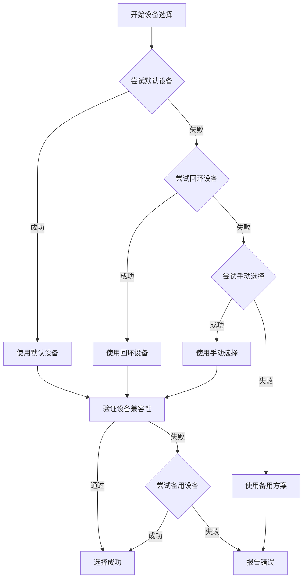

# DeviceManager类深度解析

<cite>
**本文档引用的文件**
- [device_manager.py](file://src/audio_capture/device_manager.py)
- [audio_capturer.py](file://src/audio_capture/audio_capturer.py)
- [test_audio_capture.py](file://tests/test_audio_capture.py)
- [__init__.py](file://src/audio_capture/__init__.py)
- [requirements.txt](file://requirements.txt)
</cite>

## 目录
1. [简介](#简介)
2. [项目结构概览](#项目结构概览)
3. [DeviceManager类架构](#devicemanager类架构)
4. [核心功能详解](#核心功能详解)
5. [WASAPI Loopback设备支持](#wasapi-loopback设备支持)
6. [设备信息结构](#设备信息结构)
7. [资源管理机制](#资源管理机制)
8. [调试与监控](#调试与监控)
9. [最佳实践指南](#最佳实践指南)
10. [总结](#总结)

## 简介

DeviceManager类是VRChat社交助手项目中音频采集模块的核心组件，专门负责管理系统的音频输入/输出设备，特别是支持WASAPI Loopback技术的音频设备。该类基于pyaudiowpatch库构建，提供了完整的音频设备枚举、选择和管理功能，为系统音频捕获和麦克风输入提供了强大的基础设施支持。

DeviceManager类的设计理念围绕以下核心目标：
- **全面设备枚举**：支持系统中所有音频设备的发现和信息获取
- **WASAPI Loopback专用**：特别优化了对Windows WASAPI回环设备的支持
- **灵活设备选择**：提供多种方式查找和选择合适的音频设备
- **性能优化**：通过缓存和延迟加载机制提升设备查询效率
- **错误处理**：完善的异常处理和资源清理机制

## 项目结构概览



**图表来源**
- [device_manager.py](file://src/audio_capture/device_manager.py#L1-L267)
- [audio_capturer.py](file://src/audio_capture/audio_capturer.py#L1-L325)

**章节来源**
- [device_manager.py](file://src/audio_capture/device_manager.py#L1-L20)
- [__init__.py](file://src/audio_capture/__init__.py#L1-L11)

## DeviceManager类架构

DeviceManager类采用面向对象的设计模式，封装了pyaudiowpatch库的功能，提供了简洁而强大的音频设备管理接口。



**图表来源**
- [device_manager.py](file://src/audio_capture/device_manager.py#L14-L267)

### 类属性与初始化

DeviceManager类的核心属性包括：
- `p`: PyAudio实例，负责底层音频设备操作
- `device_count`: 系统中检测到的音频设备总数
- `logger`: 日志记录器，用于跟踪设备管理过程

**章节来源**
- [device_manager.py](file://src/audio_capture/device_manager.py#L14-L21)

## 核心功能详解

### 设备枚举方法

DeviceManager提供了四个主要的设备枚举方法，每个方法都针对不同的设备类型进行了优化：

#### list_devices() - 全面设备列表

该方法遍历系统中的所有音频设备，收集详细的设备信息。返回的设备信息包含以下关键字段：

| 字段名 | 类型 | 描述 |
|--------|------|------|
| index | int | 设备索引号 |
| name | str | 设备名称 |
| max_input_channels | int | 最大输入声道数 |
| max_output_channels | int | 最大输出声道数 |
| default_samplerate | int | 默认采样率 |
| hostapi | int | 主机API类型标识 |
| hostapi_name | str | 主机API名称 |
| is_loopback | bool | 是否为回环设备 |

#### list_input_devices() - 输入设备过滤

该方法通过筛选`max_input_channels > 0`的设备，返回所有可用的输入设备（麦克风）。这种设计确保了只返回真正能够进行音频输入的设备。

#### list_output_devices() - 输出设备过滤

类似地，该方法筛选`max_output_channels > 0`的设备，返回所有可用的输出设备（扬声器）。这为系统音频捕获提供了基础。

#### list_loopback_devices() - WASAPI回环设备

这是DeviceManager最具特色的功能之一。WASAPI回环设备是Windows特有的技术，允许应用程序捕获系统播放的音频。该方法通过检查`is_loopback`标志来识别这些特殊设备。

**章节来源**
- [device_manager.py](file://src/audio_capture/device_manager.py#L27-L83)

### 默认设备获取

DeviceManager提供了三个专门的方法来获取系统的默认音频设备：

#### get_default_input_device()

该方法首先调用`get_default_input_device_info()`获取系统默认输入设备的信息，然后通过`get_device_info()`方法获取完整的设备详情。这种方法确保了即使在设备信息获取过程中出现异常，也能提供合理的错误处理。

#### get_default_output_device()

与输入设备类似，该方法获取系统默认输出设备的信息。这对于需要同时处理输入和输出的应用场景特别有用。

#### get_default_wasapi_loopback()

这是WASAPI回环设备的专用方法。它首先尝试直接获取默认WASAPI回环设备，如果失败，则退回到手动查找第一个可用的回环设备。这种降级策略确保了即使某些情况下无法直接获取默认设备，系统仍能正常工作。

**章节来源**
- [device_manager.py](file://src/audio_capture/device_manager.py#L85-L133)

### 设备查找与验证

#### find_device_by_name() - 名称匹配查找

该方法支持按设备名称进行模糊匹配查找，支持四种设备类型的选择：
- `'all'`: 查找所有类型的设备
- `'input'`: 仅查找输入设备  
- `'output'`: 仅查找输出设备
- `'loopback'`: 仅查找回环设备

查找算法采用不区分大小写的字符串包含匹配，提供了灵活的设备选择方式。

#### check_device_support() - 设备兼容性验证

该方法是音频采集应用中的关键功能，用于验证设备是否支持特定的音频配置：



**图表来源**
- [device_manager.py](file://src/audio_capture/device_manager.py#L188-L221)

**章节来源**
- [device_manager.py](file://src/audio_capture/device_manager.py#L135-L161)
- [device_manager.py](file://src/audio_capture/device_manager.py#L188-L221)

## WASAPI Loopback设备支持

WASAPI（Windows Audio Session API）回环技术是DeviceManager的核心特色功能。该技术允许应用程序捕获系统播放的音频，而不是用户的麦克风输入。

### WASAPI回环的工作原理



**图表来源**
- [device_manager.py](file://src/audio_capture/device_manager.py#L70-L83)

### 回环设备的识别机制

pyaudiowpatch库自动为每个WASAPI输出设备创建对应的回环设备，这些设备通过`is_loopback`标志进行识别。DeviceManager通过以下逻辑来处理回环设备：

1. **自动创建**: pyaudiowpatch库在检测到新的WASAPI输出设备时，自动为其创建回环版本
2. **标志识别**: 通过检查设备信息中的`isLoopbackDevice`字段来识别回环设备
3. **透明使用**: 应用程序可以像使用普通输入设备一样使用回环设备

### 回环设备的应用场景

- **游戏音频捕获**: 捕获游戏中的对话和环境音效
- **会议软件集成**: 捕获Zoom、Teams等软件的音频输出
- **语音识别**: 为语音识别系统提供系统音频输入
- **音频分析**: 分析系统播放的音频内容

**章节来源**
- [device_manager.py](file://src/audio_capture/device_manager.py#L70-L83)

## 设备信息结构

DeviceManager返回的设备信息采用了标准化的数据结构，确保了与其他组件的无缝集成。

### 设备信息字段详解



**图表来源**
- [device_manager.py](file://src/audio_capture/device_manager.py#L38-L46)

### 数据类型与约束

| 字段 | 数据类型 | 约束条件 | 示例值 |
|------|----------|----------|--------|
| index | int | ≥ 0 | 0, 1, 2... |
| name | str | 非空字符串 | "Microphone (Realtek High Definition Audio)" |
| max_input_channels | int | ≥ 0 | 1, 2, 6... |
| max_output_channels | int | ≥ 0 | 2, 6, 8... |
| default_samplerate | int | > 0 | 44100, 48000, 16000... |
| hostapi | int | ≥ 0 | 0, 1... |
| hostapi_name | str | 非空字符串 | "DirectSound", "WASAPI"... |
| is_loopback | bool | true/false | false, true |

### 设备类型判断逻辑

DeviceManager通过以下规则来判断设备类型：



**图表来源**
- [device_manager.py](file://src/audio_capture/device_manager.py#L52-L68)

**章节来源**
- [device_manager.py](file://src/audio_capture/device_manager.py#L38-L46)
- [device_manager.py](file://src/audio_capture/device_manager.py#L162-L186)

## 资源管理机制

DeviceManager实现了完善的资源管理机制，确保音频设备的正确初始化和清理。

### 初始化流程



**图表来源**
- [device_manager.py](file://src/audio_capture/device_manager.py#L17-L21)

### 资源清理机制

DeviceManager提供了多层次的资源清理机制：

#### close()方法 - 主动清理

该方法负责主动释放所有音频资源：
- 调用PyAudio实例的`terminate()`方法
- 关闭所有音频流
- 清理内部状态变量
- 记录清理日志

#### __del__()方法 - 垃圾回收清理

作为析构函数，`__del__()`方法确保即使在异常情况下也能正确清理资源。这种双重保护机制大大降低了资源泄漏的风险。

### 异常处理策略

DeviceManager在资源管理方面采用了以下异常处理策略：

1. **存在性检查**: 在执行任何操作前检查对象是否存在
2. **优雅降级**: 当某些资源无法访问时，提供合理的默认行为
3. **日志记录**: 详细记录资源管理过程中的所有操作和异常
4. **幂等性保证**: 确保多次调用清理方法不会产生副作用

**章节来源**
- [device_manager.py](file://src/audio_capture/device_manager.py#L258-L267)

## 调试与监控

DeviceManager提供了强大的调试功能，帮助开发者理解和诊断音频设备问题。

### print_device_list() - 设备列表输出

该方法提供了结构化的设备信息输出，包含以下层次：

#### 所有设备概览



**图表来源**
- [device_manager.py](file://src/audio_capture/device_manager.py#L223-L256)

#### 输出格式示例

print_device_list()方法的输出格式如下：

```
=== 所有音频设备 ===
[0] 高清音频 (Realtek High Definition Audio)
    输入通道: 2, 输出通道: 2
    默认采样率: 44100
    Host API: DirectSound

[1] 音频输入 (USB Audio Device)
    输入通道: 1, 输出通道: 0
    默认采样率: 48000
    Host API: WDM-KS

[2] WASAPI 回环 (音频输入)
    输入通道: 2, 输出通道: 0
    默认采样率: 44100
    Host API: WASAPI

=== 输入设备（麦克风）===
[0] 高清音频 (Realtek High Definition Audio)
[1] 音频输入 (USB Audio Device)

=== WASAPI Loopback 设备（系统音频）===
[2] WASAPI 回环 (音频输入)

=== 默认设备 ===
默认输入: [1] 音频输入 (USB Audio Device)
默认输出: [0] 高清音频 (Realtek High Definition Audio)
默认 Loopback: [2] WASAPI 回环 (音频输入)
```

### 调试信息的价值

print_device_list()方法在开发过程中的实用价值：

1. **设备发现**: 帮助开发者确认系统中哪些设备被正确识别
2. **配置验证**: 验证设备的音频参数是否符合预期
3. **问题诊断**: 快速定位设备相关的配置问题
4. **用户支持**: 为用户提供设备信息参考

**章节来源**
- [device_manager.py](file://src/audio_capture/device_manager.py#L223-L256)

## 最佳实践指南

基于DeviceManager的设计和实现，以下是使用该类的最佳实践建议：

### 设备选择策略

#### 优先级排序

1. **默认设备**: 优先使用系统默认设备
2. **回环设备**: 对于系统音频捕获，优先选择WASAPI回环设备
3. **手动选择**: 当默认设备不可用时，提供手动选择选项

#### 容错机制



### 性能优化建议

#### 延迟加载策略

- **按需枚举**: 只在需要时才调用设备枚举方法
- **缓存结果**: 对于频繁使用的设备信息，考虑本地缓存
- **批量操作**: 尽可能批量获取多个设备信息，减少API调用次数

#### 内存管理

- **及时清理**: 使用完毕后立即调用`close()`方法
- **避免重复创建**: 在应用程序生命周期内重用DeviceManager实例
- **监控资源**: 定期检查音频资源的使用情况

### 错误处理模式

#### 异常分类处理

```python
try:
    device = manager.find_device_by_name("我的设备", "loopback")
    if not device:
        # 设备不存在的处理
        pass
except Exception as e:
    # 系统级错误处理
    logger.error(f"设备查找失败: {e}")
```

#### 降级策略实现

当首选设备不可用时，实现多级降级：
1. 尝试默认设备
2. 尝试回环设备  
3. 尝试其他可用设备
4. 提供错误提示

### 集成测试建议

#### 自动化测试覆盖

- **设备枚举测试**: 验证所有设备都能被正确枚举
- **设备信息测试**: 确认设备信息字段的完整性
- **默认设备测试**: 验证默认设备获取的准确性
- **回环设备测试**: 特别测试WASAPI回环设备的功能

#### 性能基准测试

定期进行设备枚举性能测试，确保在大量设备环境下仍能保持良好的响应速度。

**章节来源**
- [test_audio_capture.py](file://tests/test_audio_capture.py#L46-L55)

## 总结

DeviceManager类作为VRChat社交助手项目音频采集模块的核心组件，展现了优秀的软件设计原则和工程实践。通过深入分析其实现机制，我们可以看到以下几个关键特点：

### 技术优势

1. **完整的设备管理**: 提供了从设备枚举到具体使用的完整解决方案
2. **WASAPI回环支持**: 专门优化了Windows平台的音频捕获需求
3. **灵活的设备选择**: 支持多种设备查找和验证方式
4. **健壮的资源管理**: 实现了多层次的资源清理和异常处理

### 设计亮点

1. **模块化架构**: 清晰的方法划分和职责分离
2. **扩展性设计**: 易于添加新的设备类型和功能
3. **向后兼容**: 保持了良好的API稳定性
4. **调试友好**: 提供了丰富的调试和监控功能

### 应用价值

DeviceManager不仅解决了当前项目的需求，还为类似的音频处理应用提供了可复用的解决方案。其设计理念和实现方式对于理解现代音频编程具有重要的参考价值。

通过本文档的详细分析，开发者可以更好地理解和使用DeviceManager类，同时也为后续的功能扩展和维护奠定了坚实的基础。这个类的成功实现展示了如何将复杂的音频设备管理抽象为简洁易用的接口，这是软件工程中优秀设计的典范。