# 音频采集模块

<cite>
**本文档引用的文件**
- [device_manager.py](file://src/audio_capture/device_manager.py)
- [audio_capturer.py](file://src/audio_capture/audio_capturer.py)
- [audio_config.yaml](file://config/audio_config.yaml)
- [test_audio_capture.py](file://tests/test_audio_capture.py)
- [__init__.py](file://src/audio_capture/__init__.py)
- [requirements.txt](file://requirements.txt)
- [架构设计.md](file://doc/架构设计.md)
</cite>

## 目录
1. [简介](#简介)
2. [项目结构](#项目结构)
3. [核心组件](#核心组件)
4. [架构概览](#架构概览)
5. [详细组件分析](#详细组件分析)
6. [WASAPI Loopback 技术原理](#wasapi-loopback-技术原理)
7. [配置参数详解](#配置参数详解)
8. [生产者-消费者模式](#生产者-消费者模式)
9. [VRChat 场景应用](#vrchat-场景应用)
10. [性能优化建议](#性能优化建议)
11. [故障排除指南](#故障排除指南)
12. [总结](#总结)

## 简介

音频采集模块是 VRChat 社交助手的核心组件之一，专门设计用于同时采集系统音频和用户麦克风音频。该模块采用 WASAPI Loopback 技术，能够实时捕获 VRChat 中的扬声器输出音频，配合麦克风输入实现完整的语音交互功能。

模块的主要特点包括：
- **双流同步采集**：同时处理系统音频和麦克风音频
- **WASAPI Loopback 技术**：直接访问 Windows 系统音频流
- **实时处理能力**：支持低延迟音频处理
- **灵活配置**：可自定义采样率、缓冲区大小等参数
- **设备智能管理**：自动识别和选择最佳音频设备

## 项目结构

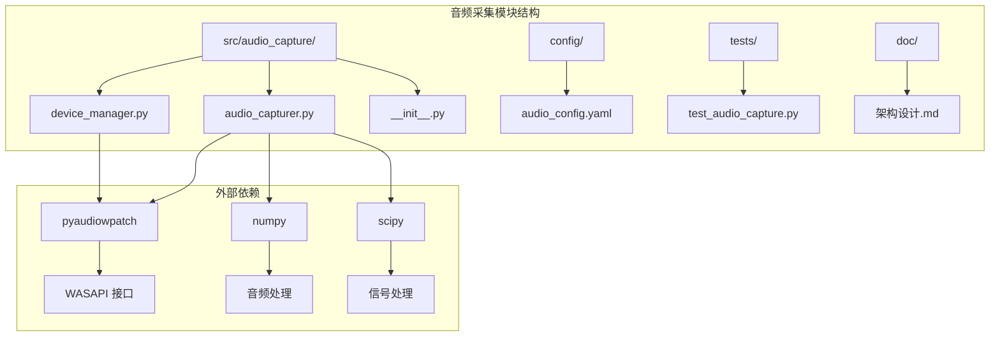

**图表来源**
- [device_manager.py](file://src/audio_capture/device_manager.py#L1-L267)
- [audio_capturer.py](file://src/audio_capture/audio_capturer.py#L1-L325)
- [audio_config.yaml](file://config/audio_config.yaml#L1-L32)

**章节来源**
- [__init__.py](file://src/audio_capture/__init__.py#L1-L11)
- [requirements.txt](file://requirements.txt#L1-L4)

## 核心组件

音频采集模块由两个核心类组成：

### DeviceManager 类
负责音频设备的枚举、管理和选择，支持 WASAPI Loopback 设备的特殊处理。

### AudioCapturer 类  
实现双流音频采集功能，同时处理系统音频和麦克风音频的并行捕获。

**章节来源**
- [device_manager.py](file://src/audio_capture/device_manager.py#L14-L267)
- [audio_capturer.py](file://src/audio_capture/audio_capturer.py#L19-L325)

## 架构概览

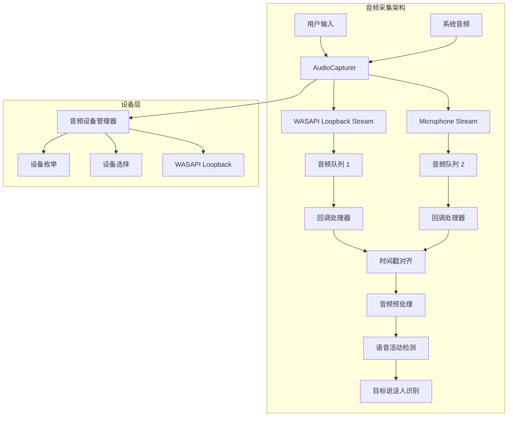

**图表来源**
- [audio_capturer.py](file://src/audio_capture/audio_capturer.py#L154-L214)
- [device_manager.py](file://src/audio_capture/device_manager.py#L27-L83)

## 详细组件分析

### DeviceManager 设备管理器

DeviceManager 是音频设备管理的核心组件，提供了完整的设备枚举、查询和选择功能。

#### 主要功能特性

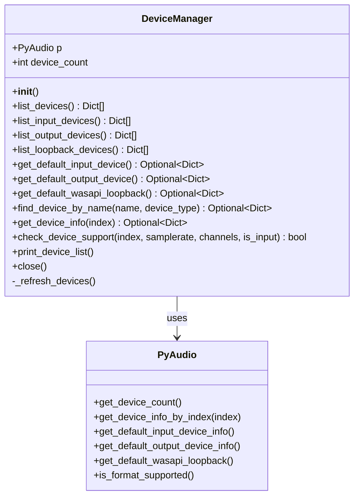

**图表来源**
- [device_manager.py](file://src/audio_capture/device_manager.py#L14-L267)

#### 设备信息结构

每个音频设备包含以下关键信息：

| 字段 | 类型 | 描述 |
|------|------|------|
| index | int | 设备索引号 |
| name | str | 设备名称 |
| max_input_channels | int | 最大输入声道数 |
| max_output_channels | int | 最大输出声道数 |
| default_samplerate | int | 默认采样率 |
| hostapi | int | Host API 类型 |
| hostapi_name | str | Host API 名称 |
| is_loopback | bool | 是否为回环设备 |

#### 设备选择策略

DeviceManager 实现了智能的设备选择策略：

1. **优先级选择**：优先使用默认设备
2. **兼容性检查**：验证设备是否支持指定参数
3. **回环设备识别**：自动识别 WASAPI Loopback 设备
4. **容错机制**：当首选设备不可用时提供备用方案

**章节来源**
- [device_manager.py](file://src/audio_capture/device_manager.py#L27-L267)

### AudioCapturer 音频采集器

AudioCapturer 是模块的核心执行组件，实现了双流音频采集和实时处理功能。

#### 双流同步采集机制

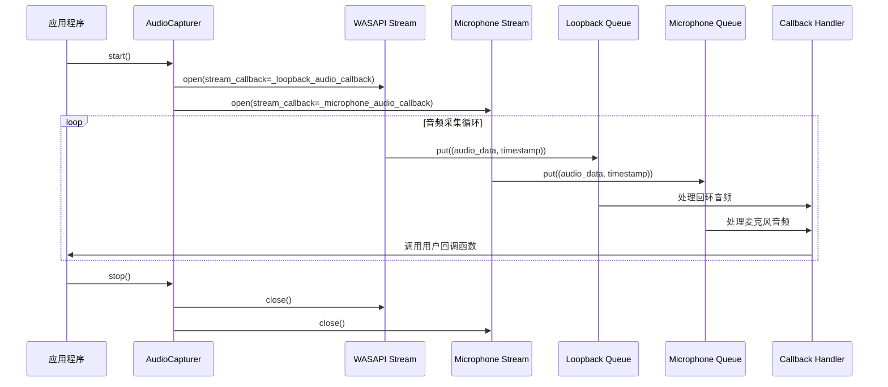

**图表来源**
- [audio_capturer.py](file://src/audio_capture/audio_capturer.py#L154-L246)

#### 回调函数设计

AudioCapturer 实现了专门的回调函数来处理不同类型的音频流：

1. **_loopback_audio_callback()**：处理 WASAPI Loopback 音频流
2. **_microphone_audio_callback()**：处理麦克风音频流

回调函数的主要处理步骤：
- 数据格式转换（字节到 numpy 数组）
- 声道数调整（单声道化）
- 时间戳记录
- 队列存储
- 用户回调调用

#### 数据队列管理

```mermaid
graph LR
subgraph "音频队列系统"
A[Loopback Stream] --> B[Loopback Queue]
C[Microphone Stream] --> D[Microphone Queue]
B --> E[数据获取]
D --> F[数据获取]
E --> G[时间戳对齐]
F --> G
G --> H[预处理]
H --> I[语音检测]
end
subgraph "队列操作"
J[put()] --> K[存储音频数据]
L[get()] --> M[获取音频数据]
N[qsize()] --> O[队列大小监控]
end
B --> J
D --> L
B --> N
D --> N
```

**图表来源**
- [audio_capturer.py](file://src/audio_capture/audio_capturer.py#L56-L58)
- [audio_capturer.py](file://src/audio_capture/audio_capturer.py#L248-L276)

**章节来源**
- [audio_capturer.py](file://src/audio_capture/audio_capturer.py#L19-L325)

## WASAPI Loopback 技术原理

### 技术概述

WASAPI (Windows Audio Session API) Loopback 是 Windows 系统提供的高级音频功能，允许应用程序捕获其他应用程序的音频输出。在 VRChat 场景下，这项技术特别重要，因为它能够直接捕获游戏中的音频内容。

### 工作原理

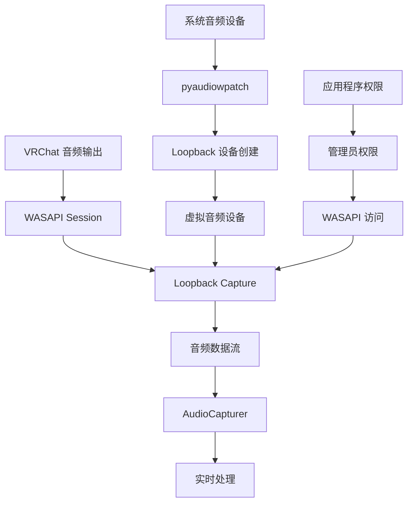

**图表来源**
- [device_manager.py](file://src/audio_capture/device_manager.py#L70-L83)
- [audio_capturer.py](file://src/audio_capture/audio_capturer.py#L163-L188)

### VRChat 场景应用价值

在 VRChat 环境中，WASAPI Loopback 技术的应用价值体现在：

1. **游戏内语音识别**：实时捕获玩家对话和游戏音效
2. **多语言翻译**：支持不同语言的语音转文字
3. **语音控制**：通过语音指令控制游戏行为
4. **社交互动增强**：实现更自然的虚拟社交体验

### 设备识别机制

DeviceManager 通过以下方式识别支持回环采集的扬声器设备：

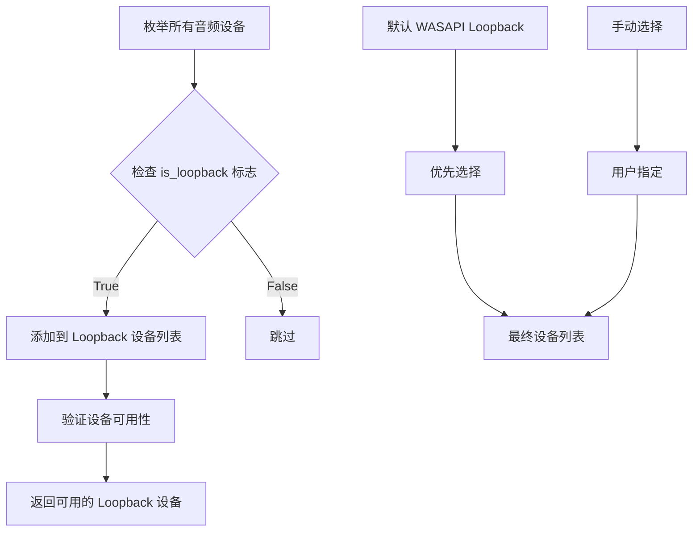

**图表来源**
- [device_manager.py](file://src/audio_capture/device_manager.py#L70-L83)

**章节来源**
- [device_manager.py](file://src/audio_capture/device_manager.py#L70-L83)
- [audio_capturer.py](file://src/audio_capture/audio_capturer.py#L163-L188)

## 配置参数详解

### 音频配置文件结构

audio_config.yaml 文件包含了音频采集模块的所有配置参数：

| 参数名 | 类型 | 默认值 | 描述 |
|--------|------|--------|------|
| samplerate | int | 16000 | 采样率（Hz） |
| channels | int | 1 | 声道数（1=单声道，2=立体声） |
| chunk_size | int | 480 | 缓冲区大小（样本数） |
| format | str | "paInt16" | 音频格式 |
| wasapi_loopback_device | int/null | null | WASAPI Loopback 设备索引 |
| microphone_device | int/null | null | 麦克风设备索引 |

### 关键参数说明

#### 采样率配置
- **16000 Hz**：标准语音识别采样率
- **支持范围**：通常支持 8000-48000 Hz
- **影响因素**：CPU 性能、网络带宽、识别精度

#### 缓冲区大小优化
- **480 样本**：对应 30ms 的音频片段
- **计算公式**：chunk_size = samplerate × duration(seconds)
- **典型值**：30ms、60ms、120ms

#### 时间戳对齐方法

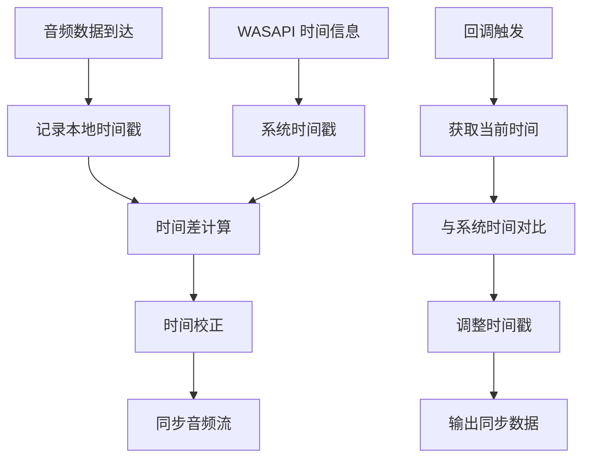

**图表来源**
- [audio_capturer.py](file://src/audio_capture/audio_capturer.py#L98-L152)

**章节来源**
- [audio_config.yaml](file://config/audio_config.yaml#L1-L32)
- [audio_capturer.py](file://src/audio_capture/audio_capturer.py#L26-L34)

## 生产者-消费者模式

### 模式架构

音频采集模块采用了经典的生产者-消费者模式来处理实时音频数据：

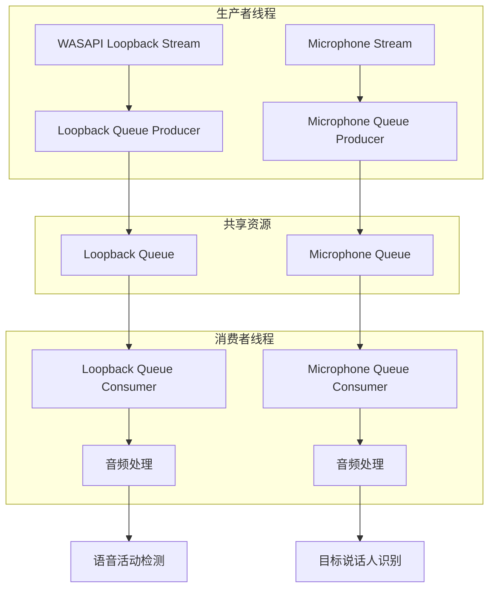

**图表来源**
- [audio_capturer.py](file://src/audio_capture/audio_capturer.py#L56-L58)
- [audio_capturer.py](file://src/audio_capture/audio_capturer.py#L248-L276)

### 队列管理策略

#### 队列容量控制
- **动态调整**：根据系统负载调整队列大小
- **溢出处理**：及时丢弃过期数据避免内存泄漏
- **监控机制**：实时监控队列状态

#### 线程安全保证
- **Queue 类**：Python 标准库提供的线程安全队列
- **原子操作**：确保数据读写的原子性
- **超时机制**：防止无限等待导致的死锁

### 实时性能优化

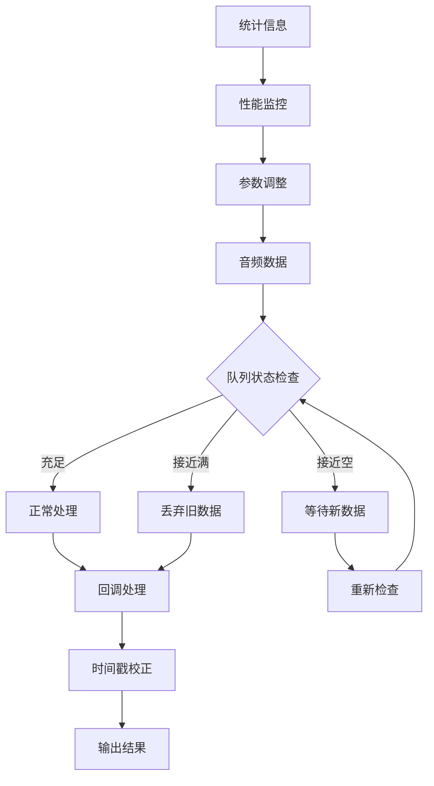

**图表来源**
- [audio_capturer.py](file://src/audio_capture/audio_capturer.py#L278-L293)

**章节来源**
- [audio_capturer.py](file://src/audio_capture/audio_capturer.py#L56-L58)
- [audio_capturer.py](file://src/audio_capture/audio_capturer.py#L248-L276)

## VRChat 场景应用

### 应用场景分析

在 VRChat 环境中，音频采集模块主要服务于以下应用场景：

#### 1. 游戏内语音识别
- **实时对话监听**：捕获玩家间的实时对话
- **关键词检测**：识别特定的游戏事件或命令
- **多语言支持**：支持不同语言的语音识别

#### 2. 社交互动增强
- **自动回复**：基于上下文的智能回复
- **情感分析**：识别玩家情绪状态
- **群体管理**：识别特定玩家的声音特征

#### 3. 内容创作辅助
- **直播字幕**：实时生成直播字幕
- **内容分析**：分析游戏内容和玩家行为
- **自动化剪辑**：基于语音内容的视频剪辑

### 性能要求指标

| 指标 | 要求 | 说明 |
|------|------|------|
| 延迟 | < 100ms | 实时交互要求 |
| 吞吐量 | > 1000 FPS | 高频率音频处理 |
| 准确率 | > 95% | 语音识别精度 |
| 资源占用 | CPU < 20% | 保持游戏流畅性 |

### 集成架构

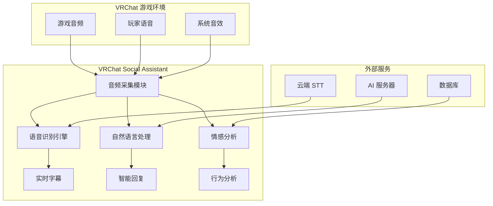

**图表来源**
- [架构设计.md](file://doc/架构设计.md#L89-L155)

**章节来源**
- [架构设计.md](file://doc/架构设计.md#L89-L155)

## 性能优化建议

### 硬件配置优化

#### 推荐硬件规格
- **CPU**：Intel i5 或 AMD Ryzen 5 以上
- **内存**：8GB RAM 或更多
- **音频接口**：高质量 USB 麦克风
- **声卡**：支持高采样率的专业声卡

#### 系统优化
- **音频驱动**：使用最新版 Realtek 或 ASIO 驱动
- **电源管理**：设置高性能模式
- **后台进程**：关闭不必要的音频相关进程

### 软件参数调优

#### 采样率和缓冲区优化

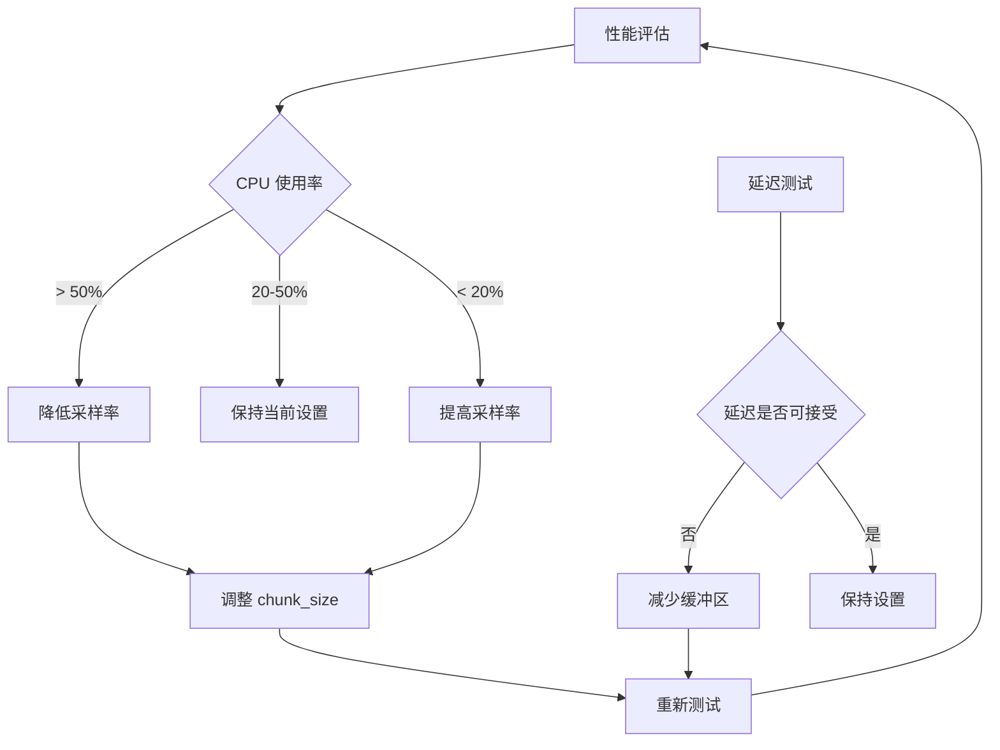

#### 内存管理优化
- **队列大小**：根据系统内存动态调整
- **数据压缩**：对长时间音频进行压缩存储
- **垃圾回收**：定期清理无用的音频数据

### 并发处理优化

#### 多线程策略
- **分离处理**：将音频采集和处理分离到不同线程
- **优先级设置**：为音频线程设置较高优先级
- **负载均衡**：监控各线程负载，动态调整任务分配

**章节来源**
- [audio_capturer.py](file://src/audio_capture/audio_capturer.py#L278-L293)

## 故障排除指南

### 常见问题诊断

#### 1. WASAPI Loopback 设备无法识别

**症状**：未检测到回环设备列表为空

**可能原因**：
- pyaudiowpatch 库未正确安装
- 系统不支持 WASAPI Loopback
- 缺少管理员权限

**解决方案**：
```bash
# 检查依赖安装
pip show pyaudiowpatch

# 以管理员身份运行
runas /user:Administrator python test_audio_capture.py
```

#### 2. 音频采集延迟过高

**症状**：音频处理延迟超过 100ms

**诊断步骤**：
1. 检查系统 CPU 使用率
2. 验证音频缓冲区设置
3. 确认设备驱动程序版本

**优化措施**：
- 降低采样率至 16000 Hz
- 减小缓冲区大小
- 关闭不必要的后台程序

#### 3. 音频质量不佳

**症状**：采集的音频噪音大或失真

**排查方法**：
- 检查麦克风设备设置
- 验证音频格式配置
- 确认设备驱动程序

### 调试工具和方法

#### 日志分析
模块提供了详细的日志记录功能：

```python
# 启用详细日志
import logging
logging.basicConfig(level=logging.DEBUG)
```

#### 性能监控
通过统计信息监控模块性能：

```python
stats = capturer.get_statistics()
print(f"队列大小: {stats['loopback_queue_size']}")
print(f"溢出次数: {stats['loopback_overflows']}")
```

#### 设备测试
使用内置的设备测试功能：

```python
manager = DeviceManager()
manager.print_device_list()
```

**章节来源**
- [test_audio_capture.py](file://tests/test_audio_capture.py#L46-L55)
- [audio_capturer.py](file://src/audio_capture/audio_capturer.py#L278-L293)

## 总结

音频采集模块是 VRChat 社交助手的重要组成部分，通过 DeviceManager 和 AudioCapturer 两个核心类的协同工作，实现了高效、稳定的双流音频采集功能。

### 主要优势

1. **技术先进性**：采用 WASAPI Loopback 技术，实现系统级音频捕获
2. **架构合理性**：清晰的模块划分和职责分离
3. **性能优异**：支持实时音频处理和低延迟响应
4. **配置灵活**：丰富的参数配置选项满足不同需求
5. **易于扩展**：良好的接口设计便于功能扩展

### 应用前景

随着 VR 技术的发展和社交需求的增长，音频采集模块将在以下方面发挥更大作用：

- **沉浸式社交体验**：提供更真实的虚拟社交环境
- **智能语音助手**：集成 AI 功能实现智能化交互
- **内容创作工具**：为创作者提供强大的音频处理能力
- **无障碍支持**：为特殊用户提供更好的交互体验

该模块的设计充分考虑了 VRChat 场景的特殊需求，在保证功能完整性的同时，注重性能优化和用户体验，为构建下一代虚拟社交平台奠定了坚实的技术基础。