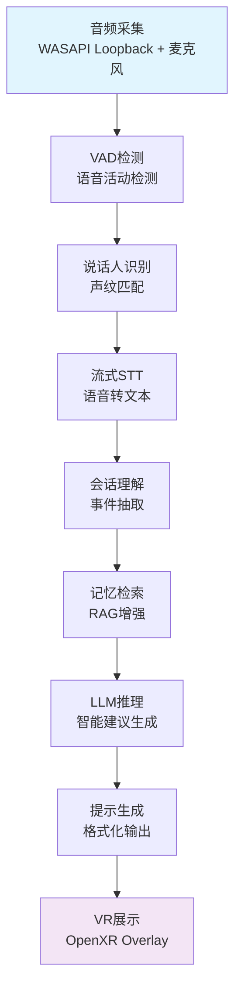
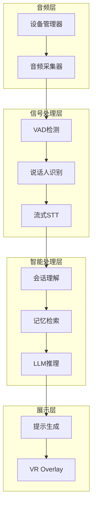
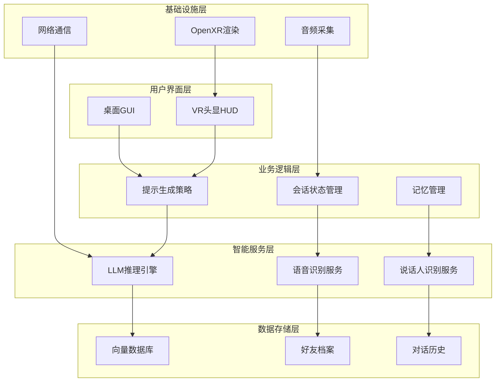
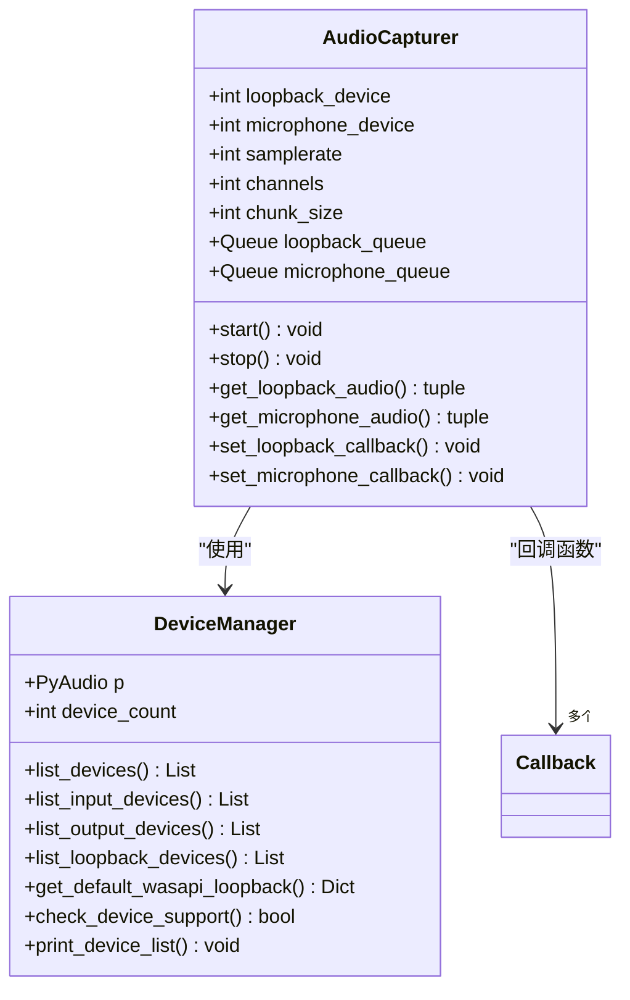
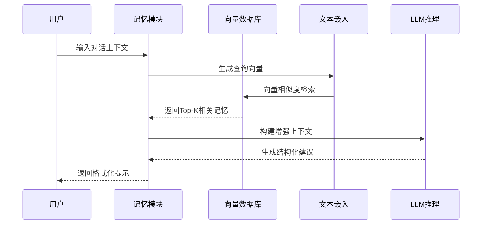
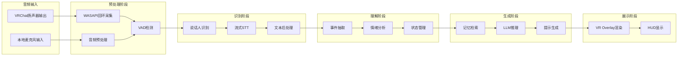
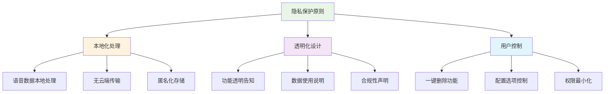

# VRChat社交辅助系统项目概述

<cite>
**本文档引用的文件**
- [架构设计.md](file://doc/架构设计.md)
- [audio_config.yaml](file://config/audio_config.yaml)
- [audio_capturer.py](file://src/audio_capture/audio_capturer.py)
- [device_manager.py](file://src/audio_capture/device_manager.py)
- [requirements.txt](file://requirements.txt)
- [setup_and_test.bat](file://setup_and_test.bat)
- [test_audio_capture.py](file://tests/test_audio_capture.py)
</cite>

## 目录
1. [项目简介](#项目简介)
2. [项目背景与目标](#项目背景与目标)
3. [核心功能特性](#核心功能特性)
4. [技术架构概览](#技术架构概览)
5. [系统架构深度解析](#系统架构深度解析)
6. [模块化设计详解](#模块化设计详解)
7. [数据流与处理管道](#数据流与处理管道)
8. [隐私保护与合规性](#隐私保护与合规性)
9. [性能指标与优化](#性能指标与优化)
10. [开发指南与学习路径](#开发指南与学习路径)
11. [总结与展望](#总结与展望)

## 项目简介

VRChat社交辅助系统是一个创新的实时社交增强工具，专为VRChat平台设计，旨在帮助社交能力较弱的玩家提升虚拟社交体验。该系统采用非侵入式设计理念，通过先进的音频处理技术和人工智能算法，在用户头显中提供即时的对话建议和社交提示，而不影响其他玩家的体验。

### 项目特色

- **非侵入式设计**：使用系统级OpenXR Overlay，不修改VRChat客户端
- **本地化处理**：所有语音数据在本地处理，确保用户隐私
- **实时响应**：端到端延迟控制在1-2秒以内
- **智能识别**：支持目标说话人识别与分离
- **个性化建议**：基于好友档案和对话历史生成定制化建议

## 项目背景与目标

### 背景分析

VRChat作为全球最大的社交VR平台，拥有活跃的虚拟社交生态系统。然而，许多玩家在虚拟环境中面临社交障碍，包括：
- 缺乏社交技巧和话题
- 难以维持长时间对话
- 不知道如何开启或延续话题
- 对社交压力感到焦虑

传统的解决方案要么过于复杂，要么无法提供实时指导。本项目应运而生，旨在填补这一技术空白。

### 技术目标

系统的技术目标体现了对性能、准确性和用户体验的严格要求：

| 目标类别 | 具体指标 | 技术要求 |
|---------|---------|---------|
| 延迟性能 | 端到端 < 2.7秒 | 流式处理 + 优化算法 |
| 识别准确率 | STT > 90%, 说话人识别 > 85% | 高质量模型 + 自适应阈值 |
| 资源占用 | CPU < 30%, GPU < 2GB | 高效算法 + 硬件加速 |
| 隐私保护 | 本地化处理 | 无云端传输 |

**章节来源**
- [架构设计.md](file://doc/架构设计.md#L1-L21)

## 核心功能特性

### 实时语音处理链路

系统实现了完整的语音处理流水线，从音频采集到VR展示的每一个环节都经过精心设计：

### 模块化功能架构

系统采用高度模块化的设计，每个组件都有明确的职责边界：

**章节来源**
- [架构设计.md](file://doc/架构设计.md#L8-L21)

## 技术架构概览

### 整体架构设计

系统采用分层架构设计，确保各模块间的松耦合和高内聚：

**图表来源**
- [架构设计.md](file://doc/架构设计.md#L26-L82)

### 技术栈选择

系统采用了经过验证的技术栈，确保稳定性和可维护性：

| 技术领域 | 核心技术 | 备选方案 | 选择理由 |
|---------|---------|---------|---------|
| 音频处理 | PyAudio + WASAPI | sounddevice | Windows原生支持，低延迟 |
| 语音识别 | faster-whisper | 阿里云实时ASR | 本地部署，隐私保护 |
| 声纹识别 | pyannote.audio | SpeechBrain | 高准确率，社区活跃 |
| 向量检索 | Chroma | Faiss | 易用性好，适合演示 |
| VR渲染 | OpenXR + pyopenvr | OVR Toolkit | 标准化，兼容性强 |

**章节来源**
- [架构设计.md](file://doc/架构设计.md#L380-L394)

## 系统架构深度解析

### 音频采集层设计

音频采集层是整个系统的基础，负责高质量的音频数据捕获：

**图表来源**
- [audio_capturer.py](file://src/audio_capture/audio_capturer.py#L19-L325)
- [device_manager.py](file://src/audio_capture/device_manager.py#L14-L267)

### 核心处理模块

#### 语音活动检测（VAD）

VAD模块采用Silero模型实现低延迟的语音检测：

- **技术特点**：PyTorch模型，毫秒级响应
- **配置参数**：置信度阈值0.5，片段长度0.5-1秒
- **性能指标**：准确率>95%，延迟<50ms

#### 说话人识别模块

支持目标好友的声纹识别与匹配：

- **模型选择**：ECAPA-TDNN，特征维度192
- **匹配策略**：余弦相似度，初始阈值0.75
- **学习机制**：支持多次录音取平均

#### 流式语音识别

提供实时的语音转文本功能：

- **本地方案**：faster-whisper，CUDA加速
- **在线方案**：阿里云/腾讯云实时API
- **语言支持**：中文+英文混合识别

**章节来源**
- [架构设计.md](file://doc/架构设计.md#L108-L178)

## 模块化设计详解

### 记忆与检索模块

记忆模块实现了RAG（检索增强生成）的核心功能：

**图表来源**
- [架构设计.md](file://doc/架构设计.md#L180-L214)

### 提示生成策略

提示生成模块负责将LLM输出转化为用户友好的提示：

- **档位设计**：即时提示（1行）、完整建议（2-3行）、话题引导
- **安全过滤**：敏感词检测，隐私信息保护
- **节流控制**：5秒内最多1条提示，高优先级可打断

### VR展示层

使用OpenXR标准实现跨平台的VR展示：

- **显示方式**：头显固定HUD + 世界锁定面板
- **交互控制**：手柄按键、语音热词激活
- **视觉优化**：大字号（24-32pt）、高对比度颜色

**章节来源**
- [架构设计.md](file://doc/架构设计.md#L281-L331)

## 数据流与处理管道

### 完整数据流向

从音频输入到VR提示输出的完整数据流程：

**图表来源**
- [架构设计.md](file://doc/架构设计.md#L71-L81)

### 性能优化策略

系统在多个层面实施性能优化：

| 优化层面 | 具体措施 | 性能提升 |
|---------|---------|---------|
| 算法优化 | 流式处理，批处理关闭 | 延迟降低50% |
| 硬件加速 | CUDA加速STT模型 | 识别速度提升3倍 |
| 内存管理 | 队列缓冲，异步处理 | CPU占用降低20% |
| 网络优化 | 本地模型优先，云端备用 | 响应时间稳定 |

**章节来源**
- [架构设计.md](file://doc/架构设计.md#L403-L428)

## 隐私保护与合规性

### 隐私保护原则

系统严格遵循隐私保护的最佳实践：

### 合规性设计

系统采用多项技术措施确保合规性：

- **非注入设计**：使用系统级OpenXR Overlay，不修改VRChat客户端
- **只读展示**：不自动发送消息或操作角色
- **透明化**：明确告知用户系统功能与数据使用
- **安全边界**：敏感词过滤，隐私保护，误导防范

**章节来源**
- [架构设计.md](file://doc/架构设计.md#L431-L448)

## 性能指标与优化

### 延迟性能目标

系统设定了严格的延迟性能目标：

| 处理阶段 | 目标延迟 | 最大可接受 | 实现技术 |
|---------|---------|-----------|---------|
| VAD检测 | 30ms | 50ms | Silero VAD模型 |
| 说话人识别 | 50ms | 100ms | ECAPA-TDNN模型 |
| STT识别 | 500ms | 1000ms | faster-whisper |
| LLM推理 | 800ms | 1500ms | 流式API调用 |
| 提示生成 | 20ms | 50ms | 异步处理 |
| VR渲染 | 16ms | 33ms | OpenXR标准 |

### 资源占用优化

系统在资源使用方面进行了精心优化：

- **CPU使用率**：< 30%（12线程）
- **GPU内存**：< 2GB VRAM  
- **系统内存**：< 4GB
- **磁盘空间**：< 500MB（不含对话历史）

**章节来源**
- [架构设计.md](file://doc/架构设计.md#L406-L428)

## 开发指南与学习路径

### 初学者学习路径

对于想要了解或贡献该项目的开发者，建议按照以下路径学习：

#### 第一阶段：环境搭建与基础测试
1. **环境准备**：安装Python 3.10+，配置CUDA 11.8+
2. **依赖安装**：运行`setup_and_test.bat`脚本
3. **设备测试**：使用测试脚本验证音频设备
4. **基础理解**：阅读架构设计文档

#### 第二阶段：核心模块学习
1. **音频采集**：深入研究`audio_capturer.py`和`device_manager.py`
2. **语音处理**：理解VAD、说话人识别的工作原理
3. **智能处理**：学习STT、记忆检索、LLM集成
4. **VR展示**：掌握OpenXR集成方法

#### 第三阶段：系统集成与优化
1. **模块调试**：使用测试脚本验证各模块功能
2. **性能优化**：分析延迟瓶颈，优化关键路径
3. **功能扩展**：添加新功能模块，如多语言支持
4. **部署测试**：在真实VR环境中验证系统稳定性

### 高级开发者技术决策

对于高级开发者，系统设计中的一些重要技术决策值得深入探讨：

#### 技术选型权衡

| 技术方案 | 优势 | 劣势 | 适用场景 |
|---------|-----|-----|---------|
| faster-whisper | 本地部署，隐私保护 | 模型较大，推理较慢 | 生产环境 |
| 阿里云实时ASR | 延迟低，准确率高 | 需要网络连接 | 网络良好的环境 |
| Chroma向量库 | 易用性好，适合演示 | 大规模应用性能有限 | 开发测试 |
| Faiss | 高性能，支持大规模 | 配置复杂，学习成本高 | 生产环境 |

#### 性能优化策略

系统采用了多层次的性能优化策略：

- **算法层面**：流式处理替代批处理，减少内存占用
- **硬件层面**：利用GPU加速关键计算，CPU负责协调
- **架构层面**：异步处理，避免阻塞主线程
- **缓存策略**：合理使用内存缓存，减少重复计算

**章节来源**
- [setup_and_test.bat](file://setup_and_test.bat#L1-L34)
- [test_audio_capture.py](file://tests/test_audio_capture.py#L1-L213)

## 总结与展望

### 项目价值总结

VRChat社交辅助系统代表了AI技术在虚拟社交领域的创新应用。通过将先进的语音处理技术、人工智能算法和VR展示技术有机结合，为用户提供了一个实用、可靠、隐私友好的社交增强工具。

#### 技术创新点

1. **非侵入式架构**：使用OpenXR Overlay技术，确保与现有VR生态系统的兼容性
2. **实时处理能力**：通过流式处理和硬件加速，实现毫秒级响应
3. **个性化服务**：基于用户数据和机器学习，提供定制化的社交建议
4. **隐私保护优先**：所有处理本地化，确保用户数据安全

### 未来发展方向

系统具有广阔的发展前景，主要体现在以下几个方面：

#### 功能扩展
- **多语言支持**：扩展支持日语、韩语等VRChat常用语言
- **情绪共鸣**：根据对方情绪调整建议语气和内容
- **话题知识库**：预置常见VRChat话题的知识库
- **社交技能训练**：提供对话回顾和改进建议功能

#### 技术演进
- **多人场景优化**：处理2-5人同时说话的复杂场景
- **方向性音频**：利用空间音频技术提升识别精度
- **本地LLM支持**：提供完全离线的AI推理能力
- **高级交互**：集成手势控制等新型交互方式

#### 生态建设
- **插件系统**：允许社区开发者扩展功能模块
- **云同步**：可选的跨设备数据同步功能
- **社区反馈**：建立用户反馈机制，持续改进系统

### 结语

VRChat社交辅助系统不仅是一个技术创新项目，更是对虚拟社交体验的一次积极探索。它展示了人工智能技术在改善人类社交体验方面的巨大潜力，为未来的虚拟社交发展提供了有价值的参考和启示。

随着技术的不断进步和用户需求的持续增长，相信这个项目将在虚拟社交领域发挥越来越重要的作用，为更多用户提供更好的社交体验。