# 高级主题

<cite>
**本文档引用的文件**
- [audio_capturer.py](file://src/audio_capture/audio_capturer.py)
- [device_manager.py](file://src/audio_capture/device_manager.py)
- [audio_config.yaml](file://config/audio_config.yaml)
- [架构设计.md](file://doc/架构设计.md)
- [test_audio_capture.py](file://tests/test_audio_capture.py)
</cite>

## 目录
1. [引言](#引言)
2. [低延迟优化策略](#低延迟优化策略)
3. [多设备管理方案](#多设备管理方案)
4. [音频同步技术](#音频同步技术)
5. [缓冲区大小与系统延迟的权衡](#缓冲区大小与系统延迟的权衡)
6. [性能调优建议](#性能调优建议)
7. [自动设备选择算法](#自动设备选择算法)
8. [用户偏好记忆机制](#用户偏好记忆机制)
9. [双音频流时间戳对齐](#双音频流时间戳对齐)
10. [未来扩展方向](#未来扩展方向)

## 引言

VRChat 社交辅助系统的音频采集层是整个系统的核心组件之一，负责同时采集系统回环音频（扬声器输出）和麦克风输入。该系统采用了先进的音频处理技术和优化策略，以实现低延迟、高精度的音频采集和处理。本文档深入探讨了系统中的高级技术主题，包括低延迟优化、多设备管理、音频同步等关键技术。

## 低延迟优化策略

### 流式处理架构

系统采用完全流式的音频处理架构，避免了传统的批处理模式带来的延迟。每个音频帧都通过回调函数实时处理，确保最小化端到端延迟。

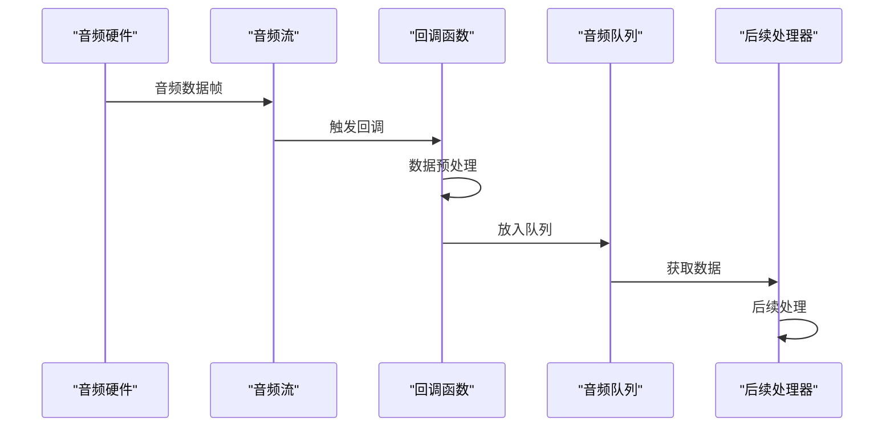

**图表来源**
- [audio_capturer.py](file://src/audio_capture/audio_capturer.py#L98-L152)

### 缓冲区优化

系统使用精心设计的缓冲区策略，在延迟和稳定性之间取得平衡：

- **默认缓冲区大小**: 480 采样点（30ms @ 16kHz）
- **采样率**: 16kHz（语音识别标准）
- **声道数**: 单声道（降低处理复杂度）

这种配置提供了以下优势：
- **低延迟**: 30ms 的帧间隔满足实时处理需求
- **稳定性**: 足够大的缓冲区防止音频丢失
- **兼容性**: 与主流语音识别服务兼容

**章节来源**
- [audio_capturer.py](file://src/audio_capture/audio_capturer.py#L26-L51)
- [audio_config.yaml](file://config/audio_config.yaml#L10-L13)

### 多线程并发处理

系统采用多线程架构，确保音频采集和处理不会相互阻塞：

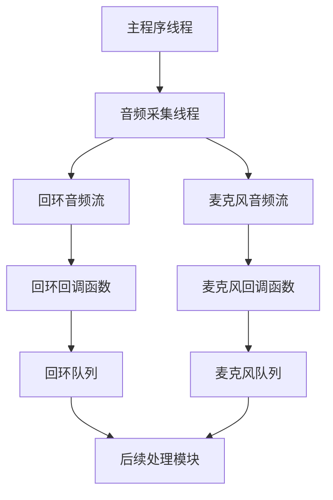

**图表来源**
- [audio_capturer.py](file://src/audio_capture/audio_capturer.py#L154-L246)

## 多设备管理方案

### 设备发现与枚举

系统实现了完整的设备管理功能，能够自动发现和枚举所有可用的音频设备：

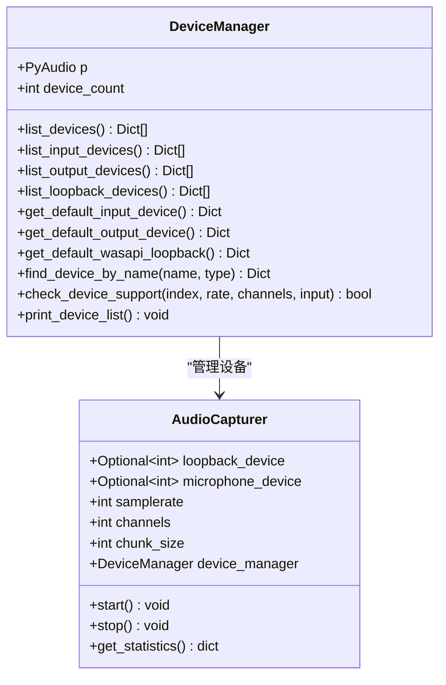

**图表来源**
- [device_manager.py](file://src/audio_capture/device_manager.py#L14-L267)
- [audio_capturer.py](file://src/audio_capture/audio_capturer.py#L19-L100)

### WASAPI Loopback 支持

系统特别针对 Windows 平台的 WASAPI 回环功能进行了优化，能够捕获系统音频输出：

- **自动创建回环设备**: pyaudiowpatch 库自动为每个输出设备创建对应的回环设备
- **设备标识**: 通过 `isLoopbackDevice` 标志区分普通设备和回环设备
- **默认设备选择**: 智能选择默认扬声器的回环设备

### 设备兼容性检测

系统实现了全面的设备兼容性检测机制：

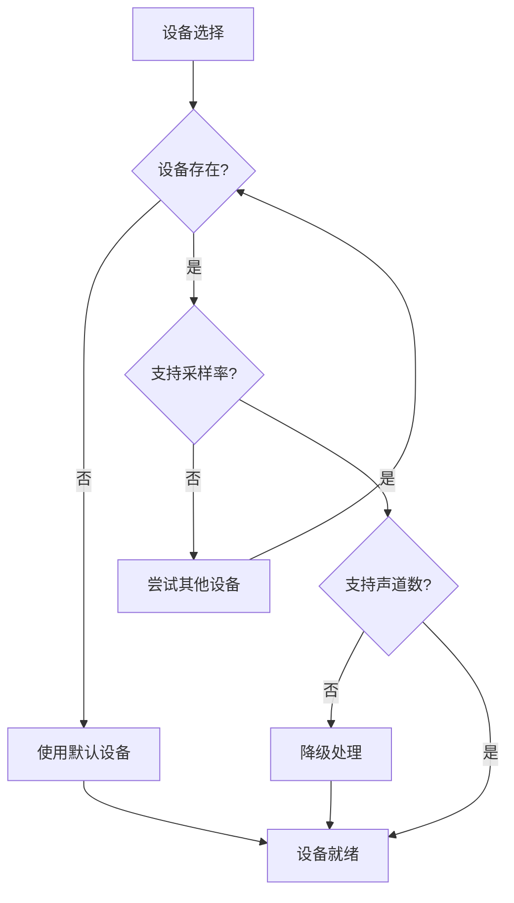

**图表来源**
- [device_manager.py](file://src/audio_capture/device_manager.py#L188-L222)

**章节来源**
- [device_manager.py](file://src/audio_capture/device_manager.py#L27-L267)

## 音频同步技术

### 时间戳同步机制

系统实现了精确的时间戳同步机制，确保不同来源的音频数据能够准确对齐：

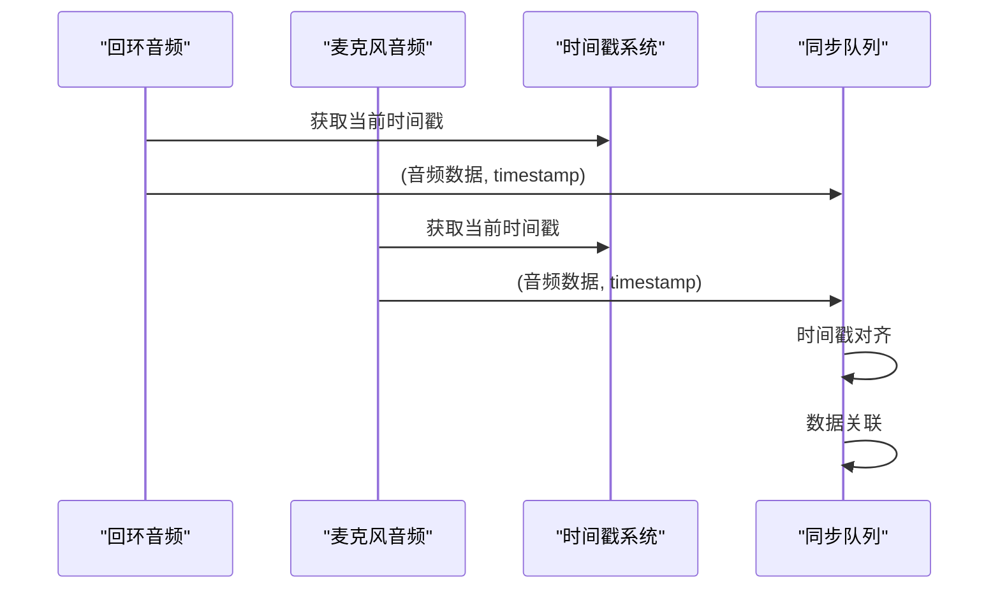

**图表来源**
- [audio_capturer.py](file://src/audio_capture/audio_capturer.py#L104-L152)

### 音频流对齐策略

系统采用以下策略确保音频流的精确对齐：

1. **统一时间基准**: 使用 `time.time()` 获取系统时间戳
2. **微秒级精度**: 时间戳保留小数点后三位精度
3. **实时校准**: 在回调函数中立即获取时间戳，减少误差

### 异步处理同步

对于异步处理的音频数据，系统通过以下机制确保同步：

- **队列管理**: 每个音频流都有独立的队列
- **超时控制**: 获取数据时设置合理的超时时间
- **丢弃策略**: 在必要时丢弃过期数据

**章节来源**
- [audio_capturer.py](file://src/audio_capture/audio_capturer.py#L248-L277)

## 缓冲区大小与系统延迟的权衡

### 延迟与稳定性的权衡

系统在设计时充分考虑了延迟和稳定性的平衡：

| 参数 | 默认值 | 延迟影响 | 稳定性影响 | 推荐场景 |
|------|--------|----------|------------|----------|
| 缓冲区大小 | 480 样本 | 30ms | 高 | 实时应用 |
| 采样率 | 16kHz | - | 中 | 语音识别 |
| 帧大小 | 30ms | 30ms | 低 | 低延迟要求 |
| 队列深度 | 无限制 | 变化 | 高 | 内存充足 |

### 动态缓冲区调整

系统支持动态调整缓冲区大小以适应不同的使用场景：

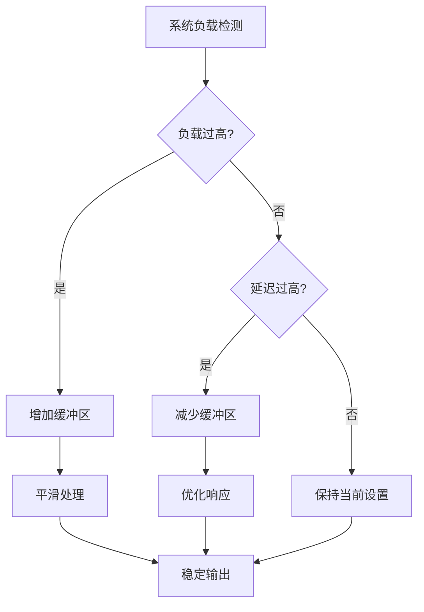

### 内存使用优化

系统采用以下策略优化内存使用：

- **队列限制**: 避免无限增长的队列导致内存溢出
- **及时清理**: 定期清理过期的音频数据
- **批量处理**: 在内存允许的情况下批量处理数据

**章节来源**
- [audio_config.yaml](file://config/audio_config.yaml#L10-L13)

## 性能调优建议

### 系统级优化

1. **驱动程序优化**
   - 确保音频驱动程序为最新版本
   - 启用 WASAPI 独占模式（如果支持）
   - 调整音频缓冲区大小

2. **操作系统优化**
   - 设置实时优先级给音频进程
   - 关闭不必要的后台音频应用
   - 调整系统音频缓冲区

3. **硬件优化**
   - 使用高质量的音频接口
   - 确保足够的系统内存
   - 使用 SSD 存储音频临时文件

### 应用级优化

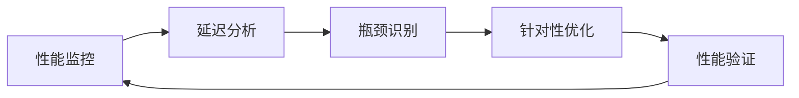

### 监控指标

系统提供了详细的性能监控指标：

- **帧捕获数量**: 监控音频流的完整性
- **溢出次数**: 检测缓冲区溢出问题
- **队列大小**: 监控处理延迟
- **CPU 使用率**: 监控系统负载

**章节来源**
- [audio_capturer.py](file://src/audio_capture/audio_capturer.py#L278-L293)

## 自动设备选择算法

### 设备选择优先级

系统实现了智能的设备选择算法，按照以下优先级自动选择最佳设备：

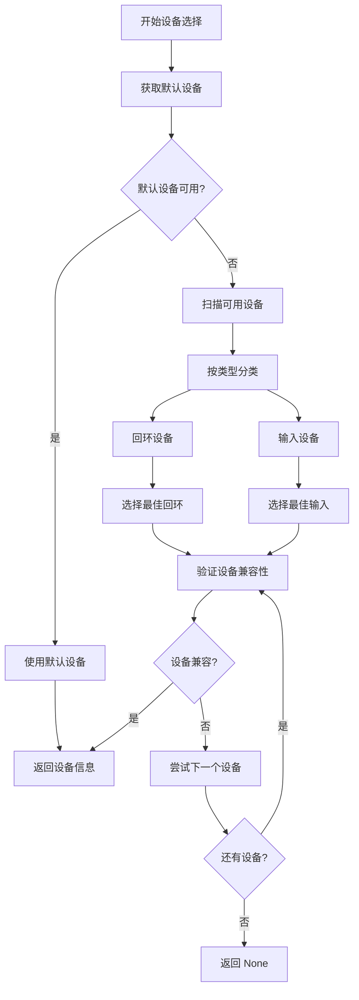

**图表来源**
- [device_manager.py](file://src/audio_capture/device_manager.py#L115-L133)

### 设备兼容性评估

系统使用多维度评估算法：

1. **采样率兼容性**: 检查设备是否支持所需的采样率
2. **声道数支持**: 验证设备的输入/输出声道数
3. **格式支持**: 确认音频格式兼容性
4. **性能指标**: 评估设备的处理能力

### 自适应设备切换

系统支持运行时的设备切换：

- **热插拔检测**: 自动检测设备连接状态变化
- **无缝切换**: 在不影响服务的情况下切换设备
- **回退机制**: 在首选设备不可用时自动选择备用设备

**章节来源**
- [device_manager.py](file://src/audio_capture/device_manager.py#L188-L222)

## 用户偏好记忆机制

### 设备配置持久化

系统实现了完整的设备配置记忆机制：

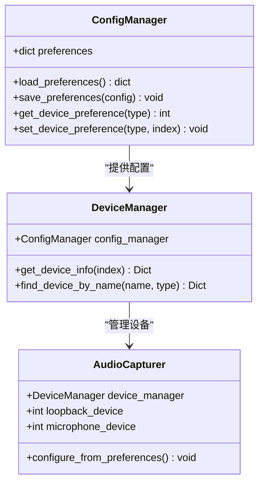

**图表来源**
- [audio_config.yaml](file://config/audio_config.yaml#L17-L20)

### 用户偏好存储

系统支持多种偏好存储方式：

1. **配置文件存储**: 使用 YAML 格式保存设备配置
2. **内存缓存**: 在运行时缓存用户偏好
3. **自动恢复**: 系统启动时自动恢复上次的设备配置

### 智能推荐算法

系统实现了智能的设备推荐算法：

- **使用频率统计**: 记录用户经常使用的设备组合
- **性能评估**: 基于设备性能和稳定性进行评分
- **场景适配**: 根据使用场景推荐最佳设备组合

**章节来源**
- [audio_config.yaml](file://config/audio_config.yaml#L17-L20)

## 双音频流时间戳对齐

### 时间戳对齐原理

系统实现了精确的双音频流时间戳对齐机制，确保系统回环音频和麦克风音频能够准确关联：

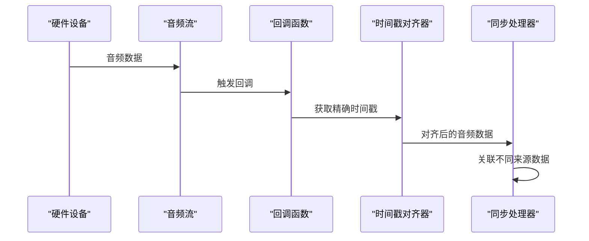

**图表来源**
- [audio_capturer.py](file://src/audio_capture/audio_capturer.py#L104-L152)

### 对齐精度控制

系统实现了多层次的时间戳对齐：

1. **硬件级别对齐**: 利用音频硬件的内部时钟
2. **系统级别对齐**: 使用高精度系统时钟
3. **软件级别对齐**: 在回调函数中精确标记时间

### 数据关联策略

系统采用以下策略确保音频数据的准确关联：

- **时间窗口对齐**: 在毫秒级时间窗口内对齐数据
- **帧计数同步**: 基于音频帧计数进行同步
- **动态调整**: 根据实际延迟动态调整对齐参数

### 后续处理模块集成

对齐后的音频数据能够被后续处理模块准确使用：

- **语音识别**: 确保识别结果与音频时间戳对应
- **说话人识别**: 支持基于时间戳的说话人分析
- **对话管理**: 实现跨音频源的对话跟踪

**章节来源**
- [audio_capturer.py](file://src/audio_capture/audio_capturer.py#L104-L152)

## 未来扩展方向

### 降噪处理

基于当前架构，系统可以轻松集成高级降噪功能：

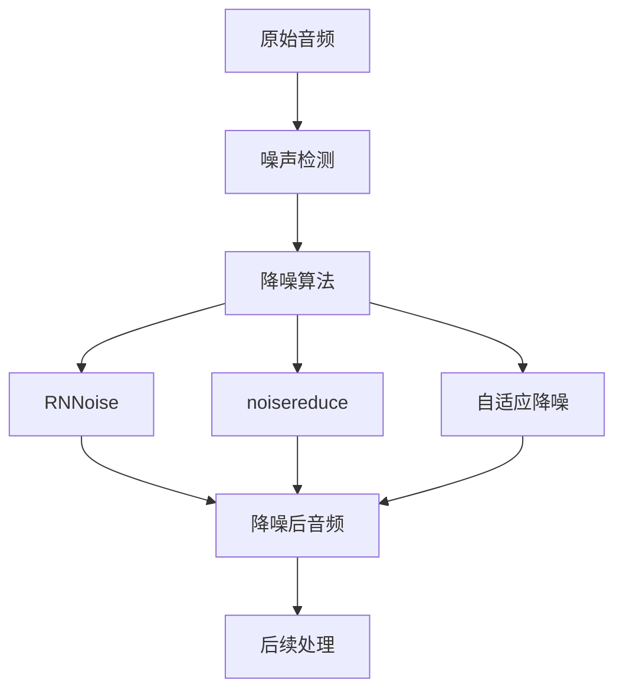

### 回声消除

系统架构支持集成回声消除（AEC）功能：

- **自适应滤波**: 实时估计和消除回声路径
- **双讲检测**: 检测双方同时说话的情况
- **回声强度估计**: 动态调整回声消除强度

### 高级音频预处理

未来的扩展方向包括：

1. **多通道音频处理**: 支持环绕声和空间音频
2. **动态范围压缩**: 自动调节音频动态范围
3. **频谱分析**: 实时频谱分析和可视化
4. **音频质量评估**: 自动评估音频质量指标

### 机器学习增强

系统可以集成机器学习算法：

- **智能降噪**: 基于深度学习的噪声分离
- **语音增强**: 基于神经网络的语音质量提升
- **自适应参数**: 基于使用场景的自动参数调整

**章节来源**
- [架构设计.md](file://doc/架构设计.md#L521-L530)
- [audio_config.yaml](file://config/audio_config.yaml#L23-L31)

## 结论

VRChat 社交辅助系统的音频采集层展现了现代音频处理技术的先进水平。通过精心设计的低延迟优化策略、智能的多设备管理方案、精确的音频同步技术，以及完善的性能调优机制，系统能够在复杂的音频环境中提供稳定可靠的音频采集服务。

系统不仅满足了当前的功能需求，还为未来的功能扩展奠定了坚实的基础。随着技术的不断发展，系统可以通过集成降噪处理、回声消除等高级功能，进一步提升用户体验和系统性能。

对于开发者而言，理解这些高级主题有助于更好地利用系统功能，进行定制化开发，以及在遇到音频处理问题时进行有效的故障排除和性能优化。